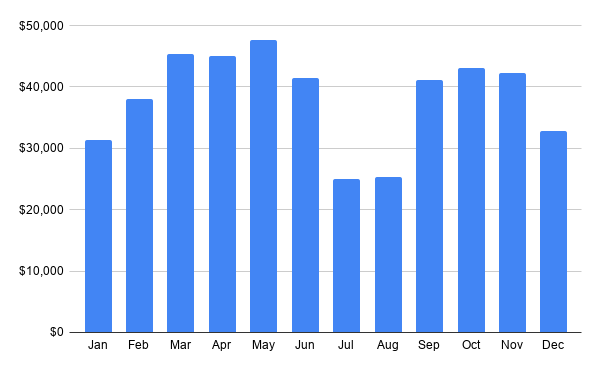
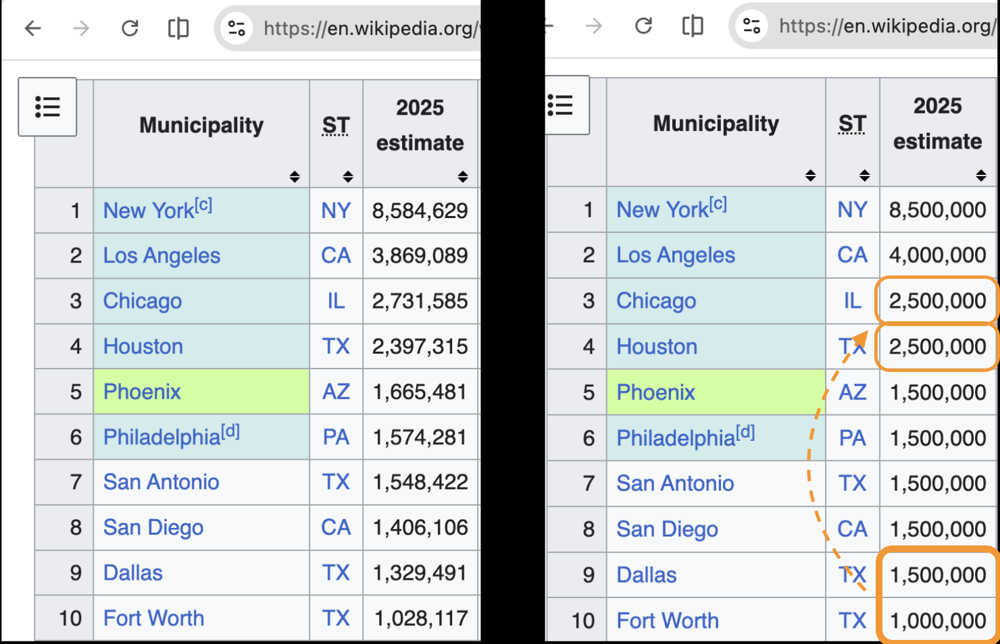

# Make data readable

Data can tell rich stories, but too much detail can make it hard to see the patterns.   

For example:
> Jan-Dec:  $31,311.28, $38,080.94, $45,291.38, $45,090.27, $47,709.54, $41,400.09, $24,923.26, $25,303.28, $41,200.80, $43,098.42, $42,210.11, $32,892.62

Removing the precise values helps the pattern jump out:

 
  
   Revenue drops during summer and winter breaks (pattern) - a business cycle tied to the academic calendar (meaning). 

Our brains unconsciously look for structure and trends, then interpret them for meaning.

Consider these presentations:

 
  
   A message: Dallas/Fort Worth is about the size of Chicago or Houston ... visually, it belongs with the largest metropolitan areas in the top-5.

Our eyes receive the image on the left, but our brains see the one on the right. This library makes data more readable by accelerating the way people naturally recognize patterns and extract meaning.

## Implementations

| Platform | Location | Install |
| :---- | :---- | :---- |
| Google Sheets | [js/](https://www.google.com/search?q=./js/) | [Copy template](https://docs.google.com/spreadsheets/d/1GdHvYk3dVzJErrGH7yDULW6srM0gaHeYMGMn3k0-GY4) |
| Python | [python/](https://www.google.com/search?q=./python/) | pip install dynamic-rounding |
| Chrome Extension | [chrome-extension/](https://www.google.com/search?q=./chrome-extension/) | [Load unpacked](https://developer.chrome.com/docs/extensions/mv3/getstarted/development-basics/#load-unpacked) |

## Quick Examples

### Chrome Extension

see [Chrome Extension README](chrome-extension/README.md)

### Google Sheets

* \=ROUND\_DYNAMIC(87054321) \-\> 85,000,000  
* \=ROUND\_DYNAMIC(A1:A10)   \-\> rounds entire range with set-aware precision

### Python

* `from dynamic_rounding import round_dynamic`  
* \# Single value: `round_dynamic(87054321)` \-\> 85,000,000  
* \# Dataset: (larger values get finer precision):  `round_dynamic([4428910, 983321, 42109])` \-\> \[4,500,000, 1,000,000, 40,000\]

### Python with pandas

* `from dynamic_rounding.pandas import round_dynamic_series`  
* \# round entire series with set-aware precision:  
* `round_dynamic_series(df['revenue'])`

--- 

## Documentation

* [Design Doc](https://www.google.com/search?q=./docs/design.md) — Algorithm and concepts  
* [Google Sheets README](https://www.google.com/search?q=./js/README.md) — Full Sheets documentation  
* [Python README](https://www.google.com/search?q=./python/README.md) — Full Python documentation
* [Chrome Extension README](https://www.google.com/search?q=./chrome-extension/README.md) — Browser-based simplification

## License

MIT

    
# Appendix

## An example of reading a story from data

Data can encode information it was not designed to reveal. For example, this invoice reveals read a company's business model, underlying architectural beliefs and transformation goals.

| Service Name | Cloud Bill |
| :---- | :---- |
| Cloud CDN | $4,228,910.4100 |
| Cloud Storage | $3,812,105.5929 |
| Cloud Load Balancing | $1,011,204.393 |
| BigQuery | $824,479 |
| Cloud Dataflow | $62,583.3113 |
| Cloud Dataproc | $43,937.77 |
| Cloud Pub/Sub | $9,911.21 |
| Compute Engine | $17.24 |
| *source: kaggle.com* |  |

Let's hunt for signal:

| Service Name | Simplified | Observations |
| :---- | :---- | :---- |
| Cloud CDN | 4,250,000 | This company 'serves': Web or media platform? |
| Cloud Load Balancing | 3,750,000 | High traffic volume:  globally-popular? |
| Cloud Storage | 1,000,000 | Significant storage footprint: serving media (e.g. streaming video)?  Gaming unlikely (too compute-intensive) |
| BigQuery | 800,000 | Data platform: logs (a streaming company) and business intelligence? |
| Cloud Dataflow | 65,000 | Real-time processing pipeline: streaming telemetry?   Spend relative to BigQuery is low: an experiment? |
| Cloud Pub/Sub | 45,000 | Streaming ingestion layer? |
| Cloud Dataproc | 10,000 | Batch: analytics?   Lower spend than Dataflow: company prioritizes streaming: log processing? |
| Compute Engine | 15 | Minimal usage of raw infrastructure:  prefer managed/serverless? |
| *If this interpretation feels obvious, try re-reading the raw invoice first and check if these observations jump out at you.* |  |  |

**TL;DR**  
This invoice suggests a large-scale content platform undergoing a **transition from centralized analytics toward a split architecture: real-time streaming plus batch processing**, with strong reliance on managed services.

**Key Narratives**

- **Business model**: A global-scale content or media-serving platform with heavy delivery and storage demand.  
- ***Architectural beliefs***: \- Near-zero Compute Engine spend suggests a strong preference for managed/serverless infrastructure.  
- ***BigQuery Decomposition*****:** BigQuery is still the system of record (nearly 10:1 cost vs. other data solutions) as the team experiments with streaming log ingestion and lower-cost batch processing (while respecting its preference for managed services).  
- ***Streaming over Batch***: The 10:1 ratio between streaming ($110,000) and batch ($10,000) shows a company that prioritizes immediacy, processing CDN telemetry in real-time to detect errors, fraud, or performance dips.  
- ***Logs over Analytics***: The combined cost of the data pipeline suggests that the logs themselves are the "nerve system" of the business, enabling real-time tuning of the $4.25M CDN spend.