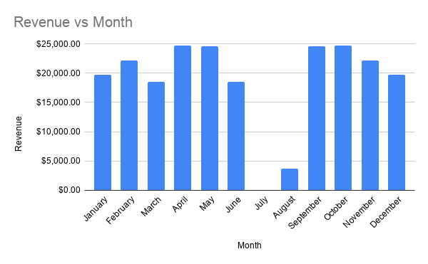

# Make data readable

Data can tell rich stories, but sometimes the numbers get in the way.

For example: can you see the story in this:
> Jan-Dec:  $19,752.96, $22,222.08, $18,518.40, $24,691.20, $24,675.40, $18,518.40, $0.00, $3,703.68, $24,580.60, $24,691.20, $22,222.08, $19,752.96

How about now:

 
  
  <i>pattern</i>: revenue drops during summer and winter breaks 
    <i>meaning</i>: a business cycle tied to the academic calendar 

Same data, but one presentation overwhelmed our ability to hold that much data in our head and make sense of it.  

We are pretty goood at doing that - the brain continually searches for patterns and unconsciously interprets them - we just need a little help sometimes.

We can make it easier for ourselves to see the patterns and extract meaning from data just by making small changes to the numbers themselves.

Does this make the story more clear?  
> Jan-Dec:  $20,000, $22,000, $19,000, $25,000, $25,000, $19,000, $0, $4,000, $25,000, $25,000, $22,000, $20,000 

I see a story of consistent revenue that falls off a cliff in July/August, and returns immediately.  Once we look closely, we can see Spring Break and Winter Vacation, even Thanksgiving.  

Our eyes _receive_ numbers as originally shown, but our brains _see_ them as just above. This library accelerates what we are *already* doing.

This library makes data more readable, helping us see the patterns and relationships, and find the stories hidden within.

## Implementations

| Platform | Location | Install |
| :---- | :---- | :---- |
| Google Sheets | [js/](https://www.google.com/search?q=./js/) | [Copy template](https://docs.google.com/spreadsheets/d/1GdHvYk3dVzJErrGH7yDULW6srM0gaHeYMGMn3k0-GY4) |
| Python | [python/](https://www.google.com/search?q=./python/) | pip install dynamic-rounding |
| Chrome Extension | [chrome-extension/](https://www.google.com/search?q=./chrome-extension/) | [Load unpacked](https://developer.chrome.com/docs/extensions/mv3/getstarted/development-basics/#load-unpacked) |

## Quick Examples

### Chrome Extension
[(]1 minute video demo](https://share.descript.com/view/Y76MAoqM06p)

[Chrome Extension README](chrome-extension/README.md)

### Google Sheets

* \=ROUND\_DYNAMIC(87054321) \-\> 85,000,000  
* \=ROUND\_DYNAMIC(A1:A10)   \-\> rounds entire range with set-aware precision

### Python

* `from dynamic_rounding import round_dynamic`  
* \# Single value: `round_dynamic(87054321)` \-\> 85,000,000  
* \# Dataset: (larger values get finer precision):  `round_dynamic([4428910, 983321, 42109])` \-\> \[4,500,000, 1,000,000, 40,000\]

### Python with pandas

* `from dynamic_rounding.pandas import round_dynamic_series`  
* \# round entire series with set-aware precision:  
* `round_dynamic_series(df['revenue'])`

--- 

## Documentation

* [Design Doc](https://www.google.com/search?q=./docs/design.md) — Algorithm and concepts  
* [Google Sheets README](https://www.google.com/search?q=./js/README.md) — Full Sheets documentation  
* [Python README](https://www.google.com/search?q=./python/README.md) — Full Python documentation
* [Chrome Extension README](https://www.google.com/search?q=./chrome-extension/README.md) — Browser-based simplification

## License

MIT
