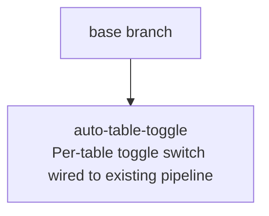

# Sprint Plan: Per-Table Auto-Injected Toggle Switch

**Status:** COMPLETED
**Created:** 2026-05-25
**Base branch:** main
**Slug:** auto-table-toggle

## 1. Repo Survey

Monorepo housing three implementations of the Dynamic Rounding algorithm:

- `js/` — Google Sheets Apps Script port (`round_dynamic.js`) with a Node-runnable test harness (`tests.js`).
- `python/` — `pip`-installable package.
- `chrome-extension/` — Manifest V3 Chrome extension (the target of this plan). Files: `manifest.json`, `background.js` (service worker, owns the context menu), `content.js` (DOM logic and the inlined rounding algorithm), `defaults.js` (single source of truth for sidebar + content-script defaults), `sidebar.html` / `sidebar.js` (options UI), `tests.js` (Node harness that `eval`s `content.js` against a stub `document`/`chrome`).

Existing patterns relevant to this feature:

- **Context menu pipeline (`background.js:11-22`)** registers two items: `"Toggle readable data"` (`dr-action`) and the sidebar opener.
- **Per-table state in `content.js`:** rounded cells get class `dr-ext-rounded`; the table itself gets `dataset.drShowingOriginal = 'true'` when the user has flipped back to originals while leaving the rounded values cached on the cells (`content.js:684-707`).
- **Per-table options memory:** `tableOptions` WeakMap (`content.js:29`) remembers the options used for the most recent `roundTable()` run so the toggle path re-renders consistently.
- **Overlay convention:** `flashRangePulse` (`content.js:166-224`) shows how the extension already creates absolutely-positioned overlay divs on `document.body` aligned to a table's `getBoundingClientRect()` — the same shape this feature needs.
- **Tests run in Node** via `eval` of `content.js` against stubbed `document` / `chrome` / `window` (`chrome-extension/tests.js:13-30`).

Languages: JavaScript (vanilla, no bundler, no framework). No TypeScript. No CSS preprocessor; styles are injected via `<style>` tags from JS.

## 2. Repo Conventions

- **Version files:**
  - `chrome-extension/manifest.json` — `version` key, integer-dot format (1-4 components).
  - `python/pyproject.toml` — semver in `version =` line.
  - `js/CHANGELOG.md` — informational changelog (not auto-bumped).
- **Test command:** `node chrome-extension/tests.js` (and `node js/tests.js` for the Sheets port; not touched by this plan).
- **Lint:** none configured.
- **Format:** none configured.
- **Build:** none (extension is loaded unpacked).
- **Branch naming:** `feature/<label>` per CONTRIBUTING.md.
- **Commit convention:** plain, descriptive. Recent merged-sprint commits use prefixes like `Sprint <label>: <subject>`.
- **PR template:** none.
- **Version-bump workflow:** detected at `.github/workflows/bump-version.yml` — triggers on `pull_request: types: [closed]` with `if: github.event.pull_request.merged == true`, bumps `chrome-extension/manifest.json` patch component when files under `chrome-extension/**` change. Sprint commits in this plan do **not** modify `manifest.json`.

## 3. Design

### 3.1 Reuse the existing toggle pipeline; do not duplicate it

The user request explicitly states the switch must kick off the same action as the `"Toggle readable data"` context-menu item. That handler lives in `content.js:39-59` (the `MENU_CLICKED` branch). It already has the round-vs-untoggle branching encoded:

- If the table has no `.dr-ext-rounded` cells → `roundTable(table)`.
- Otherwise → `toggleOriginalValues(table)` (which flips between rounded and pristine views).

**Decision:** The new switch invokes the same code path. We extract the body of the `MENU_CLICKED` branch into a small named function (e.g. `runToggleAction(table)`) and call it from both the context-menu listener and the switch's `change` event.

*Principle: simple components / minimize design-time coupling — one pipeline, two entry points, no parallel behavior to keep in lockstep.*

*Alternative considered:* synthesizing a `chrome.runtime.sendMessage({ action: 'MENU_CLICKED' })` from the switch. Rejected because `MENU_CLICKED` is dispatched from the service worker to the content script, and the switch already lives in the content script — bouncing the message through the service worker would be a runtime round-trip with no benefit. *Principle: efficient interactions — prefer local to distributed.*

### 3.2 Switch lives in a body-level overlay, not inside the table

Inserting the switch as a child of the `<table>` (e.g. as a `<caption>` or absolutely-positioned `<div>` inside a cell) risks breaking host-page layout (column widths, sort behavior, CSS selectors). The existing `flashRangePulse` overlay (`content.js:209-223`) demonstrates the safe alternative: an absolutely-positioned div appended to `document.body`, sized and placed by the table's `getBoundingClientRect()` offset by `window.scrollX`/`scrollY`.

**Decision:** Each toggle is a `<label class="dr-ext-toggle">` containing an `<input type="checkbox">` and a styled `<span class="dr-ext-toggle-slider">`, appended to `document.body` (or a single shared `document.body`-level container), with `position: absolute` and `z-index: 2147483646` (one less than the range-pulse so the pulse can still draw over it during a flash).

The DOM relationship between switch and table is tracked via a `WeakMap<HTMLTableElement, HTMLLabelElement>`. The reverse lookup (switch → table) is via a `WeakRef` or a closure on the `change` handler — `WeakMap` keys must be objects, so for the reverse we use a closure to avoid leaking.

*Principle: simple interactions; minimize runtime coupling with the host page's CSS.*

### 3.3 Positioning is reactive, not polled

The switch must stay glued to the table's upper-right corner as the user scrolls, resizes the window, or as the host page reflows. Polling with `requestAnimationFrame` would burn CPU on every page. Listening to `scroll` and `resize` on `window` (with `{ passive: true }`) plus a `ResizeObserver` on each tracked `<table>` covers the cases the user will see. We do **not** observe arbitrary DOM mutations that might re-flow the page; the next `scroll`/`resize`/`ResizeObserver` tick will catch it, and intermediate jitter is acceptable.

*Principle: efficient interactions.*

### 3.4 Dynamically-added tables

Modern host pages render tables after initial load (SPAs, lazy-loaded reports). A `MutationObserver` on `document.body` watching for added `<table>` elements (and added subtrees that contain `<table>` descendants) registers them as they appear. The observer is set up once at content-script init.

*Alternative considered:* `IntersectionObserver` to defer until the table is in view. Rejected — switch creation is cheap (a single label + 2 children), and not having the switch ready when the table scrolls into view would feel laggy.

### 3.5 Switch state ↔ table state synchronization

The switch is the visual representation of "is this table currently showing rounded values?" — *not* a separate piece of state. The source of truth is the existing per-table state already encoded in the DOM (`.dr-ext-rounded` cells + `dataset.drShowingOriginal`). We add one helper:

```
isTableRounded(table) =
  table.querySelector('.dr-ext-rounded') !== null
  && table.dataset.drShowingOriginal !== 'true'
```

The switch's `checked` property is set from this on every state transition:
- After `roundTable` / `toggleOriginalValues` / `resetTable` runs, regardless of trigger (context menu, sidebar, or the switch itself).

We add a single function `syncSwitchForTable(table)` and call it at the end of every code path that mutates table state. This is the only "coupling" cost paid for adding the switch.

*Principle: prefer ACID over BASE — one observable source of truth (the DOM), not a parallel state variable.*

### 3.6 Default state and definition of "table"

- **Default:** unchecked. Matches the user request and aligns with the current default behavior (tables are not rounded until the user asks).
- **What counts as a table:** every `<table>` in the document on initial scan and every `<table>` added later via MutationObserver. No size filter in this sprint — host pages occasionally use `<table>` for layout, but adding a size heuristic is a polish concern best deferred so we don't ship a guess that silently hides the switch from a real data table. Tracked in Open Questions.

### 3.7 Styling

A standard iOS-style toggle switch implemented in pure CSS, injected via a `<style>` tag (same pattern as `ensureHighlightStyleInjected`). Track + thumb, ~36×20 px, blue when on (matches the existing `rgba(66, 133, 244, …)` brand color used elsewhere in `content.js`), grey when off. No label text. `z-index: 2147483646`, `position: absolute`. The switch is offset 4 px inside the table's top-right corner.

## 4. Sprint List & Dependency Graph

### Sprint List

1. **`auto-table-toggle`** — Core feature: scan `<table>`s on load, inject a body-level overlay toggle switch positioned at each table's upper-right corner, wire the switch's `change` event to the existing toggle pipeline (extracted into a shared `runToggleAction` helper), and keep the switch state in sync with table state across all entry points (context menu, sidebar, switch). Includes MutationObserver for dynamically-added tables, scroll/resize/ResizeObserver-driven repositioning, and unit tests for the pure helpers. **Depends on:** none.

Only one sprint is proposed. The feature is small and cohesive; further decomposition would create a linear chain whose intermediate states (switch present but inert, or wired but with no positioning) ship visible UI that doesn't work — worse than no UI. Polish items (sidebar opt-out, size-based filtering, hidden-table handling) are listed in §7 as a follow-up sprint-stack candidate.

### Dependency Graph



## 5. Sprint Definitions

### auto-table-toggle

- **Goal:** On every page the extension runs on, inject an unobtrusive toggle switch at the upper-right corner of every `<table>`. Flipping the switch invokes the same code path as the "Toggle readable data" context-menu item, and the switch's checked state always reflects whether the table is currently showing rounded values.
- **Scope:**
  - `chrome-extension/content.js`:
    - Extract `MENU_CLICKED` body into a named helper `runToggleAction(table)`.
    - Add `injectTableToggles()` — initial scan over `document.querySelectorAll('table')`, creating one overlay switch per table via a new `createToggleForTable(table)` function. Run on `DOMContentLoaded` (or immediately if document is already interactive).
    - Add MutationObserver on `document.body` (`childList: true, subtree: true`) that picks up added `<table>` nodes and added subtrees containing tables.
    - Add positioning logic: `positionToggle(table, switchEl)` using `getBoundingClientRect()` + `window.scrollX/Y`. Hook to `window` `scroll` and `resize` events (passive) and a per-table `ResizeObserver`. Use a single `requestAnimationFrame`-coalesced reposition to avoid layout thrash when many tables exist.
    - Add a CSS injector `ensureToggleStyleInjected()` following the `ensureHighlightStyleInjected` pattern: track + thumb, blue-on / grey-off, 36×20 px, no label.
    - Add `isTableRounded(table)` and `syncSwitchForTable(table)` helpers; call `syncSwitchForTable` at the end of `roundTable`, `toggleOriginalValues`, `resetTable`, and `applySidebarRounding`.
    - Wire the `<input>`'s `change` event to `runToggleAction(table)` followed by `syncSwitchForTable(table)`.
    - Tear down: remove the overlay switch and stop observers for a table that is removed from the DOM (caught via the same MutationObserver's `removedNodes`).
  - `chrome-extension/tests.js`:
    - Add tests for `isTableRounded` (covering: fresh table, rounded table, table flipped back to original).
    - Add a test that exercises `runToggleAction` against a stub `<table>` with cell stubs (similar in shape to existing tests that build minimal DOM stubs).
    - Add a test that `syncSwitchForTable` sets `checkbox.checked` to match `isTableRounded` output.
- **Out of scope:**
  - Sidebar option to globally enable/disable the auto-injected switches.
  - Minimum-table-size heuristic to skip layout `<table>`s.
  - Hiding the switch when the table is off-screen or hidden via `display: none` / `visibility: hidden`.
  - Touch-device or accessibility (ARIA, keyboard) tuning beyond what the native `<input type="checkbox">` already provides.
  - Any change to the `MENU_CLICKED` semantics — the extraction is mechanical.
  - Any change to `manifest.json` (versioning is handled by the merge-time workflow).
- **Acceptance criteria:**
  - Loading a page with one or more `<table>` elements injects exactly one toggle switch per table, positioned within ~5 px of the table's top-right corner.
  - The switch is unchecked when first injected on a never-rounded table.
  - Flipping the switch on rounds the table (cells gain `.dr-ext-rounded`, visual text changes).
  - Flipping the switch off restores the original cell text (cells are not necessarily un-classed but `dataset.drShowingOriginal` is `'true'`).
  - Right-clicking the same table and choosing "Toggle readable data" updates the switch's checked state to match the resulting view.
  - Opening the sidebar and applying settings updates the switch's checked state to match.
  - Tables added to the DOM after page load receive a switch within one MutationObserver tick.
  - Scrolling and resizing the window keeps the switch glued to the table's top-right corner.
  - `node chrome-extension/tests.js` passes, including the new tests.
- **Depends on:** none
- **Complexity:** M
- **Dev notes:**
  - Follow the `ensureHighlightStyleInjected` pattern: a module-scoped boolean guards a single `<style>` injection.
  - The overlay should be appended to `document.body || document.documentElement` (same fallback as `flashRangePulse`).
  - Use `z-index: 2147483646` so it sits just below the range-pulse (which is at `2147483647`) — flashing should remain visible over the switch.
  - Stop event propagation on the switch's `click`/`mousedown` so it doesn't trigger host-page handlers, but **do not** stop the `change` event itself.
  - When the MutationObserver sees a removed `<table>`, look it up in the WeakMap, remove its switch from the DOM, and disconnect its `ResizeObserver`. The WeakMap entry can be left to GC.
  - Test harness already stubs `document`, `chrome`, and `NodeFilter`. You will need to add stubs for `MutationObserver` and `ResizeObserver` (no-op classes are fine — the pure logic under test does not require real observer behavior; the integration-level wiring is exercised by direct calls).
  - Do not introduce any new top-level constants beyond what is necessary. Reuse `CLEAN_REGEX` etc. where applicable (none of these touch numeric parsing, so likely no overlap).
  - Keep the new code grouped after `ensureHighlightStyleInjected` in `content.js` to mirror the existing "UI overlay" section of the file.

## 6. Open Questions

None currently open — see Backlog for deferred items.

## 7. Backlog (Deferred to Future Sprint)

These were open questions resolved by deferral — none block the current sprint stack.

| Item | Notes |
|---|---|
| **Opt-in toggle** | Add `DR_DEFAULTS.showAutoToggle` flag + sidebar UI to disable auto-injection globally. |
| **Layout `<table>` exclusion** | Heuristic to suppress switches on tables with no numeric cells, or fewer than 2×2 cells. |
| **Off-screen / hidden-table suppression** | Hide switch when table rect is zero-area (`display:none`, `visibility:hidden`, or scrolled offscreen). |
| **Accessibility pass** | ARIA label, visible focus ring, keyboard activation beyond native checkbox. |
| **Mobile / touch tuning** | Chrome on Android via WebView, if relevant. |
| **Host-page allow/blocklist** | Per-site setting for users who want auto-injection only on specific sites. |

Each item is independent of the others and would be a small sprint rooted at `base`.

## 8. Out of Scope (Separate Sprint-Stack)

Nothing remaining — former §7 items have been folded into the Backlog above.

## Decisions Log

- 2026-05-25: Initial draft generated by sprint-plan skill.
- 2026-05-25: Open questions resolved (all deferred to backlog). Single-sprint approach approved by user.
