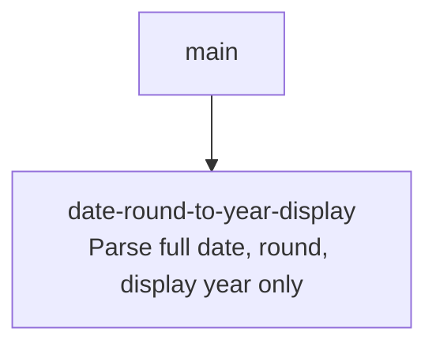

# Sprint Plan: Round Dates to a Bare Year (strip month/day) in the Chrome Extension

**Status:** DRAFT
**Created:** 2026-05-27
**Base branch:** main
**Slug:** date-round-to-year-display

## 1. Repo Survey

Monorepo with three implementations of Dynamic Rounding:

- `js/round_dynamic.js` — Google Sheets Apps Script port. No date logic (dates pass through; see `js/tests.js:279`).
- `python/dynamic_rounding/` — pip package. No date logic.
- `chrome-extension/` — Manifest V3 extension. Date detection and rounding live here, in `content.js`:
  - `isYearValue` (`content.js:755`) — matches bare 4-digit years in `[1900, 2099]`.
  - `DATE_REGEXES` / `isDateLike` (`content.js:761-778`) — matches ISO, US-slash, US-dash, and several month-name forms.
  - `roundDateText` (`content.js:785-797`) — current implementation extracts the year, replaces just those four characters in the original string, and returns `null` at year-granularity (no-op).
  - Dispatch site: `content.js:609-611` — when a row is in `mode: 'date'`, the cell text is replaced by `roundDateText(originalValue, opts.dateGranularity)`.
- `chrome-extension/tests.js` — Node harness that `eval`s `content.js` against stubbed `document`/`chrome`/`window`. Contains existing coverage for `isYearValue`, `isDateLike`, exclusion routing, and a small set of `roundDateText` cases (search `roundDateText` in tests for context).

Sidebar (`chrome-extension/sidebar.html:231-238`, `sidebar.js`) exposes the granularity selector `year | decade | century`, default `decade` (`defaults.js:17`).

## 2. Repo Conventions

- **Version files:**
  - `chrome-extension/manifest.json` — `version` key, integer-dot format (1-4 components).
  - `python/pyproject.toml` — semver in `version =` line.
  - `js/CHANGELOG.md` — informational changelog (not auto-bumped).
- **Test command:** `node chrome-extension/tests.js` (and `node js/tests.js`; not touched by this plan).
- **Lint:** none configured.
- **Format:** none configured.
- **Build:** none (extension is loaded unpacked).
- **Branch naming:** `feature/<label>` per CONTRIBUTING.md and CLAUDE.md (never `claude/`).
- **Commit convention:** plain, descriptive. Recent merged sprints use `Sprint <label>: <subject>`.
- **PR template:** none.
- **Version-bump workflow:** detected at `.github/workflows/bump-version.yml` — triggers on `pull_request: types: [closed]` with `if: github.event.pull_request.merged == true`, bumps `chrome-extension/manifest.json` patch when files under `chrome-extension/**` change. Sprint commits in this plan must **not** modify `manifest.json`.

## 3. Design

### 3.1 Round the whole date, not just the year substring

Today, `roundDateText` does a substring splice: it finds the 4-digit year in the original cell, replaces it, and leaves the month/day characters in place. That is the bug shown in the issue screenshots — "Jun 21, 2025" becomes "Jun 21, 2020" instead of just `2020`.

**Decision:** rework `roundDateText` into a two-stage function:

1. **Parse** the cell text into a `{year, month, day}` triple. Reuse the existing `DATE_REGEXES` shapes but in capturing form (one parser per shape, returning a normalized triple). `month` and `day` default to `1` when absent (e.g. "Mar 2024", bare year). Month names are mapped via the same `MONTH_NAMES` token list used today.
2. **Round** the triple to a year:
   - `year` granularity → round to the nearest whole year using a month/day-of-year test (`month >= 7` rounds up; `Jun 21` rounds down, `Dec 21` rounds up — matches the issue's stated examples).
   - `decade` granularity → `Math.floor(year / 10) * 10`.
   - `century` granularity → `Math.floor(year / 100) * 100`.
3. **Materialize** the result as Jan 1 of the rounded year internally (a `Date(year, 0, 1)`), per the user's invariant that the internal representation is `<year>/01/01` in all three cases.
4. **Return** only the 4-digit year string for display.

Returning `null` (current sentinel for "no change") still applies if parsing fails, so non-date strings flow through untouched.

*Principle: simple components — one parser, one rounder, one formatter; no string-splicing.*

### 3.2 Internal-date object is local to the function

The user asked that the "internal representation" be Jan 1 of the rounded year. There is no persistent date model in the extension — cells are strings flowing through `roundTable`. To honor the request without overbuilding, the Jan-1 `Date` is constructed inside `roundDateText` (for clarity and as a hook for future use) but the function still returns a display string. We do not introduce a per-cell `Date` model.

*Principle: minimize design-time coupling — no new data type leaks into `roundTable`.*

*Alternative considered:* skip the `Date` allocation entirely and just return `String(roundedYear)`. Rejected (mildly) because constructing the `Date(year, 0, 1)` makes the semantic the user described explicit in code and gives us one obvious extension point if the dispatch site ever wants the full date later.

### 3.3 Display is just the year

The dispatch site (`content.js:609-611`) writes the returned string directly into `cell.textContent`. Returning a bare 4-digit year therefore satisfies the display requirement without any change to the dispatch code.

Edge cases:
- Bare-year input (e.g. `"2018"`) with `decade` granularity already produces a 4-digit string; the new behavior keeps it 4-digit (`"2010"`).
- Inputs without an extractable year (e.g. `"14 March"`) return `null`, unchanged behavior.
- Two-digit-year slash/dash dates (e.g. `"3/14/24"`): current `DATE_REGEXES` accepts them, but `roundDateText`'s year matcher only handles 19xx/20xx. We preserve current behavior (return `null`) and flag this as an open question rather than expanding scope.

### 3.4 One sprint, not two

Parsing, rounding, and display formatting are one tightly-coupled refactor of a ~10-line function plus its tests. Splitting parse-vs-format into separate sprints would create a dependency edge with no independent value at either end. Keep it as a single sprint.

*Principle: simple components / fast deployment pipeline — small atomic change, single PR, single review.*

## 4. Sprint List & Dependency Graph

### Sprint List

1. **`date-round-to-year-display`** — rework `roundDateText` to parse the full date, round per granularity (year=nearest, decade/century=floor), and return only the rounded year as the displayed string. Update tests to cover the issue's examples and the existing date shapes. *Depends on: none.*

### Dependency Graph

## 5. Sprint Definitions

### date-round-to-year-display

- **Goal:** Round date cells to a whole year and display only the year, matching the user-described semantics for year / decade / century granularities.
- **Scope:**
  - `chrome-extension/content.js` — rewrite `roundDateText` (and add a small `parseDateLike` helper if it keeps the rewrite readable). Do not change the dispatch site at `content.js:609-611`; do not change `isDateLike` / `isYearValue` / `DATE_REGEXES`.
  - `chrome-extension/tests.js` — add cases for each granularity covering the user's examples (`Jun 21, 2020`, `Dec 21, 2020`), each `DATE_REGEXES` shape, and the bare-year case. Update any existing `roundDateText` assertions that previously expected the year-substituted-in-place format.
- **Out of scope:**
  - JS / Python implementations (no date logic there).
  - Changing the granularity selector UI or its defaults.
  - Supporting new date shapes (e.g. two-digit-year `3/14/24`, quarter-style `Q1 2024`).
  - Persisting a date object beyond `roundDateText`'s local scope.
  - Any bump of `chrome-extension/manifest.json` (the merge-time workflow handles it).
- **Acceptance criteria:**
  - At `year` granularity, `Jun 21, 2020` → `2020`; `Dec 21, 2020` → `2021`.
  - At `decade` granularity, `Jun 21, 2020` → `2020`; `Dec 21, 2020` → `2020`; `Jun 21, 2025` → `2020`; `Apr 11, 2026` → `2020`; `May 9, 2026` → `2020`.
  - At `century` granularity, `Jun 21, 2020` → `2000`; `Dec 21, 2020` → `2000`; any `19xx` → `1900`.
  - Bare year `2018` at `decade` → `2010`; at `century` → `2000`; at `year` → `2018` (no-op, may return `null`).
  - Non-date strings (`"hello"`, `"14 March"` without year) return `null` and remain unchanged in the cell.
  - `node chrome-extension/tests.js` passes; `node js/tests.js` passes.
- **Depends on:** none
- **Complexity:** S
- **Dev notes:**
  - Internally construct `new Date(roundedYear, 0, 1)` to make the "Jan 1 of rounded year" semantic explicit, then return `String(d.getFullYear())`. Do not use `toLocaleDateString` (locale-variable) or `toISOString` (timezone-shifted).
  - Reuse the `MONTH_NAMES` token list when building the parser; lowercase the matched month and look it up in a 12-entry map (`jan`→1, `feb`→2, `sep`/`sept`→9, etc.).
  - For the year-granularity "round up" rule, use `month >= 7` as the boundary so `Jun 21` rounds down and `Dec 21` rounds up — both stated by the user. If the user clarifies a finer rule (see Open Questions), adjust before merge.
  - Keep `roundDateText`'s `null` return as the "no change" sentinel; the dispatch site already treats `null` as "leave the cell alone".
  - When rewriting tests, prefer parameterized rows (input, granularity, expected) over many one-off `eq` calls to keep diff readable.

## 6. Open Questions

1. **Year-granularity boundary** — the user gave only Jun 21 (down) and Dec 21 (up). Plan uses `month >= 7` as the round-up boundary (so Jul 1 rounds up, Jun 30 rounds down). Acceptable, or do you want day-of-year ≥ 183, or some other rule?
2. **Decade / century rule** — plan uses `floor` (matches the existing code and all the screenshots' implied behavior). Confirm you don't want "nearest decade" (which would send `2026` → `2030`, not `2020`).
3. **Two-digit-year dates** (`3/14/24`) — current `roundDateText` ignores them (year matcher is 19xx/20xx). Plan preserves that. Worth a follow-up sprint, or out of scope forever?

## 7. Out of Scope (Separate Sprint-Stack)

- Expanding `DATE_REGEXES` to new shapes (two-digit years, quarters, fiscal years).
- Surfacing the rounded date as a tooltip alongside the displayed year.
- Applying the same rounding model in the `js/` Apps Script port (dates currently pass through there by design).

## Decisions Log

- 2026-05-27: Initial draft generated by sprint-plan skill.
