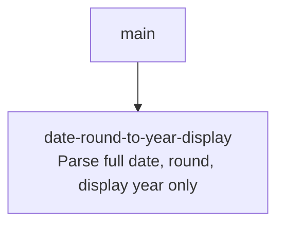

# Sprint Plan: Round Dates to a Bare Year (strip month/day) in the Chrome Extension

**Status:** DRAFT
**Created:** 2026-05-27
**Base branch:** main
**Slug:** date-round-to-year-display

## 1. Repo Survey

Monorepo with three implementations of Dynamic Rounding:

- `js/round_dynamic.js` — Google Sheets Apps Script port. No date logic (dates pass through; see `js/tests.js:279`).
- `python/dynamic_rounding/` — pip package. No date logic.
- `chrome-extension/` — Manifest V3 extension. Date detection and rounding live here, in `content.js`:
  - `isYearValue` (`content.js:755`) — matches bare 4-digit years in `[1900, 2099]`.
  - `DATE_REGEXES` / `isDateLike` (`content.js:761-778`) — matches ISO, US-slash, US-dash, and several month-name forms.
  - `roundDateText` (`content.js:785-797`) — current implementation extracts the year, replaces just those four characters in the original string, and returns `null` at year-granularity (no-op).
  - Dispatch site: `content.js:609-611` — when a row is in `mode: 'date'`, the cell text is replaced by `roundDateText(originalValue, opts.dateGranularity)`.
- `chrome-extension/tests.js` — Node harness that `eval`s `content.js` against stubbed `document`/`chrome`/`window`. Contains existing coverage for `isYearValue`, `isDateLike`, exclusion routing, and a small set of `roundDateText` cases (search `roundDateText` in tests for context).

Sidebar (`chrome-extension/sidebar.html:231-238`, `sidebar.js`) exposes the granularity selector `year | decade | century`, default `decade` (`defaults.js:17`).

## 2. Repo Conventions

- **Version files:**
  - `chrome-extension/manifest.json` — `version` key, integer-dot format (1-4 components).
  - `python/pyproject.toml` — semver in `version =` line.
  - `js/CHANGELOG.md` — informational changelog (not auto-bumped).
- **Test command:** `node chrome-extension/tests.js` (and `node js/tests.js`; not touched by this plan).
- **Lint:** none configured.
- **Format:** none configured.
- **Build:** none (extension is loaded unpacked).
- **Branch naming:** `feature/<label>` per CONTRIBUTING.md and CLAUDE.md (never `claude/`).
- **Commit convention:** plain, descriptive. Recent merged sprints use `Sprint <label>: <subject>`.
- **PR template:** none.
- **Version-bump workflow:** detected at `.github/workflows/bump-version.yml` — triggers on `pull_request: types: [closed]` with `if: github.event.pull_request.merged == true`, bumps `chrome-extension/manifest.json` patch when files under `chrome-extension/**` change. Sprint commits in this plan must **not** modify `manifest.json`.

## 3. Design

### 3.1 Round the whole date, not just the year substring

Today, `roundDateText` does a substring splice: it finds the 4-digit year in the original cell, replaces it, and leaves the month/day characters in place. That is the bug shown in the issue screenshots — "Jun 21, 2025" becomes "Jun 21, 2020" instead of just `2020`.

**Decision:** rework `roundDateText` into a three-stage function:

1. **Parse** the cell text into a `{year, month, day}` triple via a `parseDateLike` helper, which also replaces the regex-only `isDateLike` (now `isDateLike(t)` becomes `parseDateLike(t) !== null`). `month` and `day` default to `1` when absent (e.g. "Mar 2024", bare year). Month names are mapped via the existing `MONTH_NAMES` token list. See §3.4 for the shapes the parser must accept.
2. **Compute a fractional year** = `year + (month >= 7 ? 0.5 : 0)`. Jul 1 is the round-up boundary per user direction; Jun 30 rounds down, Jul 1 rounds up.
3. **Round to the appropriate base** using `Math.round` (half-up nearest), not floor:
   - `year` → `Math.round(fractional)`
   - `decade` → `Math.round(fractional / 10) * 10`
   - `century` → `Math.round(fractional / 100) * 100`
4. **Materialize** the result as Jan 1 of the rounded year internally (a `new Date(rounded, 0, 1)`), per the user's invariant that the internal representation is `<year>/01/01` in all three cases.
5. **Return** only the 4-digit year string for display.

Returning `null` (current sentinel for "no change") still applies if parsing fails, so non-date strings flow through untouched.

*Principle: simple components — one parser, one rounder, one formatter; no string-splicing.*

**Worked examples** (Jul 1 boundary, nearest rounding to base 1/10/100):

| input | fractional | year | decade | century |
| :-- | :-- | :-- | :-- | :-- |
| Jun 21, 2020 | 2020.0 | 2020 | 2020 | 2000 |
| Dec 21, 2020 | 2020.5 | 2021 | 2020 | 2000 |
| Jun 21, 2025 | 2025.0 | 2025 | 2030 | 2000 |
| Apr 11, 2026 | 2026.0 | 2026 | 2030 | 2000 |
| May 9, 2026  | 2026.0 | 2026 | 2030 | 2000 |
| Jun 30, 2024 | 2024.0 | 2024 | 2020 | 2000 |
| Jul 1, 2024  | 2024.5 | 2025 | 2020 | 2000 |
| 1975 (bare)  | 1975.0 | 1975 | 1980 | 2000 |

Note: with nearest-rounding instead of floor, the screenshots in the issue (which showed Jun 21, 2025 → 2020 at decade granularity) will *not* be reproduced — that was the buggy floor behavior. The new behavior sends Jun 21, 2025 to 2030 at decade granularity.

### 3.2 Internal-date object is local to the function

The user asked that the "internal representation" be Jan 1 of the rounded year. There is no persistent date model in the extension — cells are strings flowing through `roundTable`. To honor the request without overbuilding, the Jan-1 `Date` is constructed inside `roundDateText` (for clarity and as a hook for future use) but the function still returns a display string. We do not introduce a per-cell `Date` model.

*Principle: minimize design-time coupling — no new data type leaks into `roundTable`.*

*Alternative considered:* skip the `Date` allocation entirely and just return `String(roundedYear)`. Rejected (mildly) because constructing the `Date(year, 0, 1)` makes the semantic the user described explicit in code and gives us one obvious extension point if the dispatch site ever wants the full date later.

### 3.3 Display is just the year

The dispatch site (`content.js:609-611`) writes the returned string directly into `cell.textContent`. Returning a bare 4-digit year therefore satisfies the display requirement without any change to the dispatch code.

Edge cases:
- Bare-year input (e.g. `"2018"`) — `parseDateLike` returns `{year: 2018, month: 1, day: 1}`; the result is whatever the granularity rounds it to.
- Inputs without an extractable year (e.g. `"14 March"`) return `null`, unchanged behavior.

### 3.4 Date shapes the parser must accept

Per user direction, the same logical date (e.g. "Jun 21, 2020") must round identically regardless of which textual form it appears in. The parser must therefore accept at least these shapes (extending today's `DATE_REGEXES`):

| shape | example | notes |
| :-- | :-- | :-- |
| ISO dash | `2020-07-21` | already supported |
| ISO slash | `2020/07/21` | **new** — YYYY/MM/DD |
| US slash | `7/21/2020`, `3/14/24` | 4-digit already supported; **2-digit year is new** |
| US dash | `7-21-2020`, `3-14-24` | 4-digit already supported; **2-digit year is new** |
| Month-name, comma-year | `June 21, 2020`, `Jun 21, 2020` | already supported |
| Day-month-name-year | `21 June 2020` | already supported |
| Year month-name day | `2020 June 21` | **new** |
| Month-name year | `Jun 2020` | already supported; day defaults to 1 |
| Bare year | `2020` | already supported via `isYearValue` |

**Two-digit-year pivot:** map `00–49` → `20xx`, `50–99` → `19xx` (50-year Y2K convention, confirmed by user).

The parser is implemented as an ordered list of `(regex, extractor)` pairs. The first match wins. `isDateLike` is reimplemented as a thin wrapper (`parseDateLike(t) !== null`), preserving its existing call sites at `content.js:550` and `content.js:773`.

*Principle: minimize design-time coupling — replacing two parallel sources of truth (`DATE_REGEXES` for detection, the year-matcher inside `roundDateText` for extraction) with one parser used by both call sites.*

### 3.5 Column-level MDY/DMY auto-detect for all-numeric dates

All-numeric `N1/N2/Y` (or `N1-N2-Y`) shapes are ambiguous between US `M/D/Y` and EU `D/M/Y`. Per user direction, resolve the ambiguity at the *column* level using the other dates in that column as evidence, and pass the input through unchanged when no resolution is possible.

**Algorithm:**

1. After `cellInfo` is built (`content.js:583`) and before the rendering loop (`content.js:600`), add a pre-pass over each column `c`:
   - Collect every `mode: 'date'` cell in that column.
   - For each cell, attempt to parse with both `MDY` and `DMY` interpretations using the helper `parseAmbiguousNumericDate(text)` → `{mdyValid, dmyValid, n1, n2, year}`. A shape is "valid" if its month component is in `[1,12]` and its day component is in `[1, 31]`.
   - Determine the column's `formatHint`:
     - If every ambiguous cell admits MDY but at least one rejects DMY (i.e. some `n1 > 12`) → `MDY`.
     - If every ambiguous cell admits DMY but at least one rejects MDY (`n2 > 12`) → `DMY`.
     - Otherwise (every cell admits both, or the column has conflicting evidence) → `AMBIGUOUS`.
   - Default for a column with zero ambiguous cells → `MDY` (US bias, matches existing behavior).
2. Store the hint per column (`columnDateHints[c]`) and pass it into `roundDateText(text, granularity, columnDateHints[c])`.
3. Inside `roundDateText`/`parseDateLike`, when the matched shape is the all-numeric `N1/N2/Y` form:
   - If hint is `MDY` → month = `n1`, day = `n2`.
   - If hint is `DMY` → month = `n2`, day = `n1`.
   - If hint is `AMBIGUOUS` → return `null` (cell passes through unchanged).

Non-numeric shapes (`2020-07-21` ISO, named-month shapes) are unambiguous and never need the hint.

*Principle: simple interactions — the hint is a single scalar per column, computed once, threaded through one extra parameter; no shared mutable state.*

*Alternative considered:* attempting per-cell heuristic without column context (e.g. "if `n1 > 12`, must be DMY"). Rejected — the user explicitly asked for column-level reasoning, and a column where every date happens to have both components ≤ 12 (e.g. all January dates) would be silently misinterpreted under a per-cell rule.

### 3.6 Return value: always the year string for parsed dates

`roundDateText` returns:

- **a 4-digit year string** when the parser succeeds — even when the rounded year equals the input year. The dispatch site at `content.js:611` already short-circuits on `formattedValue === originalValue`, so a `Jan 1, 2020 → "2020"` "no-op" still gets rewritten (the display changes from "Jan 1, 2020" to "2020") while a bare-year `"2020" → "2020"` no-op skips the DOM write.
- **`null`** only when there is no parseable date (non-date string, or ambiguous all-numeric `M/D/Y` with no column-level resolution per §3.5). `null` is still required as a sentinel because the dispatch site treats `null` as "leave the cell alone" and any string return would overwrite the cell.

### 3.7 One sprint, not two

Parsing, rounding, column-level format detection, and display formatting are one tightly-coupled refactor of a small region of `content.js` plus its tests. Splitting them into separate sprints would create dependency edges with no independent value. Keep it as a single sprint.

*Principle: simple components / fast deployment pipeline — small atomic change, single PR, single review.*

## 4. Sprint List & Dependency Graph

### Sprint List

1. **`date-round-to-year-display`** — rework `roundDateText` to parse the full date, round per granularity (year=nearest, decade/century=floor), and return only the rounded year as the displayed string. Update tests to cover the issue's examples and the existing date shapes. *Depends on: none.*

### Dependency Graph

## 5. Sprint Definitions

### date-round-to-year-display

- **Goal:** Round date cells to a whole year and display only the year, matching the user-described semantics for year / decade / century granularities.
- **Scope:**
  - `chrome-extension/content.js` —
    - Add `parseDateLike(text, formatHint) → {year, month, day} | null` covering every shape listed in §3.4. `formatHint` is `'MDY' | 'DMY' | 'AMBIGUOUS'` and only affects the all-numeric `N1/N2/Y` and `N1-N2-Y` shapes; defaults to `'MDY'` so existing call sites that don't pass a hint behave like today.
    - Add `parseAmbiguousNumericDate(text) → {n1, n2, year} | null` used by the column pre-pass to test MDY/DMY validity without committing to either.
    - Add a column-level pre-pass (per §3.5) between `content.js:583` and `content.js:600` that computes `columnDateHints[c]` and pass `columnDateHints[c]` into `roundDateText` at `content.js:610`.
    - Reimplement `isDateLike` as `parseDateLike(text) !== null` (no hint needed for the exclusion check — the existing US-first default suffices for "is this date-shaped at all?"). The `DATE_REGEXES` array and the standalone `isYearValue` may be deleted, inlined into the parser, or retained as helpers — whichever leaves the smallest diff while keeping the call sites at `content.js:550` and `content.js:773` working.
    - Rewrite `roundDateText(text, granularity, formatHint)` per §3.1 (parse → fractional year → `Math.round` to base 1/10/100 → `new Date(rounded, 0, 1)` → return 4-digit year string). Always return the year string on successful parse; return `null` only when `parseDateLike` returns `null` (per §3.6).
    - The dispatch site at `content.js:609-611` keeps its existing `formattedValue === originalValue` short-circuit; the only edit there is threading the column hint into the call.
  - `chrome-extension/tests.js` —
    - Add a parameterized table of `(input, granularity, expected)` rows covering the §3.1 worked-examples table, plus at least one input per shape in §3.4 (including two-digit-year and `2020 June 21`).
    - Add tests for the column-level format detector covering: (a) column with a `13/04/2022` cell → DMY hint applied to sibling `03-04-2022` so it parses as Apr 3; (b) column with a `04/13/2022` cell → MDY; (c) all-ambiguous column → `03-04-2022` passes through unchanged.
    - Update existing `roundDateText` assertions that expected year-substituted-in-place output.
    - Extend `isDateLike` tests to cover the newly accepted shapes.
- **Out of scope:**
  - JS / Python implementations (no date logic there).
  - Changing the granularity selector UI or its defaults.
  - Quarter-style (`Q1 2024`), fiscal-year, week-number, or ordinal (`21st June 2020`) shapes.
  - Persisting a date object beyond `roundDateText`'s local scope.
  - Any bump of `chrome-extension/manifest.json` (the merge-time workflow handles it).
- **Acceptance criteria:**
  - All rows in the §3.1 worked-examples table produce the listed result.
  - The same logical date in different shapes produces the same output, e.g. all of `Jun 21, 2020`, `2020/06/21`, `2020-06-21`, `2020 June 21`, `06-21-2020`, `21 June 2020` → `2020` at year and decade granularities, `2000` at century.
  - Two-digit-year `3/14/24` parses to `2024-03-14` and rounds accordingly. Pivot at 50: `25` → 2025, `75` → 1975.
  - Column-level auto-detect: in a column where some cell disambiguates (`n > 12` on one side), all sibling all-numeric dates use the resolved MDY/DMY interpretation. In a fully ambiguous column, all-numeric dates pass through unchanged.
  - Non-date strings (`"hello"`, `"14 March"` without year) return `null` and remain unchanged in the cell.
  - On successful parse, `roundDateText` always returns the 4-digit year string (no `null` for "no change"). The dispatch site's existing `formattedValue === originalValue` short-circuit handles the bare-year no-op.
  - `node chrome-extension/tests.js` passes; `node js/tests.js` passes.
- **Depends on:** none
- **Complexity:** M
- **Dev notes:**
  - Internally construct `new Date(roundedYear, 0, 1)` to make the "Jan 1 of rounded year" semantic explicit, then return `String(d.getFullYear())`. Do not use `toLocaleDateString` (locale-variable) or `toISOString` (timezone-shifted).
  - Reuse the `MONTH_NAMES` token list; lowercase the matched month and look it up in a 12-entry map (`jan`→1, `feb`→2, `sep`/`sept`→9, etc.).
  - For two-digit years, normalize with the 50-year pivot: `yy < 50 ? 2000 + yy : 1900 + yy`. Constant lives next to the parser.
  - When the parser encounters an all-numeric `M/D/YY` (or `M-D-YY`) shape, parse as US order (month-first); this matches existing `^\d{1,2}/\d{1,2}/\d{2,4}$` behavior. Do *not* attempt EU `D/M/Y` disambiguation.
  - `Math.round` in JS rounds half-away-from-zero for positives, which is what we want (e.g. 2025.0 → 2030 at decade is *not* a tie, but Dec 31 of year 2024 → fractional 2024.5 → year 2025; both sides consistent).
  - Keep `roundDateText`'s `null` return as the "no change" sentinel; the dispatch site already treats `null` as "leave the cell alone".
  - When rewriting tests, prefer parameterized rows (input, granularity, expected) over many one-off `eq` calls to keep the diff readable.

## 6. Open Questions

_All open questions resolved 2026-05-27 — pivot at 50 (user confirmed), column-level MDY/DMY auto-detect with passthrough on ambiguous (per §3.5), always return the year string with `null` reserved for non-parseable input (per §3.6)._

## 7. Out of Scope (Separate Sprint-Stack)

- Expanding `DATE_REGEXES` to new shapes (two-digit years, quarters, fiscal years).
- Surfacing the rounded date as a tooltip alongside the displayed year.
- Applying the same rounding model in the `js/` Apps Script port (dates currently pass through there by design).

## Decisions Log

- 2026-05-27: Initial draft generated by sprint-plan skill.
- 2026-05-27: Switched year-boundary phrasing to "Jul 1", changed decade/century from floor to nearest-rounding, expanded accepted date shapes (YYYY/MM/DD, 2-digit-year US, `YYYY Month DD`).
- 2026-05-27: Added column-level MDY/DMY auto-detect with passthrough on ambiguous columns (§3.5); pinned return semantics to "always year string on parse, null only on parse failure" (§3.6).
