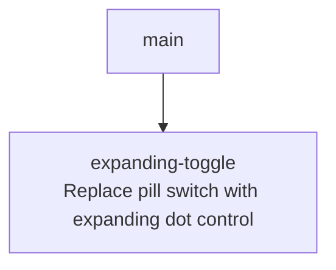

# Sprint Plan: Expanding Toggle

**Created:** 2026-06-01
**Base branch:** main
**Slug:** expanding-toggle

## 1. Repo Survey

Monorepo with three implementations of Dynamic Rounding (`js/`, `python/`, `chrome-extension/`). This plan targets `chrome-extension/` only; nothing in `js/`, `python/`, `docs/design.md`, or the Python/Sheets test harnesses is in scope.

The per-table toggle switch was introduced by the `auto-table-toggle` sprint and currently lives in `chrome-extension/content.js`:

- `ensureToggleStyleInjected()` (`content.js:152-201`) injects the CSS for `.dr-ext-toggle` (36×20 pill switch with 14×14 knob).
- `createToggleForTable(table)` (`content.js:244-291`) builds the DOM as `<label class="dr-ext-toggle"><input type=checkbox><span class="dr-ext-toggle-slider"></span></label>`, appends it to `document.body`, wires a `change` listener that calls `runToggleAction(table)`, attaches a `ResizeObserver` to the table, and registers the input in the `tableToggles` `WeakMap`.
- `positionToggle(table, labelEl)` (`content.js:203-222`) anchors the toggle to the table's top-right corner using `rect.right - 36 + 2` / `rect.top - 2` (the literal `36/20/14/3/2/16` values are hard-coded across the CSS template and the positioning math).
- `syncSwitchForTable(table)` (`content.js:144-149`) sets `input.checked = isTableRounded(table)`.
- `runToggleAction(table)` is the user-visible action: round if not rounded, restore originals if rounded.

This sprint replaces the 36×20 pill switch with an **expanding control** designed and prototyped interactively in `docs/toggle-choices.html` (card #7). At rest the visible part is a 10×10 dot; on hover (mouse) or tap (touch) it expands to a 28×16 compact switch with a sliding knob. The hit area is centered on the dot with 7px of transparent padding on every side, giving a 24×24 minimum tap target without enlarging the visible footprint.

`docs/toggle-choices.html` (added on this plan branch) is the canonical visual spec — the implementing sprint should refer to it for exact CSS values, geometry, and interaction nuances.

Languages: vanilla JS, no bundler, no framework. CSS is injected via `<style>` tags from JS.

## 2. Repo Conventions

- **Version files:**
  - `chrome-extension/manifest.json` — `version` key, 1-4 dot-separated integers (currently `2.0.0`).
  - `python/pyproject.toml` — semver in `version =` line.
  - `js/CHANGELOG.md` — informational only.
- **Test command:** `node chrome-extension/tests.js`
- **Lint / Format / Build:** none configured.
- **Branch naming:** `fix/<label>` for bug fixes, `feature/<label>` for new behavior, `refactor/<label>` for restructuring, per `CLAUDE.md`. Never `claude/`.
- **Commit convention:** `Sprint <label>: <subject>` for sprint-stack feature/test/log commits; plain `fix:`/`chore:`/`docs:` prefixes elsewhere.
- **PR template:** none.
- **Version-bump workflow:** detected at `.github/workflows/bump-version.yml` — triggers on `pull_request: types: [closed]` with `if: github.event.pull_request.merged == true && github.event.pull_request.user.login != 'github-actions[bot]'`, bumps `chrome-extension/manifest.json` patch when files under `chrome-extension/**` change. Sprint commits in this plan do **not** modify `manifest.json`.

## 3. Design

### 3.1 The control: 10px dot at rest, 28×16 compact switch on engagement

The visible part is a **10×10 circular dot** anchored to the table's top-right corner. On engagement (hover for mouse, tap for touch, focus for keyboard) it animates into a **28×16 rounded pill** with a 12×12 white knob whose horizontal position reflects `aria-pressed`. The dot's right edge is the anchored edge: when the dot expands into the pill, the right edge stays put and the pill grows leftward and downward. Color carries the rounded/not-rounded state at rest (off = `#cccccc`, on = `#3d85c6`) so the user can read state without expanding.

*Principle: simple components — one element with two visual states, sharing CSS transitions instead of swapping DOM. Color-as-state at rest means the user does not need to expand to read whether the table is rounded.*

*Alternative considered:* keeping the existing 36×20 pill switch in place but moving it above the table (the design from the prior `toggle-positioning` plan). Rejected because the prior plan's residual risks — the toggle overlapping content above the table, getting clipped by containers, disappearing under sticky headers — are not solvable by a fixed shift. Shrinking the at-rest footprint to a 10×10 dot reduces the overlap to a near-acceptable amount in-corner, and the on-demand expansion provides a full-size hit target only when the user is actively interacting.

### 3.2 Anchor: 8px overlap, 2px overhang (per axis)

The 10×10 dot is anchored such that:

- **Vertical:** 8px of the dot sits *below* the table top edge (inside the table), 2px sits *above* (outside).
- **Horizontal:** 8px of the dot sits *left of* the table's right edge (inside the table), 2px sits *right of* (outside).

In viewport coordinates:

```
visible.bottom = rect.top  + scrollY + TOGGLE_DOT_OVERLAP_PX        // = rect.top  + scrollY + 8
visible.right  = rect.right + scrollX + TOGGLE_DOT_OVERHANG_PX      // = rect.right + scrollX + 2
```

When the dot expands to the 28×16 pill, the **right edge stays anchored** at `rect.right + scrollX + 2`. The pill therefore grows to the left (leftward expansion happens entirely inside the table). The pill's bottom edge shifts down by `(TOGGLE_PILL_HEIGHT_PX − TOGGLE_DOT_PX) = 6` px relative to the dot's bottom; that temporary intrusion is acceptable because it only happens while the user is engaging.

*Principle: simple interactions — a single anchor (top-right corner of the visible) defines the rest geometry, and CSS handles the rest of the animation.*

### 3.3 Hit area: centered on the dot, 7px transparent buffer on every side

A `<button class="dr-ext-morph">` wraps the visible. The wrapper has `padding: 7px` on every side, giving a **24×24 hit target** around the 10×10 dot at rest. The wrapper is `display: inline-flex; justify-content: flex-end; align-items: flex-start;`, which keeps the visible anchored to the wrapper's top-right corner so the wrapper grows leftward and downward as the visible expands (matching §3.2's anchor).

The buffer must be present on **all four sides**, not only down-left. Earlier prototypes that padded only down-left exhibited two regressions: (i) approaching the dot from the top or right gave no padded entry zone, so the user's pointer hit the visible edge immediately; (ii) the visible's right edge coincided with the wrapper's right edge, so any frame in the expand animation that nudged the visible by ≥1px could push the cursor across the hover boundary and trigger an expand/collapse oscillation ("pointer shudder"). With 7px buffer on every side the cursor always crosses transparent padding before reaching the visible, and the visible's right edge never moves during the expand animation, so hover state is stable.

*Principle: minimize runtime coupling — the hit-target geometry does not depend on host-page layout or live measurements; a single CSS `padding` value plus flex anchoring is enough.*

### 3.4 Mouse vs touch behavior

The control needs two distinct interaction modes:

- **Mouse / trackpad** (devices with `(hover: hover)` and `(pointer: fine)`): hover expands; mouse-out collapses. A click toggles state.
- **Touch / pen** (devices with `(hover: none)`): there is no hover, so the control uses **tap-to-expand then tap-to-toggle**. The first tap adds an `.expanded` class but does not change state. The second tap (on the already-expanded pill) calls `runToggleAction(table)` and updates `aria-pressed`. The control auto-collapses after `TOUCH_AUTOCOLLAPSE_MS = 3000` ms of no interaction, or immediately when the user taps outside it.

The hover behavior is **CSS-only**, gated by `@media (hover: hover) and (pointer: fine)`. The touch behavior is **JS-only**, gated by `e.pointerType` at `pointerdown` — `'touch'` or `'pen'` triggers the two-tap path, anything else (`'mouse'`, `''`) triggers single-click toggling. Keyboard support comes for free via `:focus-visible`, which mirrors the expanded state; Space/Enter triggers `click`, which the same JS handler intercepts (mouse path: toggle state immediately).

*Principle: segregate by characteristics — input modalities are routed via the media query (CSS) and the captured pointer type (JS), not via user-agent sniffing or device-class guesses.*

### 3.5 Color and named constants

Replace the existing `rgba(66, 133, 244, 1)` accent (`#4285f4`) with the softer `#3d85c6`. The new color is the on-state for the visible body; `#ffffff` remains the knob; `#cccccc` remains the off-state.

The implementing sprint must extract every literal that has cross-site meaning into a module-level constant. The geometry literals appear in both the CSS template (interpolated) and the positioning math, and they must move in lockstep — naming each one is what keeps them aligned.

Constants to introduce at the top of `chrome-extension/content.js`:

- `TOGGLE_DOT_PX = 10` — visible dot diameter at rest
- `TOGGLE_PILL_WIDTH_PX = 28` — visible pill width when expanded
- `TOGGLE_PILL_HEIGHT_PX = 16` — visible pill height when expanded
- `TOGGLE_KNOB_PX = 12` — knob diameter inside the expanded pill
- `TOGGLE_KNOB_INSET_PX = 2` — knob inset from the pill's left/right edges
- `TOGGLE_KNOB_TRAVEL_PX = TOGGLE_PILL_WIDTH_PX - TOGGLE_KNOB_PX - 2 * TOGGLE_KNOB_INSET_PX` — derived, not literal
- `TOGGLE_HIT_PAD_PX = 7` — transparent buffer on every side of the visible
- `TOGGLE_DOT_OVERLAP_PX = 8` — px of the dot inside the table on the y axis
- `TOGGLE_DOT_OVERHANG_PX = 2` — px of the dot past the table's right edge on the x axis
- `TOGGLE_COLOR_ON = '#3d85c6'`
- `TOGGLE_COLOR_OFF = '#cccccc'`
- `TOUCH_AUTOCOLLAPSE_MS = 3000`

The CSS template in `ensureToggleStyleInjected` must be converted from a static template literal to one that interpolates these constants, so the JS positioning math and the CSS visual remain in lockstep automatically.

*Principle: named constants over magic numbers — the same values appear in the JS positioning math and the CSS template; defining them once is the only way to keep them consistent.*

### 3.6 Wire-up: same `runToggleAction`, same `syncSwitchForTable`, new DOM

`runToggleAction(table)` (the round / restore pipeline) is unchanged. The integration points change:

- `createToggleForTable(table)` builds the new DOM (`<button class="dr-ext-morph"><span class="dr-ext-morph-visible"><span class="dr-ext-morph-knob"></span></span></button>`) and replaces the `<label>+<input type=checkbox>+<span>` triple.
- `tableToggles` stores the `<button>` element (not the checkbox input).
- `syncSwitchForTable(table)` sets `button.setAttribute('aria-pressed', isTableRounded(table) ? 'true' : 'false')` instead of `input.checked = …`.
- The `click` handler implements §3.4's mouse-vs-touch routing.
- `keydown` Enter handling (and Space, which Buttons handle natively) calls `click`.
- The existing `click` / `mousedown` propagation-stoppers stay so host-page handlers do not fire underneath.
- The `ResizeObserver` and `MutationObserver` wiring is unchanged.

`positionToggle` is rewritten to anchor by the **visible inner element**, not the wrapper button, since the wrapper's padded edges extend beyond the visible. Concretely:

```js
const padding = TOGGLE_HIT_PAD_PX;
const wrapperLeft = (rect.right + scrollX + TOGGLE_DOT_OVERHANG_PX) - (TOGGLE_DOT_PX + 2 * padding);
const wrapperTop  = (rect.top   + scrollY + TOGGLE_DOT_OVERLAP_PX)  - TOGGLE_DOT_PX - padding;
buttonEl.style.left = wrapperLeft + 'px';
buttonEl.style.top  = wrapperTop  + 'px';
```

The visible's `bottom = rect.top + scrollY + TOGGLE_DOT_OVERLAP_PX` and `right = rect.right + scrollX + TOGGLE_DOT_OVERHANG_PX` follow from the wrapper geometry plus the inline-flex anchoring.

*Principle: minimize design-time coupling — the only public touch-point with the host page is still the `<button>` appended to `document.body` and the table-bounding-rect read. Nothing else about the round/restore pipeline changes.*

## 4. Sprint List & Dependency Graph

### Sprint List

1. **expanding-toggle** — Replace the 36×20 pill switch with the 10×10 dot that expands to a 28×16 compact switch on hover/tap, with all geometry consolidated into named constants. Depends on: none.

### Dependency Graph



## 5. Sprint Definitions

### expanding-toggle

- **Goal:** Replace the per-table 36×20 pill switch with a 10×10 dot anchored at the table's top-right corner (8px overlap, 2px overhang) that expands into a 28×16 compact switch on mouse hover or touch tap, with a 7px transparent hit-target buffer on every side and the softer `#3d85c6` accent color. The visible control matches `docs/toggle-choices.html` card #7 exactly.
- **Scope:** `chrome-extension/content.js` only. Update `ensureToggleStyleInjected` to inject the new CSS (template literal that interpolates the geometry constants, including `@media (hover: hover) and (pointer: fine)` for the hover-grow rule). Update `createToggleForTable` to build a `<button class="dr-ext-morph">` with a `<span class="dr-ext-morph-visible">` and `<span class="dr-ext-morph-knob">`, append it to `document.body`, and wire the mouse-vs-touch click handler (see §3.4) plus a global `pointerdown` listener that collapses any expanded touch-mode control when the user taps outside it. Update `syncSwitchForTable` to set `aria-pressed` on the button. Rewrite `positionToggle` per §3.6 so the visible's bottom-right lands at the spec-defined anchor. Introduce the constants listed in §3.5 at module scope and use them everywhere they apply (CSS template interpolation and JS positioning math).
- **Out of scope:** Any change to `runToggleAction`, `roundTable`, `toggleOriginalValues`, `isTableRounded`, the `MutationObserver` / `ResizeObserver` plumbing, or any file other than `chrome-extension/content.js` and `chrome-extension/tests.js`. The `flashRangePulse`/highlight subsystem is unchanged. `manifest.json` version bump (handled at merge by the workflow). The `docs/toggle-choices.html` demo is the spec, not part of the production code — do not import from it. The original `dr-ext-toggle` class names are removed; no backwards compatibility is preserved.
- **Acceptance criteria:**
  - In default (rest) state, the visible part is a 10×10 circular dot anchored such that the bottom edge is `TOGGLE_DOT_OVERLAP_PX` (=8) px below the table's top edge and the right edge is `TOGGLE_DOT_OVERHANG_PX` (=2) px to the right of the table's right edge (both per §3.2).
  - The dot's fill color is `TOGGLE_COLOR_OFF` (=`#cccccc`) when the table is not rounded and `TOGGLE_COLOR_ON` (=`#3d85c6`) when it is — verified via `aria-pressed` reflecting `isTableRounded(table)`.
  - The hit target is at least 24×24 around the dot in rest state, achieved via `TOGGLE_HIT_PAD_PX` (=7) transparent padding on every side of the visible.
  - On `:focus-visible` (keyboard) and on `:hover` when the device matches `@media (hover: hover) and (pointer: fine)`, the visible expands to `TOGGLE_PILL_WIDTH_PX` × `TOGGLE_PILL_HEIGHT_PX` (=28×16) with a `TOGGLE_KNOB_PX` (=12) knob that translates by `TOGGLE_KNOB_TRAVEL_PX` (=`28 − 12 − 2·2 = 12`) px when `aria-pressed="true"`. The visible's right edge does not move during expansion.
  - On a `click` whose preceding `pointerdown` had `pointerType` of `'touch'` or `'pen'`, a control with no `.expanded` class adds the class and does **not** change `aria-pressed`; a control that already has `.expanded` calls `runToggleAction(table)` and updates `aria-pressed` via `syncSwitchForTable`. On a `click` whose preceding `pointerdown` had any other `pointerType` (including `'mouse'` and `''`), `runToggleAction(table)` is called and `aria-pressed` updates immediately.
  - `.expanded` is removed automatically after `TOUCH_AUTOCOLLAPSE_MS` (=3000) ms of no interaction with the control, and immediately when a `pointerdown` outside the control is observed.
  - All toggle-geometry literals (`10`, `28`, `16`, `12`, `2`, `7`, `8`, `3000`) appear exactly once in the source, as the named constants listed in §3.5. The CSS template uses `${…}` interpolation rather than the literals.
  - `node chrome-extension/tests.js` passes.
  - Manual: load the unpacked extension, open Google Docs Word Count dialog, confirm the dot sits at the top-right of the table with 8px below the dialog's row 1 edge and 2px past the right edge, hover-grows on the mouse, taps-to-expand on touch, and toggles the rounding pipeline correctly when tapped a second time.
  - Manual: on a host page with multiple data tables, confirm every tracked table gets a dot, the dots reposition correctly on scroll/resize, and the colour reflects each table's individual rounding state.
- **Depends on:** none
- **Complexity:** M
- **Dev notes:** Constants live at module scope in `chrome-extension/content.js` per §3.5: `TOGGLE_DOT_PX`, `TOGGLE_PILL_WIDTH_PX`, `TOGGLE_PILL_HEIGHT_PX`, `TOGGLE_KNOB_PX`, `TOGGLE_KNOB_INSET_PX`, `TOGGLE_KNOB_TRAVEL_PX` (derived), `TOGGLE_HIT_PAD_PX`, `TOGGLE_DOT_OVERLAP_PX`, `TOGGLE_DOT_OVERHANG_PX`, `TOGGLE_COLOR_ON`, `TOGGLE_COLOR_OFF`, `TOUCH_AUTOCOLLAPSE_MS`. The CSS is the same shape as in `docs/toggle-choices.html` card #7 — copy structure and values from there. The `pointerType` capture must happen at `pointerdown` (not `click`) because `click` events do not carry pointer-type information reliably across browsers. Use `data-pointer-type` on the button to ferry the captured type from `pointerdown` into `click`. The `.expanded` class must be controllable from JS; do not implement the expand-on-touch path via CSS `:active` because that releases on `pointerup`. Existing tests asserting the old `.dr-ext-toggle` CSS classes or the `<input type=checkbox>` DOM will need to be removed or rewritten — they encode the previous design and should not gate the new one.

## 6. Open Questions

None.

## 7. Out of Scope (Separate Sprint-Stack)

None.

## Decisions Log

- 2026-06-01: Initial draft generated by sprint-plan skill, superseding the prior `toggle-positioning` plan (which targeted a positional shift rather than a control swap). The interactive spec lives in `docs/toggle-choices.html` (card #7), added on this plan branch.
