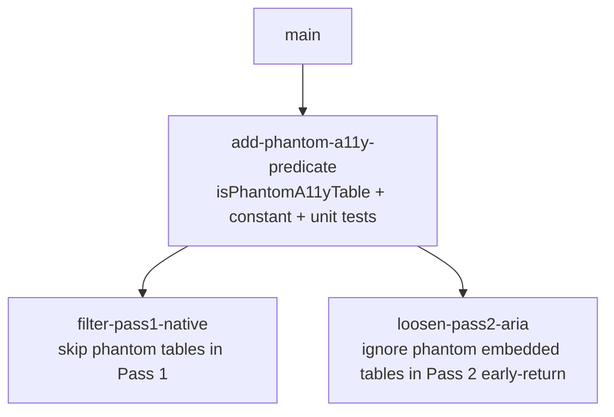

# Sprint Plan: Filter chart-accessibility tables out of auto-detection

**Created:** 2026-06-14
**Base branch:** main
**Slug:** filter-chart-a11y-tables
**Tracking issue:** [#128](https://github.com/ArieFisher/dynamic-rounding/issues/128)

## 1. Repo Survey

A monorepo with three implementations of the same "dynamic rounding" idea:

- `js/` — Google Sheets `ROUND_DYNAMIC` custom function (+ `js/tests.js`).
- `python/` — Python implementation.
- `chrome-extension/` — a Manifest V3 content-script extension that finds tabular data on web pages and attaches a morphing toggle that rounds the numbers in place.

The bug in issue #128 lives entirely in the **chrome-extension**. After the recent detection refactor (#127 extract `core.js`, #130 split `content.js` into layered modules, #132 move grid/table detection into `dom-adapters.js`), the relevant code is laid out as:

- `chrome-extension/core.js` — pure domain logic (rounding math), DOM-free.
- `chrome-extension/dom-adapters.js` — the detection layer: `GRID_ARIA_SELECTOR`, `makeAdapter`, `NativeTableAdapter`/`GridAdapter`, `isDataTable` (`dom-adapters.js:690`), `findTargetTable` (`dom-adapters.js:639`).
- `chrome-extension/ui-toggle.js` — toggle creation + the two-pass scanner `injectTableToggles` (`ui-toggle.js:286`) and `createToggleForTable` (which calls `isDataTable`), plus `flashTargetedTable`.
- `chrome-extension/content.js` — MutationObserver wiring and right-click handling; it calls `findTargetTable` and re-tags `dr-ext-grid` nodes.
- `chrome-extension/tests.js` — a single large Node-run test file (955 assertions today) using a jsdom-like harness.

The issue references pre-refactor line numbers in `content.js`; the live code is now in `ui-toggle.js` (the scanner / early-return) and `dom-adapters.js` (`isDataTable`, `findTargetTable`).

**Patterns observed:** clean layering (pure core → DOM adapters → UI), adapter pattern over native tables vs. ARIA grids, named constants for tunables (e.g. `GRID_IS_DATA_TABLE_CELL_SAMPLE`), and a heavy single-file test suite run under Node with no external test framework.

## 2. Repo Conventions

- **Version files:**
  - `chrome-extension/manifest.json` — `version` key, dotted integers only (MV3 allows 1–4 integers; no pre-release suffixes). Currently `2.1.15`.
  - `python/` carries its own version (bumped independently by the merge workflow's `python` path filter).
- **Test command:** `node chrome-extension/tests.js` (and `node js/tests.js` for the Sheets side). CI runs both.
- **Lint:** none configured in-repo.
- **Format:** none configured in-repo (match surrounding style).
- **Build:** none — the extension is loaded unpacked; no bundler.
- **Branch naming:** `feature/<label>` / `fix/<label>` / `chore/<label>` / `refactor/<label>` / `docs/<label>` / `plan/<slug>`. Never `claude/` or `session/` (per `CLAUDE.md`).
- **Commit convention:** Conventional Commits with a scope, e.g. `fix(chrome-extension): …`, `refactor(chrome-extension): …`.
- **PR template:** none detected.
- **Version-bump workflow:** **detected** at `.github/workflows/bump-version.yml` — triggers on `pull_request: types: [closed]`, `branches: [main]`, gated by `if: github.event.pull_request.merged == true`, uses `dorny/paths-filter` to bump `chrome-extension/**` vs `python/**` independently. Sprint branches must **not** touch version files; the version moves at merge time.

## 3. Design

### 3.1 Where the false positive comes from

On the Kaggle dataset page the real Data Explorer grid is a `div[role="table"][data-testid="dataset-explorer-table"]`. It *contains* eight hidden `<table>` elements — the accessibility fallbacks of SVG charts ("A tabular representation of the data in the chart"), each a 2-column label/count grid positioned at `left: -10000px` and/or inside an `aria-hidden` container.

Two scanner behaviors combine to misfire (`ui-toggle.js:286` `injectTableToggles`):

1. **Pass 1 (native `<table>`)** indiscriminately calls `createToggleForTable` on every `<table>`. The eight a11y tables pass `isDataTable()` (they are 2-column numeric tables) and each gets an off-screen toggle.
2. **Pass 2 (ARIA `[role="grid"], [role="table"]`)** bows out of the real grid because of `if (el.querySelector('table')) return;` (`ui-toggle.js:299`) — the grid embeds those hidden tables, so the ARIA pass assumes Pass 1 "owns" it. The real grid is then only ever detected via right-click (`findTargetTable`), which is why it carries `dr-ext-target-flash` but no auto `dr-ext-grid` toggle.

### 3.2 Decision: a single shared "phantom a11y table" predicate

**What:** introduce one predicate in `dom-adapters.js` — `isPhantomA11yTable(table)` — that returns `true` when a `<table>` is an off-screen / hidden chart-accessibility artifact rather than real page content. Signals (any one is sufficient), drawn from the issue's live evidence:

- self-or-ancestor `aria-hidden="true"`, **or**
- positioned off-screen — computed/`inline` `left <= OFFSCREEN_LEFT_PX_THRESHOLD` (and the analogous 1px-clip a11y container), **or**
- the table is the a11y fallback of an SVG chart — nearest positioned ancestor contains an `<svg>` with a chart `aria-label` (e.g. `aria-label="A chart."`).

**Why this shape:** a single predicate is the *simple component* (microservices.io: *simple components*) that both the Pass 1 filter (Sprint 2) and the Pass 2 early-return loosening (Sprint 3) consume. Putting the signal detection in the detection layer (`dom-adapters.js`) keeps `ui-toggle.js` declarative ("skip phantoms") and keeps the heuristics unit-testable in isolation, which *minimizes design-time coupling* between the two consuming sprints — they share infra but not each other.

**Alternatives considered:**
- *Bake the checks inline into Pass 1 only.* Rejected: Pass 2's early-return needs the same notion of "is this embedded table real?", so the logic would be duplicated and could drift.
- *Fold the check into `isDataTable`.* Rejected: `isDataTable` answers "does this contain roundable numbers?" — a different question. An off-screen real table should still be a data table; visibility is an orthogonal concern and conflating them would surprise future callers (e.g. `findTargetTable` on right-click should still operate on a deliberately-targeted element even if oddly positioned).

**Implications:** the predicate is heuristic and could in principle false-negative a legitimate table that happens to be momentarily off-screen (a carousel/virtualized panel). We scope it conservatively (require off-screen-by-thousands-of-px, not merely scrolled out of view) and gate auto-detection only — right-click targeting (`findTargetTable`) deliberately stays unfiltered so a user can always force a toggle. See Open Questions.

### 3.3 Decision: loosen the Pass 2 early-return rather than delete it

`if (el.querySelector('table')) return;` exists for a real reason: when an ARIA grid wraps a genuine native `<table>`, Pass 1 should own it to avoid double toggles. We keep that guard but make it precise: only bow out if the embedded table is a **real** (non-phantom) table. A grid that embeds *only* phantom chart tables is no longer disqualified, so the real Kaggle grid gets an auto toggle. This *minimizes runtime coupling* between the two passes while preserving the no-double-toggle invariant.

### 3.4 Named constants

- `OFFSCREEN_LEFT_PX_THRESHOLD = -9999` in `dom-adapters.js` — the px threshold below which a left offset is treated as deliberate off-screen hiding. Used by the predicate; referenced nowhere else today but likely reused if more a11y-artifact patterns surface.

## 4. Sprint List & Dependency Graph

### Sprint List

1. **add-phantom-a11y-predicate** — add `isPhantomA11yTable` + `OFFSCREEN_LEFT_PX_THRESHOLD` to `dom-adapters.js` with unit tests; no wiring. Foundational shared infra; nothing else can be correct without it.
2. **filter-pass1-native** — wire the predicate into Pass 1 of `injectTableToggles` so phantom a11y tables don't get auto toggles. Depends on Sprint 1. Independent of Sprint 3 (different code path).
3. **loosen-pass2-aria** — make the Pass 2 `querySelector('table')` early-return ignore phantom embedded tables so the real ARIA grid is auto-detected. Depends on Sprint 1. Independent of Sprint 2.

Decoupling rationale: Sprint 1 is pure, testable infra with no DOM-scan side effects. Sprints 2 and 3 touch *different passes* of the same function and fix two halves of the bug; either can merge and ship value on its own (Sprint 2 stops the eight phantom toggles; Sprint 3 makes the real grid auto-detected). Splitting them means a regression in one pass doesn't block the other.

### Dependency Graph

## 5. Sprint Definitions

### add-phantom-a11y-predicate

- **Goal:** Add a pure, unit-tested predicate that recognizes off-screen / `aria-hidden` / SVG-chart-fallback `<table>`s, without changing any detection behavior yet.
- **Scope:** `chrome-extension/dom-adapters.js` (new `isPhantomA11yTable(table)` and `OFFSCREEN_LEFT_PX_THRESHOLD`; export/expose alongside existing detection helpers so `ui-toggle.js` and `tests.js` can reach it the same way they reach `isDataTable`). New tests in `chrome-extension/tests.js`.
- **Out of scope:** any change to `injectTableToggles`, Pass 1, Pass 2, or `findTargetTable`. No version-file changes.
- **Acceptance criteria:**
  - `isPhantomA11yTable` returns `true` for: a table inside an `aria-hidden="true"` ancestor; a table whose nearest positioned ancestor has inline/computed `left <= OFFSCREEN_LEFT_PX_THRESHOLD`; a table whose nearest positioned ancestor contains an `<svg>` with a chart `aria-label`.
  - Returns `false` for an ordinary on-screen 2-column numeric table.
  - `node chrome-extension/tests.js` passes with new assertions covering each signal and the negative case.
  - No existing assertion regresses (955 baseline).
- **Depends on:** none
- **Complexity:** M
- **Dev notes:** Mirror how `isDataTable`/`findTargetTable` are exposed for the test harness — check the bottom of `dom-adapters.js` and how `tests.js` references them. The harness is jsdom-like; confirm whether `getComputedStyle` is available there — if not, fall back to reading inline `style.left` / the element's `style` object and document that limitation in a comment. Define `OFFSCREEN_LEFT_PX_THRESHOLD = -9999` as a named constant per repo convention (sits next to `GRID_IS_DATA_TABLE_CELL_SAMPLE`). Keep the SVG check anchored to the *nearest positioned ancestor* to avoid matching a chart elsewhere on the page.

### filter-pass1-native

- **Goal:** Stop Pass 1 from attaching toggles to phantom chart-accessibility tables.
- **Scope:** `chrome-extension/ui-toggle.js` — `injectTableToggles` Pass 1 loop (`ui-toggle.js:288`): skip a `<table>` when `isPhantomA11yTable(table)` is true. Tests in `chrome-extension/tests.js`.
- **Out of scope:** Pass 2 / ARIA early-return changes (Sprint 3). The predicate itself (Sprint 1). `findTargetTable` right-click path stays unfiltered. No version-file changes.
- **Acceptance criteria:**
  - On a fixture reproducing the Kaggle layout (real grid containing N off-screen chart a11y tables), Pass 1 creates **zero** `dr-ext-morph` toggles for the phantom tables.
  - A normal page with a real on-screen `<table>` still gets exactly one toggle (no regression).
  - `node chrome-extension/tests.js` passes.
- **Depends on:** add-phantom-a11y-predicate
- **Complexity:** S
- **Dev notes:** Single guard at the top of the Pass 1 `forEach`. Keep `findTargetTable` untouched so a user can still right-click-force a toggle on an oddly-positioned table. Build a minimal DOM fixture rather than relying on the live page.

### loosen-pass2-aria

- **Goal:** Let the ARIA pass auto-detect a real `role="table"`/`role="grid"` grid that embeds only phantom chart tables.
- **Scope:** `chrome-extension/ui-toggle.js` — the Pass 2 early-return `if (el.querySelector('table')) return;` (`ui-toggle.js:299`): bow out only if the element contains a **non-phantom** `<table>`. Tests in `chrome-extension/tests.js`.
- **Out of scope:** Pass 1 filtering (Sprint 2). The predicate (Sprint 1). No version-file changes.
- **Acceptance criteria:**
  - For an ARIA grid containing only phantom chart a11y tables, Pass 2 adds `dr-ext-grid` and creates a toggle for the grid.
  - For an ARIA grid wrapping a genuine on-screen native `<table>`, Pass 2 still bows out (Pass 1 owns it) — no double toggle.
  - `node chrome-extension/tests.js` passes.
- **Depends on:** add-phantom-a11y-predicate
- **Complexity:** S
- **Dev notes:** Replace the bare `el.querySelector('table')` truthiness with a check that the element contains at least one *real* table, e.g. `Array.from(el.querySelectorAll('table')).some(t => !isPhantomA11yTable(t))`. Preserve the `dr-ext-grid` / `el.tagName === 'TABLE'` guards above it. Verify the no-double-toggle invariant explicitly in tests.

## 6. Open Questions

- **Off-screen false-negatives.** The `left <= -9999px` signal assumes deliberate a11y hiding. Confirm no legitimate data table in supported sites is positioned that far off-screen (e.g. a pre-render/carousel slide). If risk is real, tighten to require *combined* signals (off-screen **and** SVG-chart ancestor) for the chart case while keeping `aria-hidden` standalone. Recommendation: ship the conservative OR-of-signals; revisit only if a real table is reported as suppressed.
- **`getComputedStyle` in the test harness.** Sprint 1 must confirm whether the Node test harness supports computed styles; if not, the off-screen check reads inline `style.left` only, which is sufficient for the captured Kaggle evidence (`left: -10000px` is inline) but should be noted as a known limitation.
- **Chart `aria-label` text matching.** The evidence shows `aria-label="A chart."`; decide whether to match that literal, a prefix, or any `<svg>` with a non-empty chart-ish `aria-label`. Recommendation: match any `<svg[aria-label]>` ancestor combined with the table's 2-column numeric shape, rather than hard-coding the exact string, to avoid brittleness across chart libraries.

## 7. Out of Scope (Separate Sprint-Stack)

- Broader detection-quality work (ranking multiple candidate grids, scoring "primary" data region on a page) is a larger orthogonal effort and should be its own plan.

## Decisions Log

- 2026-06-14: Initial draft generated by sprint-plan skill. Issue #128's "hold on implementation — detection code is being refactored" caveat is now resolved: the refactor landed in #127/#130/#132, so this plan targets the post-refactor layout (`dom-adapters.js` + `ui-toggle.js`).
