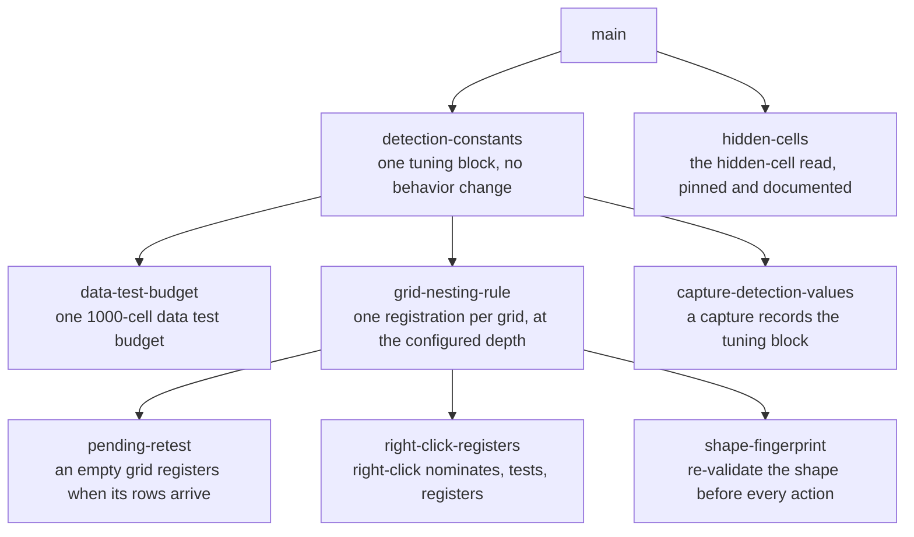

# Sprint Plan: Grid Detection Recovery, Revised

**Status:** APPROVED
**Created:** 2026-09-15
**Base branch:** main
**Slug:** grid-detection-recovery-v2
**Supersedes:** [grid-detection-recovery.md](./grid-detection-recovery.md), the
decision record, replaced before execution.

## 0. Why this revision exists

The decision record holds the investigation of a negative capture from the
Databricks SQL editor and the eight decisions the product manager took, D1 to
D8. Every decision stands. This file restates none of their reasoning; read the
decision record first.

This file carries the decisions into the structure the finalize step parses: a
status line, a repository survey, the repository conventions, and one block per sprint with
scope, out-of-scope, acceptance criteria, dependencies, and dev notes with code
pointers. The decision record has no status line and its sprint blocks use other
field names, so the finalize step cannot read it.

Three things change against the decision record. Each has its reason in §3 and
its entry in the Decisions Log.

1. The constants move and the budget change split into two sprints, so the move
   is a refactor the existing suite proves.
2. The hidden-cells sprint shrinks to tests and docs. A Chromium check (§3.7)
   shows the native read already returns a hidden cell's text.
3. The hidden-cells sprint roots at `main`. Nothing in it reads the tuning
   block.

## 1. Repo Survey

**Languages and shape.** Three platforms share one algorithm: a Google Sheets
library (`js/`), a Python package (`python/`), and a Chrome extension
(`chrome-extension/`). This plan touches the extension alone. The extension is
plain browser JavaScript under Manifest V3 with no build step, no package
manager, and no import statements: the manifest lists the content scripts in
dependency order and every file declares globals into one shared scope. The
sidebar loads the same package files through script tags in `sidebar.html`, and
the service worker loads the bus through `importScripts`.

**Tests.** One hand-rolled Node suite, `chrome-extension/tests.js`, evaluates
the content scripts behind stubbed page and Chrome interfaces (the observer
constructors are no-op stubs; tests that exercise an observer install a
capturing stub of their own). Several sections evaluate `lib/dr-table/detect.js`
on its own inside a sandbox, and several assertions read a file's source text.
Baseline on `main` at the time of writing: 2,346 passing extension assertions,
256 Sheets assertions, 67 documented examples.

**Patterns in place** (see `docs/design.md`): ports and adapters, so the
detection layer runs with no browser globals; an application model with
publishing setters (`app/store.js`, `DR_STORE`); an event bus carrying intent,
state-change, and request topics (`adapters/messaging.js`, `DR_BUS`); a table
registry keyed by the live element; and a detection layer that reports only,
with registration and the pillbox build in the callers.

**Where the work lands.** The detection layer (`chrome-extension/lib/dr-table/detect.js`),
the pillbox view (`chrome-extension/ui-toggle.js`), the controller
(`chrome-extension/content.js`), the application model
(`chrome-extension/app/store.js`), the configuration file
(`chrome-extension/constants.js`), and the capture package
(`chrome-extension/lib/dr-capture/`).

**The code as it stands**, the facts the sprints build on:

- Ten tuning values sit in the detection layer as file-level constants:
  `GRID_MIN_CHILDREN` (5), `GRID_WALK_DEPTH_CAP` (15), `GRID_COL_WIDTH_SAMPLE`
  (10), `GRID_DISPLAY_VALUES` (a Set of four display values),
  `GRID_REAPPLY_DEBOUNCE_MS` (100), `GRID_IS_DATA_TABLE_CELL_SAMPLE` (10),
  `GRID_IS_DATA_TABLE_ROW_SAMPLE` (10), `OFFSCREEN_LEFT_PX_THRESHOLD` (-9999),
  and `DEFAULT_VENDOR_PROFILES` (two profiles). Two more are bare literals inside
  `looksLikeGrid`: the half share of children that must repeat, and the 0.8
  column-width agreement. The pillbox auto-collapse, `TOUCH_AUTOCOLLAPSE_MS`
  (3000), sits in the pillbox view. The suite re-exports three of these onto
  `globalThis` and pins the off-screen threshold's value.
- The load-time scan (`injectTableToggles`), the added-node pass
  (`injectTogglesForAddedNode`), and `findTables` are three copies of one scan.
  `findTables` is tested and has no production caller (#219). The scan treats
  every role-bearing element as its own table, so a Databricks-shaped wrapper
  and its scrolling pane each get a pillbox (#270).
- `createToggleForTable` runs the data test, builds the pillbox, and registers
  the table. Detection reports `{ handle, isNew }` and never registers.
- Right-click resolves through `findTargetTable` in three steps: nearest
  native table, nearest registered ancestor, then the geometry probe walking up
  to the depth cap. The marker class `dr-ext-grid` is written by the callers
  and read by nothing (#256).
- A registry entry holds `originals`, `appliedFlag`, `lastRoundOptions`, and
  `maxMagnitude`. It holds no column count.
- The capture state carries `captureFormat` 1, composed by the sidebar from the
  page's answer; the renderer prints the format in the file's header.
- `docs/test-pages/tables.html` §13 already holds a synthetic Databricks-shaped
  grid: a `role="table"` wrapper, a pinned pane of row numbers, and a scrolling
  pane, all under `dg--` classes. Its expectation text records the two-pillbox
  behavior this plan removes.

**Recent history.** Every cross-context topic moved onto the bus (#347), the
sidebar's one-tab rule shipped (#350), and the decision record merged (#352).

**Open issues this plan touches.** #270 and #219 close with the nesting sprint.
#256 (the marker class), #116 (toolbar open with no target), #221 (the numeric
probe), and #120 (extracted cells on grids) stay open; §7 lists them.

## 2. Repo Conventions

- **Version files:**
  - `chrome-extension/manifest.json` — dotted integers in the `version` key
    (2.1.61 today); one to four integers, no pre-release suffix. The merge-time
    workflow bumps it; sprint branches never touch it.
  - `python/pyproject.toml` — semver in the `version` key (0.2.3 today). Same
    rule; no sprint here changes `python/`.
- **Test command:** `node chrome-extension/tests.js && node js/tests.js && node js/doc-tests.js`
  (the Python suite, `cd python && pytest`, covers files this plan leaves alone).
- **Gates:** `scripts/check-files.sh --staged` and `scripts/check-vocab.sh --staged`,
  run by the pre-commit hook (`git config core.hooksPath .githooks`, once per
  clone) and by CI on every pull request.
- **Lint:** none configured.
- **Format:** none configured.
- **Build:** none; the extension loads unbuilt.
- **Branch naming:** `feature/<label>`, `fix/<label>`, `refactor/<label>`,
  `chore/<label>`, `docs/<label>`; never `claude/` or `session/`.
- **Commit convention:** Conventional Commits (`fix:`, `refactor:`, `feat:`,
  `docs:`, `test:`, `chore(version):` in the log). A vocabulary definition lands
  as its own `docs:` commit on the sprint branch.
- **PR template:** none as a file; `AGENTS.md`, section Pull requests, states the
  body rules.
- **Dependent policy:** `after-merge`. CI runs only on pull requests based on
  `main`, so a dependent sprint branches from `main` after its parent merges,
  and a run stops at each wave boundary.
- **Version bump policy:** `merge-workflow`. The workflow below bumps at merge;
  a sprint branch never touches a version file.
- **Base branch writes:** `pull-request`. Nothing lands on `main` without a
  pull request; the run log arrives through one.
- **Version-bump workflow:** detected at `.github/workflows/bump-version.yml`
  (`pull_request` closed on `main`, gated on `merged == true`, bumps both
  version files and merges its own pull request).
- **Vocabulary:** `docs/vocabulary.md` is the canon. Read it in full before the
  first tool call; sweep new prose at every commit; define a new concept on the
  branch that makes it real.
- **Regression fixtures:** synthetic and minimized. A raw capture never enters
  the repository.
- **Docs track behavior:** a behavior change updates every living doc it
  invalidates on the same branch. Each sprint's dev notes name its docs.

## 3. Design

### 3.1 The decisions stand

D1 through D8 are product decisions taken in the decision record, with their
reasons and rejected alternatives. This plan implements them. Where this plan
adds a design point, it is a mechanism under one of those decisions, never a
new product rule.

### 3.2 The tuning block

D4 moves the detection tuning values into `chrome-extension/constants.js` as a
second named block beside the settings contract. This plan names it
`DR_TUNING` and gives it plain-value keys, camel-cased like the settings
contract:

| Key | Value | Replaces |
| --- | --- | --- |
| `dataTestCellBudget` | 1000 | `GRID_IS_DATA_TABLE_CELL_SAMPLE`, `GRID_IS_DATA_TABLE_ROW_SAMPLE` (D3; lands with data-test-budget) |
| `nestingDepth` | 1 | new (D2; lands with grid-nesting-rule) |
| `pendingRetestCap` | 100 | new (D5; lands with pending-retest) |
| `gridMinChildren` | 5 | `GRID_MIN_CHILDREN` |
| `gridWalkDepthCap` | 15 | `GRID_WALK_DEPTH_CAP` |
| `gridColumnWidthSample` | 10 | `GRID_COL_WIDTH_SAMPLE` |
| `gridColumnWidthAgreement` | 0.8 | the literal in `looksLikeGrid` step 6 |
| `gridRepetitionShare` | 0.5 | the `children.length / 2` literals in `looksLikeGrid` steps 2 and 3 |
| `gridRedrawDelayMs` | 100 | `GRID_REAPPLY_DEBOUNCE_MS` |
| `offscreenLeftPx` | -9999 | `OFFSCREEN_LEFT_PX_THRESHOLD` |
| `pillboxAutoCollapseMs` | 3000 | `TOUCH_AUTOCOLLAPSE_MS` |
| `gridDisplayValues` | the four display values, as an array | `GRID_DISPLAY_VALUES` |
| `vendorProfiles` | the two profiles | `DEFAULT_VENDOR_PROFILES` |

The block is plain values only, so the capture carries it (D8) and a standalone
harness loads the configuration file ahead of the detection layer with no
browser. The detection layer reads the block as a bare global, the way it reads
`DR_DEFAULTS` today, with no fallback copy: a missing block fails at load, which
is the fail-closed rule from the repository conventions. A Set becomes an array
because a Set is not a plain value.

`GRID_ARIA_SELECTOR` stays in the detection layer: it is a selector the code is
written against, not a tuning value. So do the two class names the extension
writes onto the page.

Three keys land with their first reader rather than with the move, so the move
sprint adds no value that nothing reads. **Named constants over magic numbers**
applies to the two bare literals; **simple components** applies to the block:
one reader looks in one place.

### 3.3 The nomination step

D2 needs a containment chain, and three call sites need the same chain: the
load-time scan, the added-node pass, and right-click (D1). One function in the
detection layer computes it. Two terms carry the design:

- A **qualifying element** is an element carrying a grid or table role that
  passes the accessibility-artifact guard and the native-table guard the scan
  already applies. The data test has not run yet.
- A **containment chain** belongs to an outermost qualifying element, the
  **chain root**: the qualifying elements nested under the root, the root
  included, that pass the data test, grouped by nesting depth.

The step takes a root element (the document, an added node, or a chain root),
finds the qualifying elements under it, builds one chain per chain root, applies
the configured depth with D2's two edge rules, and returns the elements to
register. On Databricks the wrapper is the chain root; its chain is
`[wrapper, scrolling pane]` because the pinned pane fails the data test on its
own (one column); depth 1 returns the scrolling pane.

The step reports. Registration, the marker class write, and the pillbox build
stay in the callers, as they do for `findTargetTable` today. `findTables`
already exists with this signature and no production caller; the step grows
inside it, and both live scanners call it (#219). A root whose chain already
holds a registered table returns nothing, so a rediscovery is idempotent.

This resolves #270 as a consequence. **Minimize design-time coupling:** three
call sites, one rule, no copy to keep in step.

### 3.4 Pending tables resolve chains

D5 makes a failed qualifying element a pending table with a subtree observer.
With nesting, three qualifying elements on Databricks would carry three
overlapping observers, and the two panes' later passes would each register
without the chain rule. So the pending unit is the chain root: a chain root
whose chain is empty becomes one pending table with one debounced observer on
its subtree, and a re-test re-runs the nomination step from that root. The
chain rule then selects the element, exactly as the load-time scan would have.

Pending bookkeeping sits behind the step's outcome in the controller: a
registration clears the pending record and disconnects the observer; a failed
re-test counts against the cap. A caller of the step never touches pending
state, so right-click (§3.5) needs nothing extra when both sprints land.

**Rejected:** one observer per qualifying element. Three observers on one
subtree, and each pane's pass would register the pane alone.

### 3.5 Right-click's new route

D1 gives right-click a route between the registry check and the geometry probe.
From the clicked element, walk up to the outermost role-bearing ancestor within
the walk cap; that is the chain root. Run the nomination step from it and return
the element it selects. A right-click in the row-number gutter therefore
resolves the scrolling pane, because the gutter's pane is in the wrapper's
chain and depth 1 selects its sibling. A chain that resolves nothing falls
through to the geometry probe unchanged.

### 3.6 The fingerprint re-validation re-runs nomination

D7 discards a registry entry whose fingerprint no longer matches and registers
the table fresh. A fresh registration goes through the nomination step from the
chain root, because a new result set can change the chain: a pinned pane that
now holds two columns passes the data test, depth 1 holds two siblings, and the
edge rule falls back to the wrapper. The fresh registration can therefore land
on a different element. The active table follows it, the old element's pillbox
and observers tear down through the same function the removal observer uses,
and the existing table-switched topic carries the move to the sidebar.

The comparison sits at two controller entry points, which together cover the
four actions D7 lists: the press subscriber (a pillbox press and the menu
toggle), before its screen read; and the apply function (an apply and a
settings change reaching the active table), before the reset.

### 3.7 D6 verified in Chromium

D6 rests on this premise from the decision record: the native path asks for
rendered text, which returns nothing for a hidden cell. A check in the
pre-installed Chromium, reading each cell through `innerText`, `textContent`,
and the adapter's read (`innerText || textContent`), returns:

| Cell | `innerText` | `textContent` | adapter read |
| --- | --- | --- | --- |
| visible cell holding a `display:none` sort key before `+2.3%` | `+2.3%` | `700023000+2.3%` | `+2.3%` |
| cell in a `display:none` row | `4567` | `4567` | `4567` |
| cell in a `visibility:hidden` row | empty | `8910` | `8910` |
| cell with the `hidden` attribute | `1112` | `1112` | `1112` |
| cell in a closed `
` | empty | `1314` | `1314` |
| cell in a hidden tab panel | `1718` | `1718` | `1718` |

Two mechanisms produce this. The HTML specification returns the descendant text
for an element that is not being rendered, so a `display:none` cell reads
through `innerText` itself. The adapter falls back to `textContent` when the
rendered read is empty, which covers `visibility:hidden` and a closed details
element. The one text the read leaves out is a hidden fragment inside a visible
cell, and that is the sort-key case the extension README documents as the
behavior to keep.

So the native path already reads hidden cells, and the engine already
simplifies them: D6 holds today. The hidden-cells sprint keeps the decision
by pinning the outcome with tests and stating the rule in the living docs. It
changes no read. §6 puts the choice of keeping or striking the sprint to the
product manager.

### 3.8 Delivery

Every sprint is one short-lived branch off `main` or off its parent's merge,
squash-merged on its own merits (**trunk-based development**, **squash and
merge**). The suite, the file gate, and the vocabulary gate run on every pull
request (**pre-merge testing**). Dependents open their pull requests after
their parent merges, per the merge-train rule in the repository conventions.

## 4. Sprint List & Dependency Graph

### Sprint List

1. **detection-constants** — one tuning block, no behavior change.
   Depends on: none.
2. **data-test-budget** — D3: one 1000-cell budget for the data test.
   Depends on: detection-constants (the budget key lives in the block).
   Split from the move so the move is a refactor the unchanged suite proves and
   the budget is a behavior change with its own tests.
3. **grid-nesting-rule** — D2: one registration per grid, at the configured
   depth. Depends on: detection-constants (the depth key lives in the block).
4. **pending-retest** — D5: an empty grid registers when its rows arrive.
   Depends on: grid-nesting-rule (re-tests run the nomination step).
5. **right-click-registers** — D1: right-click nominates, tests, and registers.
   Depends on: grid-nesting-rule (the route runs the nomination step).
6. **shape-fingerprint** — D7: re-validate a table's shape before every
   action. Depends on: grid-nesting-rule (a fresh registration runs the
   nomination step, §3.6).
7. **hidden-cells** — D6 pinned and documented. Depends on: none. The decision
   record rooted it after the move; nothing in it reads the block, and its edits
   touch a region of the detection layer the move leaves alone.
8. **capture-detection-values** — D8: a capture records the tuning block.
   Depends on: detection-constants (it serializes the block).

Sprints 4, 5, and 6 are siblings under sprint 3 and each edits the controller.
Their pull requests open in parallel against `main` once sprint 3 merges; merge
them in the order listed, and expect the second and third to need `main`
merged in before their checks pass. Sprint 4 alone closes the reported defect.
Sprint 5 covers the window before a pending table passes.

**Learning order.** Sprint 3 is the informative one: it proves the chain rule on
the Databricks-shaped fixture and settles where the shared step lives. Sprints
4, 5, and 6 all build on that, so it runs first among the behavior sprints. No
spike: the remaining unknowns (§6) are tuning values to observe, and the D6
premise is already checked (§3.7).

### Dependency Graph

## 5. Sprint Definitions

### detection-constants

- **Goal:** Every detection tuning value and both lists have one home, the
  tuning block in the configuration file, with no behavior change.
- **Branch:** `refactor/detection-constants` off `main`.
- **Scope:** Add `DR_TUNING` to `chrome-extension/constants.js` with the keys
  in §3.2 that have a reader today (every row except the three marked as
  landing later). `chrome-extension/lib/dr-table/detect.js`,
  `chrome-extension/ui-toggle.js`, and `chrome-extension/content.js` read the
  block; their local definitions go. The two bare literals in `looksLikeGrid`
  become reads of `gridRepetitionShare` and `gridColumnWidthAgreement`.
  `gridDisplayValues` is an array, so the membership check changes from `has`
  to `includes`. The detection layer's file comment states that the
  configuration file loads first. `chrome-extension/tests.js` follows: the
  `globalThis` re-exports of the three moved names, the value pin on the
  off-screen threshold, and every sandbox that evaluates the detection layer on
  its own prepend the configuration file's source.
- **Out of scope:** Any value change; the 10-by-10 data test sample stays
  until data-test-budget. `GRID_ARIA_SELECTOR`, the marker class, and the
  rounded-cell class stay where they are. `nestingDepth`,
  `pendingRetestCap`, and `dataTestCellBudget` land with their first readers.
- **Acceptance criteria:**
  - Each moved value has exactly one definition in `chrome-extension/`: a
    search for each old name and each old literal finds no second copy.
  - No fallback copy: the detection layer reads `DR_TUNING` as a bare global
    with no `typeof` guard and no local default.
  - A sandbox that evaluates the configuration file and then the detection
    layer runs `looksLikeGrid`, `isDataTable`, and `isPhantomA11yTable` with the
    same results as before the move; a sandbox that evaluates the detection
    layer alone fails at load.
  - `node chrome-extension/tests.js` passes with no assertion removed; the
    other two suites pass.
- **Depends on:** none
- **Complexity:** M
- **Dev notes:** Constants: `DR_TUNING` in `chrome-extension/constants.js`,
  keys per §3.2. Pitfalls: the suite evaluates the detection layer alone at
  three sites (a multi-file sandbox near the sidebar tests, the
  `extractFunctionBody` reader, and the phantom-table sandbox that carries only
  a fake document), and two source guards (GR3b, GR6j) scan `_makeCellObj` by
  text; removing `DEFAULT_VENDOR_PROFILES` above it shifts lines, not the
  scanned text. The configuration file is already loaded by all three contexts
  (its header says so), so no manifest or `sidebar.html` change is needed. Keep
  the ports: `opts.vendorProfiles || DR_TUNING.vendorProfiles`. Commit the
  vocabulary definition of **tuning block** as its own `docs:` commit. Living
  docs: `docs/design.md`'s package table describes `constants.js` as the
  settings contract; add the tuning block. `docs/vocabulary.md`: define tuning
  block.

---

### data-test-budget

- **Goal:** The data test spends one budget of 1000 cell reads, in document
  order, stopping at the first number, on native tables and grids alike.
- **Branch:** `fix/data-test-budget` off `main` after detection-constants.
- **Scope:** `isDataTable` in `chrome-extension/lib/dr-table/detect.js`: one
  counter across rows and cells replaces the per-row and per-table caps, for
  both adapters. `dataTestCellBudget: 1000` joins the tuning block. Tests for
  the two new outcomes and the boundary. Living docs: `chrome-extension/README.md`
  (the sentence on ten cells in each of ten rows), `docs/design.md` (the
  Detection paragraph's per-row sampling), and the data test entry in
  `docs/vocabulary.md`.
- **Out of scope:** The numeric probe and which strings count as numbers
  (#221). `looksLikeGrid`'s own numeric step. Which cells count (hidden-cells).
  The two-cell pre-check that precedes the numeric search.
- **Acceptance criteria:**
  - A grid whose first number sits in the twelfth column of its first data row
    passes the data test.
  - A table holding no number within its first 1000 cells fails; the same table
    with a number in its thousandth cell passes.
  - A native table of three rows by two cells with one number still passes.
  - Every existing detection assertion stays green; the three living docs state
    the budget.
- **Depends on:** detection-constants
- **Complexity:** S
- **Dev notes:** Constant: `dataTestCellBudget` in `DR_TUNING`. The retiring
  comment above the old caps explains per-row bounds as protection against a
  wide header; D3 accepts that case, so the comment retires with the caps.
  Count cell reads, not rows, and count an empty cell as a read. The
  `hasMultipleColumns` pre-check walks rows until one holds two cells; leave it.
  Reading the shipped data test against the Databricks-shaped fixture must
  still return a pass at six rows by four columns.

---

### grid-nesting-rule

- **Goal:** One registration per grid, at the configured nesting depth,
  through one nomination step shared by both live scanners.
- **Branch:** `fix/grid-nesting-rule` off `main` after detection-constants.
- **Scope:** The nomination step of §3.3 in
  `chrome-extension/lib/dr-table/detect.js`, grown inside `findTables`: from a
  root, list the qualifying elements, build one containment chain per chain
  root from those passing the data test, apply `DR_TUNING.nestingDepth` and
  D2's two edge rules, and return the elements to register. The load-time
  scan's ARIA pass (`injectTableToggles` in `chrome-extension/ui-toggle.js`)
  and the added-node pass (`injectTogglesForAddedNode` in
  `chrome-extension/content.js`) call it and hold no scan of their own; their
  native-table passes stay. `nestingDepth: 1` joins the tuning block. A
  synthetic Databricks-shaped fixture. Living docs: the pinned pane entry in
  `docs/vocabulary.md` becomes conditional on the configured depth (D2's docs
  impact); `docs/vocabulary.md` defines containment chain, chain root, nesting
  depth, and qualifying element; `docs/design.md`'s Detection paragraph and
  `chrome-extension/README.md`'s first point under "Data Grids vs. CSS Layout
  Grids" state the rule; `docs/test-pages/tables.html` §13's expectation text
  and comment describe one pillbox on the scrolling pane.
- **Out of scope:** The geometry probe and its gates. Right-click
  (right-click-registers). Pending state (pending-retest). Vendor profiles
  beyond the two shipped. The marker class write (#256).
- **Acceptance criteria:**
  - The Databricks-shaped fixture registers exactly one table, the scrolling
    pane, whose first column is the identifier column, and a range expression
    addressing that column addresses it as column A.
  - The same fixture at depth 0 registers the wrapper with the row-number
    gutter as its first column.
  - A chain whose depth 1 holds two qualifying siblings registers the wrapper.
  - A chain shorter than the configured depth registers its innermost element.
  - Two sibling grids under one non-qualifying parent register separately.
  - Both live scanners call the step; neither holds an ARIA pass of its own
    (#219 closes), and the load-time scan on the fixture builds one pillbox
    (#270 closes).
  - The living docs and the test page state the rule; the suites pass.
- **Depends on:** detection-constants
- **Complexity:** M
- **Dev notes:** Constant: `nestingDepth` in `DR_TUNING`. Keep the detection
  layer reporting only: the step returns `{ handle, isNew }` entries and the
  callers register through `createToggleForTable`, which re-runs the data test;
  accept the second read. Key chains by chain root and return nothing for a
  root whose chain already holds a registered table, so a rediscovery is
  idempotent. The fixture: rebuild `docs/test-pages/tables.html` §13's shape
  with invented values, per the regression-fixture convention; for the
  two-siblings edge rule give the pinned pane a second column so it passes the
  data test. The pinned pane drops out of the chain because the data test on
  it alone fails, which is the coincidence the decision record's §3 records;
  the plan relies on the chain rule, never on that coincidence, so the depth-0
  test pins the wrapper choice directly. Vocabulary definitions land as their
  own `docs:` commit.

---

### pending-retest

- **Goal:** A grid that arrives empty registers when its rows arrive, without
  a right-click.
- **Branch:** `fix/pending-retest` off `main` after grid-nesting-rule.
- **Scope:** D5 with §3.4's refinement, in `chrome-extension/content.js`. A
  chain root whose chain is empty becomes a pending table: one debounced
  subtree observer on the root (`childList`, `characterData`, `subtree`), with
  `DR_TUNING.gridRedrawDelayMs` as the delay. A mutation re-runs the nomination
  step from the root; a registration clears the pending record and disconnects
  the observer; a failed re-test counts against `DR_TUNING.pendingRetestCap`,
  and reaching the cap drops the observer with a debug log row. The removal
  branch of the table observer drops a pending root's observer and timer. The
  pending record and its clearing sit behind the step's outcome, never in a
  caller. `pendingRetestCap` joins the tuning block. Living docs:
  `docs/vocabulary.md` defines pending table; `docs/design.md`'s Detection
  paragraph states that a failed data test leaves a pending table, and its list
  of state held outside the model gains the pending observers;
  `chrome-extension/README.md`'s detection point states it.
- **Out of scope:** Right-click (right-click-registers). The fingerprint
  (shape-fingerprint). The cap's final value (§6).
- **Acceptance criteria:**
  - A qualifying container inserted empty and then filled registers and gains
    a pillbox; the Databricks-shaped fixture, inserted as an empty wrapper and
    filled in a later mutation, registers its scrolling pane alone.
  - A pending wrapper carries one observer, whatever the number of qualifying
    elements under it.
  - A container that never passes stops re-testing at the cap and holds no
    observer afterwards.
  - A pending container removed from the page leaves no observer and no timer.
  - The living docs state the rule; the suites pass.
- **Depends on:** grid-nesting-rule
- **Complexity:** M
- **Dev notes:** Constant: `pendingRetestCap` in `DR_TUNING`, starting at 100
  (§6). The harness stubs `MutationObserver` as a no-op; the
  re-apply observer tests and the removed-subtree tests already install
  capturing stubs, and the pattern to copy is the debounce in `roundTable`'s
  virtualized branch. Hold the per-root observer, timer, and count in
  `WeakMap`s beside `gridObservers` and `gridReapplyTimers`; the pending record
  is page-held state outside the model, and the design doc's list of such
  state must say so. The vocabulary definition lands as its own `docs:` commit.

---

### right-click-registers

- **Goal:** Right-click nominates, tests, and registers a table the scans
  missed (D1).
- **Branch:** `fix/right-click-registers` off `main` after grid-nesting-rule.
- **Scope:** `findTargetTable` in `chrome-extension/lib/dr-table/detect.js`
  gains §3.5's route between the registry check and the geometry probe: walk
  from the clicked element to the outermost role-bearing ancestor within
  `DR_TUNING.gridWalkDepthCap`, run the nomination step from it, and return the
  element it selects with `isNew` from the caller's registry check. The
  controller's right-click handler and menu-click subscriber already register a
  new handle through `markAndToggleIfNewGrid`; they stay. Tests. Living docs:
  the load-time scan entry in `docs/vocabulary.md` gains the sentence that a
  marked grid the scan missed enters on right-click; `docs/design.md`'s
  Detection paragraph and `chrome-extension/README.md`'s first detection point
  state the route.
- **Out of scope:** The geometry probe's gates. Pending state. The toolbar
  entry point with no prior right-click (#116).
- **Acceptance criteria:**
  - A right-click inside a Databricks-shaped grid that no scan registered
    registers its scrolling pane and makes it active.
  - A right-click in the row-number gutter registers the scrolling pane and
    makes it active.
  - A right-click inside a role-bearing element that fails the data test
    registers nothing and leaves no active table.
  - An already-registered table resolves at the registry route, with the new
    route never reached.
  - The reported defect closes with no pending observer present: the test runs
    without pending-retest's code.
  - The living docs state the route; the suites pass.
- **Depends on:** grid-nesting-rule
- **Complexity:** M
- **Dev notes:** `findTargetTable` reports only and keeps its
  `{ handle, isNew }` shape; the data test already runs inside the detection
  layer, so nomination runs there too, and registration stays with the
  controller. The route returns the depth-selected element even when the
  clicked element is a different qualifying element. The registry walk stays
  ahead of the new route so a registered table never re-nominates. When
  pending-retest has merged, registration through the step clears the pending
  record by §3.4's design; nothing here touches it.

---

### shape-fingerprint

- **Goal:** Every action on a registered table first checks that the table's
  shape still matches the shape recorded at registration (D7).
- **Branch:** `fix/shape-fingerprint` off `main` after grid-nesting-rule.
- **Scope:** A `fingerprint` field on the registry entry in
  `chrome-extension/app/store.js` with a setter and getter: the column count
  (the widest drawn row) and the header row's cell texts, recorded in
  `createToggleForTable` through the adapter. A comparison in the controller at
  the two entry points of §3.6: the press subscriber before its screen read,
  and the apply function before its reset. On a mismatch: tear the entry down
  through one function extracted from the removal observer's branch (pillbox,
  resize observer, grid observer, timer, registry entry), re-run the nomination
  step from the chain root, register the result, make it active, and publish
  the table-switched topic. Native tables carry a fingerprint too. Living docs:
  `docs/vocabulary.md` defines shape fingerprint, and its registry entry
  describes the fingerprint in place of the column-count example that matches
  no field today; `docs/design.md`'s State ownership section lists the
  fingerprint among the per-table registry fields.
- **Out of scope:** Reads: the lens preview and the capture compare nothing.
  The re-apply observer's scroll path and the frozen magnitude. Carrying the
  fingerprint into the capture; neither sprint depends on the other, and a
  later change can add the field to the serialized entry.
- **Acceptance criteria:**
  - Scrolling a virtualized grid, which changes the drawn row count, does not
    trip the fingerprint.
  - Changing the column set trips it: the entry is discarded, and a pillbox
    press afterwards simplifies from a raw state.
  - A discarded entry's originals never reach the fresh entry.
  - On a Databricks-shaped grid whose new result makes the pinned pane pass the
    data test, the fresh registration lands on the wrapper, the wrapper is
    active, and the old pane holds no pillbox.
  - A native table's fingerprint trips when its header row's text changes.
  - The living docs state the field; the suites pass.
- **Depends on:** grid-nesting-rule
- **Complexity:** L
- **Dev notes:** No new tuning value. The header row is the first row the
  adapter returns (an outside row when row groups exist, the head section on a
  native table). Keep the fingerprint plain-value. The press subscriber reads
  `isTableRounded` before its one settings write; the comparison runs before
  that read, so a press on a replaced result set reads the fresh entry's raw
  form and turns simplification on. Extracting the teardown is a one-function
  refactor inside this sprint's scope; both the removal observer and the
  mismatch path call it. The vocabulary definition lands as its own `docs:`
  commit.

---

### hidden-cells

- **Goal:** D6 holds as a stated, tested rule: the data test and the engine
  read a hidden cell's text, and a hidden fragment inside a visible cell stays
  out of the read.
- **Branch:** `chore/hidden-cells` off `main`.
- **Scope:** Tests in `chrome-extension/tests.js` on mock native cells whose
  rendered read is empty and whose raw text holds a number: the data test
  passes on a table whose only numbers sit in such cells; `roundTable`
  simplifies such a cell and `resetTable` restores it; the lens preview pool
  holds it; a visible cell whose rendered read is `+2.3%` and whose raw text
  is `700023000+2.3%` reads as `+2.3%`; an accessibility artifact stays
  excluded. Living docs: the data test entry in `docs/vocabulary.md` and
  `docs/design.md`'s Detection paragraph state that hidden cells count;
  `chrome-extension/README.md`'s data-test sentence states it.
- **Out of scope:** Any change to the adapter's read order. The two
  link-related reads (`isCellWholeLink`, `filterLinkMatches`). Grids, which
  read raw text already. The capture's displayed-text read, which stays on the
  rendered read so a capture shows what the screen showed.
- **Acceptance criteria:**
  - The five outcomes above hold as assertions that exercise the adapter, the
    data test, and the engine, with no source-text pin.
  - The three living docs state the rule.
  - The suites pass with no source change under `chrome-extension/` outside
    `tests.js`.
- **Depends on:** none
- **Complexity:** S
- **Dev notes:** §3.7 holds the Chromium evidence and the two mechanisms behind
  it. The harness's mock cells take an explicit `innerText`, so a mock with an
  empty rendered read and a numeric raw text models a hidden cell exactly. The
  branch prefix is `chore/` because the sprint changes tests and docs only; if
  the developer finds a read that misses a hidden cell, that is a finding for
  the product manager, not a fix to fold in.

---

### capture-detection-values

- **Goal:** A capture records the tuning block in force (D8).
- **Branch:** `feature/capture-detection-values` off `main` after
  detection-constants.
- **Scope:** `collectCaptureState` in `chrome-extension/lib/dr-capture/state.js`
  adds a `tuning` field holding a plain copy of `DR_TUNING`; `CAPTURE_FORMAT`
  becomes 2. The renderer in `chrome-extension/lib/dr-capture/render.js` gains
  a section that lists the values, every one through the existing escape, with
  the two lists joined for reading. The sidebar's fallback state in
  `assembleAndSaveCapture` (`chrome-extension/sidebar.js`) gains `tuning: null`
  so a failed state pull renders the absence. The suite's format pins move to
  2. Living docs: the capture state entry in `docs/vocabulary.md` lists the
  tuning block; `chrome-extension/README.md`'s capture paragraph and
  `docs/design.md`'s Capture paragraph name it.
- **Out of scope:** The settings half of the capture. A reader for old
  captures; none exists.
- **Acceptance criteria:**
  - The capture state carries every key of the tuning block with the values in
    force, and `captureFormat` is 2.
  - The rendered file shows the values in its visible half.
  - A state with no `tuning` field renders the absence placeholder and the
    capture still saves.
  - The living docs name the block; the suites pass.
- **Depends on:** detection-constants
- **Complexity:** S
- **Dev notes:** No new tuning value. `CAPTURE_FORMAT` lives in the state
  serializer and the sidebar reads it too. The vendor profiles' selectors are
  strings that reach the file, so they go through `escapeHtml` like every other
  value. The suite pins `captureFormat: 1` at five sites.

## 6. Open Questions

- **Keep or strike hidden-cells.** Resolved 2026-09-15: keep. §3.7 shows D6
  holds today; the sprint pins the outcome and states the rule in the living
  docs, at cost S, so the next refactor cannot lose a rule only the code
  states.
- **The re-test cap's value.** Resolved 2026-09-15: start at 100. A re-test
  runs only after a subtree change and the grid redraw delay, so the count
  grows under sustained churn alone, and each re-test is bounded by the data
  test budget. At the fastest rate, 100 re-tests span ten seconds and about
  half a second of processing before the observer drops. A tighter cap
  reproduces the defect on a slow query whose loading state churns the
  subtree; a generous cap costs bounded processing on a region that never
  passes. The first live observation on Databricks sets the lasting value.
- **Whether a fixed depth is enough.** Carried from the decision record's §6:
  D2 ships depth 1 as one edit in the configuration file; a per-library answer
  belongs in the vendor profile, and no principled rule is adopted yet.

## 7. Out of Scope (Separate Sprint-Stack)

- Any change to the geometry probe's gates; Databricks is reachable by role.
- The sidebar, the lens control, and every simplification rule.
- Grid libraries beyond the two vendor profiles.
- #116: a toolbar-icon open with no prior right-click has no target on an
  unmarked grid.
- #256: the marker class is written and read by nothing; D5 keeps it as a
  style hook, and the write sites stay as they are.
- #221: detection and rounding parse numbers differently.
- #120: extracted cells on virtualized grids.

## Decisions Log

- 2026-09-15: Revision drafted from the merged decision record
  (`grid-detection-recovery.md`, #352), in the sprint-plan structure the
  finalize step parses. The eight decisions stand unchanged.
- 2026-09-15: The constants move and D3's budget split into
  detection-constants and data-test-budget, so the move is a refactor the
  unchanged suite proves.
- 2026-09-15: D6's premise checked in Chromium (§3.7): the native read already
  returns a hidden cell's text. hidden-cells shrinks to tests and docs, moves to
  a `chore/` branch, and roots at `main`; §6 puts keep-or-strike to the product
  manager.
- 2026-09-15: The nomination step is keyed by chain root (§3.3), pending
  tables resolve chains (§3.4), and a fingerprint mismatch re-runs nomination
  (§3.6). Each is a mechanism under D2, D5, and D7.
- 2026-09-15: New terms (tuning block, qualifying element, containment chain,
  chain root, nesting depth, pending table, shape fingerprint) enter
  `docs/vocabulary.md` with the sprint that makes each real, the precedent the
  decision record set.
- 2026-09-15: hidden-cells stays in the stack as the reduced sprint, per the
  product manager.
- 2026-09-15: The re-test cap starts at 100, per the product manager; §6 holds
  the reasoning.
- 2026-09-16: The conventions state the three execution policies the
  sprint-stack skill reads (dependents after merge, bumps by the merge
  workflow, base-branch writes through a pull request) and point the pull
  request body at the conventions file. The handoff JSON carries the same keys.
