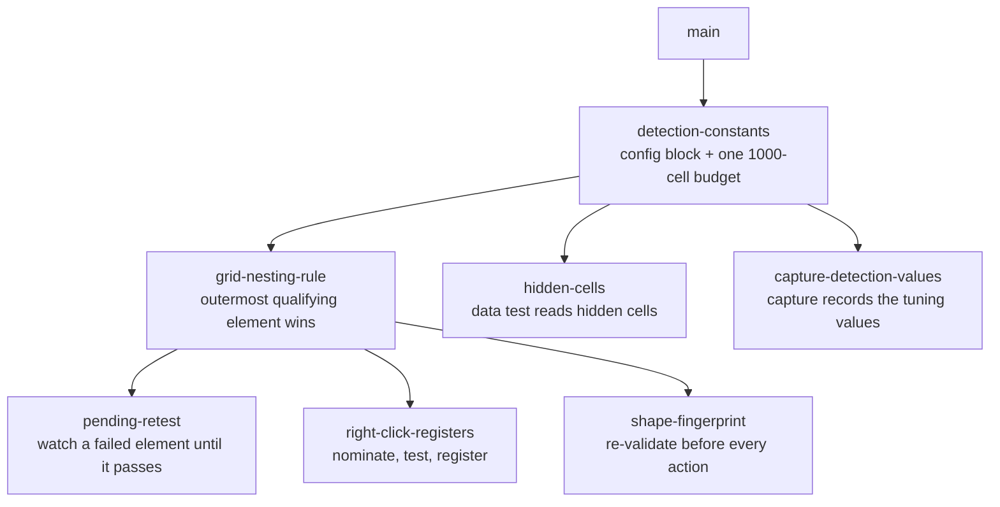

# Sprint Plan: Grid Detection Recovery

**Created:** 2026-09-15
**Base branch:** main
**Slug:** grid-detection-recovery
**Origin:** a negative capture from the Databricks SQL editor, extension 2.1.60,
reporting that right-click does not activate the results grid.

## 0. Why this plan exists

A Databricks results grid is never registered, and right-click cannot recover.

**The registration failure.** A qualifying element is examined once, at the
moment it is added to the page. Databricks attaches the grid container in one
paint and fills its rows in a later one, because the virtualizer measures the
container before determining how many rows to draw. The data test therefore runs
against a container holding no rows and fails. The rows that arrive afterwards
carry a row role, which starts no further examination, so the container stays
out of the registry for the life of the page.

Evidence from the capture: all three Databricks containers carry the marker
class, the registry holds zero tables, and the log rows record no registration.
The marker class is written before the data test runs, and the data test is the
only step that ends an examination early. Running the shipped data test against
the same markup after the rows exist returns a pass, six rows by four columns.

**The recovery failure.** Right-click resolves a table by two routes: an
enclosing element already in the registry, or the geometry probe. The registry is
empty. The geometry probe requires one box directly holding five or more sibling
rows in a grid or flex layout; Databricks holds the five rows in a block-layout
box and gives every other enclosing box one to three children. Every ancestor
fails, under both layout readings. The role and vendor-class acceptances inside
the geometry probe run after its child-count and layout gates, so neither is
reached.

**When the recovery failure entered.** Before [#258](https://github.com/ArieFisher/dynamic-rounding/pull/258)
(shipped in 2.1.45, 26 August 2026) right-click's second route read the marker
class, which is present on a container whose data test failed. That route
resolved the scrolling pane and made it active. #258 replaced the class read with
a registry check, which is correct in itself and removed the compensation that
had been hiding the registration failure since grid support shipped.

## 1. Repo conventions

Restated so this artifact is self-contained for a fresh session.

- **Test commands:** `node chrome-extension/tests.js` (the suite these sprints
  touch), `node js/tests.js`, `node js/doc-tests.js`.
- **Gates:** `scripts/check-files.sh --staged` and `scripts/check-vocab.sh`, both
  run by the pre-commit hook and by CI.
- **Lint / format / build:** none configured; the extension loads unbuilt.
- **Branch naming:** `feature/<label>`, `fix/<label>`, `refactor/<label>`,
  `chore/<label>`, `docs/<label>`. Never `claude/` or `session/`.
- **Commits:** Conventional Commits.
- **Version:** sprint branches must not edit `chrome-extension/manifest.json`; a
  workflow bumps it on merge to main.
- **PR template:** none present.
- **Vocabulary:** read `docs/vocabulary.md` in full before the first tool call;
  sweep new prose at every commit.

## 2. Decisions

Each decision below was taken by the product manager during the investigation.
The reason is recorded so a fresh session does not re-open it.

### D1 — Right-click identifies and registers

Right-click serves two purposes: make a table active, and identify a table the
automatic route missed. An identification enters the registry. The registry
therefore holds every table the extension knows, whatever route found it, and
stays the single record of that.

### D2 — When qualifying elements nest, keep the outermost

One rule, no vendor-specific branches. On Databricks the outermost qualifying
element is the wrapper, so the wrapper is the table and both panes are its parts.

**Accepted cost, recorded deliberately.** The pinned pane holds the row-number
gutter, and its cells become the table's leading column. The first-column
exclusion then protects the row numbers, which never needed protecting, and the
identifier column beside them becomes reachable by simplification and
unprotectable except through a range expression. Range expressions address the
gutter as the first column, which does not match the spreadsheet model the
product borrows elsewhere.

The alternative, binding the scrolling pane, avoids both effects on Databricks
and drops genuinely frozen data columns on any grid whose pinned pane holds real
data. Simplicity wins for now. Revisit once a principled test for the right
level exists (§6).

This decision keeps the canon accurate: the vocabulary already defines a pinned
pane's cells as the table's first columns.

### D3 — One data test budget, 1000 cells, any shape

The numeric search is capped at 1000 cell reads for native tables and grids
alike, spent in document order, stopping at the first number. The per-row
allowance is removed.

The current split caps a grid at ten rows by ten cells and leaves a native table
uncapped. That split was justified by cost, and the costs run the other way: the
native read asks for rendered text and forces layout, the grid read takes the raw
text node; a virtualized grid holds only its drawn rows, while a native table can
hold thousands in the page.

Effects: grids gain detections, since a wide grid whose numeric columns sit past
the tenth column is currently missed. Native tables lose the uncapped scan, which
costs a detection only for a table holding no number within its first 1000 cells.

The wide-header case is accepted: a table 1000 columns wide spends the budget on
its header row and never reaches a data row.

### D4 — Detection tuning values live in the configuration file

`chrome-extension/constants.js` already states that any constant more than one
component reads belongs there. The detection tuning values move into a second
named block in that file, beside the settings contract and outside it, because
they are not user options and must not enter the settings record, the sidebar's
controls, or the settings half of a capture.

One definition each. No fallback copy in the detection layer, which the
conventions forbid. Detection keeps running outside a browser because the
configuration file holds plain values and depends on nothing in a browser; a
standalone harness loads that file first.

Values that move, with their current settings:

| Value | Current | Governs |
| --- | --- | --- |
| data test budget | 10 rows by 10 cells | replaced by D3's 1000 |
| minimum repeated rows | 5 | the geometry probe's child-count gate |
| ancestors walked from a click | 15 | how far up right-click searches |
| column-width sample | 10 rows | the geometry probe's alignment sample |
| column-width agreement | 80% | how closely those widths must match |
| repetition threshold | half the children | the geometry probe's row-likeness gate |
| grid redraw delay | 100 ms | the re-apply observer's debounce |
| off-screen threshold | -9999 px | the accessibility-artifact test |
| pillbox auto-collapse | 3000 ms | the touch pillbox's collapse delay |
| pending re-test cap | new, see D5 | how many re-tests one pending table gets |

Two lists move with them by the same convention: the CSS display values that
count as a grid layout, and the vendor profiles holding each known grid library's
class token and pane selectors.

### D5 — A failed data test leaves a pending table, watched until it passes

A qualifying element whose data test fails becomes a **pending table**: it keeps
its marker class and gains a debounced observer on its own subtree, reusing the
existing grid redraw delay. A subtree change re-runs the data test. A pass
registers the table, builds its pillbox, and disconnects the observer. A pending
table removed from the page drops its observer. A re-test cap bounds a region
that changes continuously and never passes.

The rejected alternative is recorded in §3.

### D6 — The data test reads hidden cells

Cells hidden by the page still count toward the data test, so a table qualifies
on numbers the user has not revealed yet and is already registered when a
collapsed section, tab, or toggled column exposes them.

Grids already read raw text and already see hidden cells. Only the native path
asks for rendered text, which returns nothing for a hidden cell. That read also
feeds the rounding engine, so a hidden numeric cell begins to be simplified: on
reveal it shows a simplified value, consistent with the rest of its table, and it
restores like any other cell. This is why D6 travels as its own sprint with its
own tests.

Screen-reader-only and off-screen chart tables stay excluded. The
accessibility-artifact test runs before this and is unaffected by the read.

### D7 — Re-validate a table's shape before every action

A results grid is volatile: a new query changes its columns, its rows, and
whether it exists at all, sometimes while reusing the same container element. A
registry entry made against one result set must not be acted on against another.

Each registered table carries a **shape fingerprint** recorded at registration:
its column count and its header row's text. Both are stable while the user
scrolls a virtualized grid, and both change when a new result set lands. Drawn
row count is deliberately excluded, because it changes on every scroll.

Before any action on a table — an apply, a pillbox press, a menu toggle, a
settings change reaching the active table — the fingerprint is compared against
the table as it now stands. A mismatch discards the entry, including its
originals, which refer to values no longer in the page, and registers the table
fresh.

### D8 — A capture records the detection tuning values

A capture is a bug report about detection, so it carries the values in force
under D4 alongside the settings it already records.

## 3. Rejected alternatives

One line each, recorded so a fresh session does not retry them.

- **Restore the pre-#258 marker-class read on its own.** The marker hit returned
  "already known", which skips marking and registration in full, so the table
  became active and bound to the sidebar while absent from the registry and
  never subjected to the data test.
- **Use the pinned pane's own data test to tell a gutter from frozen data.**
  Coincidental: Databricks' pinned pane fails because it is one column, not
  because it holds row numbers. A single frozen identifier column would fail for
  the same wrong reason.
- **Bind the scrolling pane (the inner table).** Correct for Databricks, and it
  requires a vendor-specific branch or a content signature that does not exist
  yet. Deferred to §6.
- **Re-test by walking up from every added node.** Fires on every insertion on
  every page, including pages holding no grid, and never stops. D5 attaches the
  cost to the unresolved case and removes it on resolution.
- **Leave both data test scans uncapped, or cap both at ten.** Uncapped leaves
  the native path reading every cell through a layout-forcing read; capping both
  at ten removes native detections that work today.

## 4. Sprint list and dependency graph

The chain is largely linear: each sprint edits the detection layer or the scan
that drives it, so parallel branches would conflict.

1. **detection-constants** — move the tuning values and two lists into the
   configuration file; replace the two-number grid cap with D3's single budget.
   _Branch from:_ `main`.
2. **grid-nesting-rule** — register only the outermost qualifying element.
   _Depends on:_ detection-constants.
3. **pending-retest** — watch a failed qualifying element and register it when
   its data test passes. _Depends on:_ grid-nesting-rule.
4. **right-click-registers** — right-click nominates, tests, and registers.
   _Depends on:_ grid-nesting-rule.
5. **shape-fingerprint** — record a fingerprint and re-validate before every
   action. _Depends on:_ grid-nesting-rule.
6. **hidden-cells** — the data test reads hidden cells.
   _Depends on:_ detection-constants.
7. **capture-detection-values** — a capture records the tuning values.
   _Depends on:_ detection-constants.

Sprint 3 alone closes the reported defect: once the grid registers on its own,
right-click resolves it through the registry. Sprint 4 implements D1 and covers
the window before a pending table passes.

## 5. Sprint definitions

### detection-constants

- **Goal:** one home for the detection tuning values, and one data test budget.
- **Branch:** `refactor/detection-constants` off `main`.
- **Scope:**
  - Add a named block to `chrome-extension/constants.js` holding every value in
    D4's table, plus the grid-layout display list and the vendor profiles.
  - `chrome-extension/lib/dr-table/detect.js` and
    `chrome-extension/ui-toggle.js` read that block. Remove their local
    definitions. No fallback copies.
  - Replace the per-row and per-table grid caps in the data test with one shared
    budget of 1000 cell reads, applied to both adapters.
  - Update the standalone-running note in the detection layer's file comment to
    state that the configuration file loads first.
- **Tests:** a data test that passes on a grid whose numbers sit past the tenth
  column; a data test that fails on a table holding no number within 1000 cells;
  every existing detection test stays green.
- **Acceptance:** `node chrome-extension/tests.js` passes; no tuning number is
  defined in two places.
- **Complexity:** M

---

### grid-nesting-rule

- **Goal:** one registration per grid, the outermost qualifying element.
- **Branch:** `fix/grid-nesting-rule` off `main` after detection-constants.
- **Scope:** the load-time scan's ARIA pass, the added-node pass, and the
  right-click resolution all skip a qualifying element enclosed by one already
  registered.
- **Tests:** a Databricks-shaped fixture registers exactly one table, the
  wrapper; its row list stitches the pinned column as the leading column; two
  sibling grids under one non-qualifying parent still register separately.
- **Acceptance:** one pillbox on a Databricks-shaped grid.
- **Fixture note:** synthetic and minimized, per the regression-fixture
  convention. The capture that prompted this plan carries a usable shape; rebuild
  it with invented values.
- **Complexity:** M

---

### pending-retest

- **Goal:** a grid that arrives empty registers when its rows arrive.
- **Branch:** `fix/pending-retest` off `main` after grid-nesting-rule.
- **Scope:** D5. A failed data test records a pending table and attaches a
  debounced subtree observer; a pass registers and disconnects; removal from the
  page drops the observer; the re-test cap bounds a continuously changing region.
- **Tests:** a qualifying container inserted empty, then filled, registers and
  gains a pillbox; a container that never passes stops at the cap; a pending
  container removed from the page leaves no observer.
- **Acceptance:** the Databricks-shaped fixture registers without a right-click.
- **Docs:** define **pending table** in `docs/vocabulary.md` as its own `docs:`
  commit on this branch.
- **Complexity:** M

---

### right-click-registers

- **Goal:** implement D1.
- **Branch:** `fix/right-click-registers` off `main` after grid-nesting-rule.
- **Scope:** right-click's resolution gains a route between the registry check
  and the geometry probe: the nearest enclosing element carrying a table or grid
  role, subject to the same accessibility and native-table guards the scan
  applies, then the data test, then registration. The nomination step is one
  function shared with the scan rather than a second copy.
- **Tests:** a right-click inside a pending Databricks-shaped grid registers it
  and makes it active; a right-click inside a role-bearing element that fails the
  data test registers nothing and leaves no active table; an already-registered
  table still resolves at the earlier route.
- **Acceptance:** the reported defect closes with the pending observer disabled.
- **Complexity:** M

---

### shape-fingerprint

- **Goal:** implement D7.
- **Branch:** `fix/shape-fingerprint` off `main` after grid-nesting-rule.
- **Scope:** record the fingerprint at registration; compare before an apply, a
  pillbox press, a menu toggle, and a settings change reaching the active table;
  on a mismatch discard the entry and register fresh.
- **Tests:** scrolling a virtualized grid does not trip the fingerprint; changing
  the column set does; a discarded entry's originals do not reach the new one.
- **Docs:** define **shape fingerprint** in `docs/vocabulary.md` as its own
  `docs:` commit. The registry entry's description in the vocabulary gives
  "number of columns" as an example of the detail held per table; no such field
  exists today, and this sprint makes that line accurate.
- **Complexity:** L

---

### hidden-cells

- **Goal:** implement D6.
- **Branch:** `fix/hidden-cells` off `main` after detection-constants.
- **Scope:** the native adapter's text read. Consider whether the rounding
  engine's read and the data test's read stay one read; the conventions favor
  one, and D6 accepts the engine-side effect that follows.
- **Tests:** a native table whose only numbers sit in a hidden section qualifies;
  a hidden numeric cell simplifies and restores; an accessibility artifact stays
  excluded.
- **Complexity:** M

---

### capture-detection-values

- **Goal:** implement D8.
- **Branch:** `feature/capture-detection-values` off `main` after
  detection-constants.
- **Scope:** the capture state carries the detection tuning values; the visible
  half of the capture file renders them; the capture format version increments.
- **Tests:** a capture's state holds the values; an older capture format still
  reads.
- **Docs:** the capture state's description in `docs/vocabulary.md` lists what a
  capture carries and gains this item.
- **Complexity:** S

## 6. Open questions

- **A principled test for the right level.** D2 takes the outermost qualifying
  element for simplicity and accepts the gutter as the leading column. Two
  candidates for a better rule, neither adopted: recording in each vendor profile
  what that library's pinned pane holds, or a content signature for a gutter
  column, such as consecutive integers from 1 under a blank header. Revisit with
  usage.
- **The re-test cap's value.** D5 bounds a continuously changing pending region.
  The right number is unknown; start generous and observe.

## 7. Out of scope

- Any change to the geometry probe's gates. Databricks is reachable by role, and
  widening the probe is a separate question with its own false-positive surface.
- The sidebar, the lens control, and every simplification rule.
- Support for grid libraries beyond those already in the vendor profiles.
