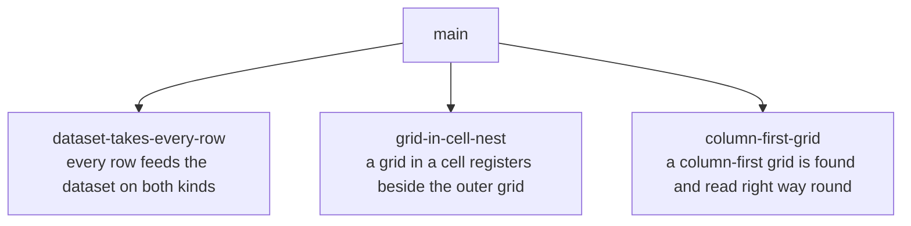

# Sprint Plan: Grid Reading Gaps

**Status:** APPROVED
**Created:** 2026-10-09
**Base branch:** main
**Slug:** grid-reading-gaps

Three defects, each a place where a grid reads differently from what the reader
sees or from the native table beside it: #511 (a grid whose children are columns
gets no pillbox), #526 (a header row or total row feeds the dataset on one table
kind and stays out on the other), and #527 (a grid inside a grid cell registers
alone). Issue #528 (one fixture per grid library) was in the request and the
product manager skipped it on 2026-10-09; §7 records it.

## 1. Repo Survey

**Languages and shape.** Three platforms share one algorithm: a Google Sheets
library (`js/`), a Python package (`python/`), and a Chrome extension
(`chrome-extension/`). This plan touches the extension alone. The extension is
plain browser JavaScript under Manifest V3 with no build step, no package
manager, and no import statements: the manifest lists the content scripts in
dependency order and every file declares globals into one shared scope.

**Tests.** One hand-rolled Node suite, `chrome-extension/tests.js`, joins the
test pieces in `chrome-extension/tests/` and runs them as one script. Baseline on
`main` at the time of writing: 3,895 passing extension assertions, 260 Sheets
assertions, 69 documented examples. The comparison tests in
`chrome-extension/tests/table-kinds.js` read the design doc's table kind pairs
list and compare each pair, once under the shipped defaults and once with the
first-row and first-column switches on and the top band rounding finer than the
other band.

**Patterns in place** (see `docs/design.md`): ports and adapters, so the
detection layer in `chrome-extension/lib/dr-table/detect.js` runs with no
browser globals; the style probe, the numeric probe, and the originals are
ports with browser defaults. The controller in `chrome-extension/content.js`
runs the one simplification pass over rows the adapters return. The detection
layer reports and the callers register.

**Where the work lands.** Detection and both adapters
(`chrome-extension/lib/dr-table/detect.js`), the controller
(`chrome-extension/content.js`), the capture state
(`chrome-extension/lib/dr-capture/state.js`), the manual test page
(`docs/test-pages/tables.html`), and the living docs.

**The code as it stands**, checked against `main` for this plan:

- A native table marks a row outside when its parent is a `<tfoot>`
  (`NativeTableAdapter.getRows`). A grid marks a row outside when it sits outside
  every row group (`GridAdapter._getRowEntries`). The dataset behind the max
  magnitude and the lens preview pool both skip an outside row
  (`datasetMaxMagnitude`, `collectNumericCells`). A native header row therefore
  joins the dataset, a grid header row above its row group stays out, and a grid
  that groups nothing has no outside rows. The comparison tests pin the two
  differences: the `column-header` and `footer-group` pairs read `different`
  and the suite asserts the difference still shows.
- A first-row or first-column exclusion makes a cell classify as skipped, and a
  skipped cell never reaches the dataset. A header cell feeds the dataset only
  when the matching switch is on, so the two differences show only then and
  only when the sidebar's two offsets differ.
- The shape fingerprint reads a grid's header row from the adapter's outside
  mark: a grid that groups its data rows has a header row when its first row is
  an outside row (`_hasHeaderRow`).
- Detection registers every native table that is not an accessibility artifact.
  Detection registers one grid per nest of role-bearing elements. The nest is
  the chain root plus every qualifying element below it, so a grid inside a cell
  of another grid joins the outer grid's nest, and the configured depth of 1
  selects the inner grid (`nominateNest`, `_chainRootOf`, `_depthInChain`). The
  `nested-table` pair reads `different`.
- `looksLikeGrid` treats an element's children as rows. Its last step compares
  the width of each child's first cell with the first child's, and it runs only
  for an element with no role and no vendor class. When the children are columns
  and the first column is wider than the rest, the step fails and the
  right-click finds nothing. `GridAdapter` reads rows from `[role="row"]`,
  `.dg--virtual-row`, or `<tr>`, and otherwise takes the element's children as
  rows and each child's children as cells, so a column-first grid that did pass
  the probe would read turned.
- The probes the suite builds by hand hold two members, the computed-style
  read and the offset-width read. A new member on the style probe port needs a
  default for a probe that lacks it.

**Recent history.** The comparison tests and the pair list merged (#529). The
header-role and grid-cell-role cells merged (#522).

**Open issues this plan touches.** #511, #526, and #527 close with their
sprints. #525 (hidden text ahead of a value in a grid cell), #418 (the
first-row exclusion on a table with no header row), and #394 (a geometry-probe
grid loses its entry on a shape change) stay open. #528 is skipped.

## 2. Repo Conventions

- **Version files:**
  - `chrome-extension/manifest.json` — dotted integers in the `version` key
    (2.2.4 today); one to four integers, no pre-release suffix. The merge-time
    workflow bumps it; sprint branches never touch it.
  - `python/pyproject.toml` — semver in the `version` key (0.2.5 today). Same
    rule; no sprint here changes `python/`.
- **Test command:** `node chrome-extension/tests.js && node js/tests.js && node js/doc-tests.js`
- **Gate command:** `scripts/check-files.sh --staged && scripts/check-vocab.sh --staged`,
  the pre-commit hook (`git config core.hooksPath .githooks`, once per clone)
  and the repo-hygiene workflow on every pull request both run it.
- **Lint:** none configured.
- **Format:** none configured.
- **Build:** none; the extension loads unbuilt.
- **Branch naming:** `feature/<label>`, `fix/<label>`, `refactor/<label>`,
  `chore/<label>`, `docs/<label>`, `plan/<slug>`; never `claude/` or `session/`.
- **Commit convention:** Conventional Commits (`fix:`, `refactor:`, `feat:`,
  `docs:`, `test:`, `chore:`). A vocabulary change lands as its own `docs:`
  commit on the sprint branch. No attribution trailer and no generated-by line,
  per `AGENTS.md`.
- **PR template:** none as a file; `AGENTS.md`, section Pull requests, states the
  body rules: the diff test, `## Tested` with results inline, and
  `## Manual tests` as unchecked boxes that name the test page section.
- **Dependent policy:** `after-merge`. The checks run only on pull requests based on
  `main`, so a dependent sprint branches from `main` after its parent merges.
  This plan has no dependent sprint.
- **Version bump policy:** `merge-workflow`. A sprint branch never touches a
  version file.
- **Base branch writes:** `pull-request`. Nothing lands on `main` without a
  pull request; the run log arrives through one.
- **Version-bump workflow:** detected at `.github/workflows/bump-version.yml`
  (`pull_request` closed on `main`, gated on `merged == true`, bumps both
  version files and merges its own pull request).
- **Vocabulary:** `docs/vocabulary.md` is the canon. Read it in full before the
  first tool call, sweep new prose at every commit, and define a new concept on
  the branch that makes it real.
- **Regression fixtures:** synthetic and minimized. A raw capture never enters
  the repository.
- **Docs track behavior:** a behavior change updates every living doc it
  invalidates on the same branch. Each sprint's dev notes name its docs.
- **Manual test page:** every sprint names the section of
  `docs/test-pages/tables.html` where the product manager runs its manual test.

## 3. Design

### 3.1 The dataset takes every row

The product manager's rule, set 2026-10-09: every cell in a table counts toward
the dataset, whether it sits in a header row, a body row, or a total row, and a
native table and a grid behave the same. This replaces the four paths issue #526
offered. The issue's header path A would have left the `head-group` pair
different, because a native head section would stay out while a grid header row
inside its own row group would count. Its total-row path D would have kept a
difference the rule forbids. The rule removes the cause: the dataset stops
reading the outside-row mark on both kinds, so neither the markup around a row
nor the table kind changes whether its values count.

The mark keeps one reader. The shape fingerprint reads a grid's header row from
the grid adapter's mark, and that read is a statement about where a header row
sits, with no bearing on rounding. The sprint keeps the grid adapter's mark for
that reader and removes every other reader and the native adapter's footer mark,
which has none left (§3.5, decision 4).

*Principles.* **Simple components**: the dataset reads one fact, a cell's
classified result. **Minimize design-time coupling**: markup differences between
the two kinds stop reaching the dataset.

### 3.2 A cell starts a nest

Two native tables nest freely: detection registers both. Two grids should do
the same, and the same rule serves both kinds. The nomination step walks up from
a qualifying element to find its chain root and counts qualifying ancestors for
depth. The sprint adds one stop to those walks: a walk upward from a qualifying
element ends at the first element carrying a cell role, so a grid inside a cell
is its own chain root. The set of cell roles already has one home, the cell
selector in the detection layer, and the stop reads it. The nest's membership
test uses the same stop, so a grid inside a cell never counts as a member of the
outer grid's nest, which keeps the outer nest's already-registered check from
reading the inner grid.

A vendor grid's panes sit outside any cell, so the nesting depth still picks
the scrolling pane there.

*Principles.* **Minimize design-time coupling**: one predicate, read by every
walk. **Named constants over magic numbers** applies to the cell role list,
which stays defined once.

### 3.3 One read of which way a grid's children run

Two places treat an element's children as rows today: the probe's width step and
the adapter's children fallback. A column-first grid needs both to learn that
the children are columns. One function reads which way the children run, and
both call it, so the rule lives once. The signal is the boxes of the first two
children that hold a box: the same top with a larger left means column-first,
and anything else, including too few boxes, means row-first. A child with no box
is hidden or a `display: contents` row, and the read skips it. The read
inspects at most the number of children the width step already samples, which
keeps it bounded and keeps the extension's current reading, row-first, as the
answer whenever the evidence is thin.

The read sits on the style probe port beside the computed-style and offset-width
reads. The probe's width step then measures along the axis on which the cells of
one row line up: widths of first cells across rows for a row-first grid, and the
matching extent of first cells across columns for a column-first grid. The
adapter turns a column-first grid so that row r holds the r-th item of every
column, in column order. Everything downstream reads rows and cells through the
adapter and needs no change.

The alternative of reading the grid's computed track count and flex direction
needs two branches and misreads a row-first grid whose rows use
`display: contents`; the box read covers both layout values with one branch.

*Principles.* **Simple interactions**: one local read. **Minimize design-time
coupling**: the probe and the adapter cannot disagree about direction.

### 3.4 Delivery

Every sprint is one short-lived branch off `main`, squash-merged on its own
merits (**trunk-based development**, **squash and merge**). The suite, the file
gate, and the vocabulary gate run on every pull request (**pre-merge testing**).
The three sprints share no code dependency. Two pairs touch the same documents
and one pair touches the same code region, so a later merge brings `main` into
its branch first; §4 states the order that costs least.

### 3.5 The decisions on record

1. Issue #511 takes path 1, the right-way-round read (product manager,
   2026-10-09). Side effect accepted: a row of five or more equal-width cards
   drawn side by side, which the extension reads as rows today, reads as columns.
2. Issue #526: every row feeds the dataset, header, body, and total alike, on
   both kinds (product manager, 2026-10-09).
3. Issue #527: a grid inside a cell registers beside the grid around it. The
   table-kind rule makes the native result the target, and nothing in the grid
   markup forces a difference, so the plan builds path A without a product
   choice.
4. The capture state drops its per-cell outside-row field, because nothing reads
   it once the dataset stops. The capture format moves from 7 to 8. No reader of
   old captures exists, so no consumer needs the old field. If the developer
   finds a reader, the field stays and the sprint's pull request says why.

## 3b. Simplicity

**1. Size.**

- `dataset-takes-every-row` removes code. It deletes the dataset's two outside-row
  skips in the controller, the outside-row argument that threads through the
  classification step, the native adapter's footer mark, the capture's per-cell
  field, and the tests that pin the two differences. It adds one direct test per
  row kind. The code after the change is smaller.
- `grid-in-cell-nest` adds one stop to two walks and one membership condition,
  all reading the existing cell role list, and removes nothing. The code grows by
  a few lines. Requirement: a grid in a cell registers as its own nest.
- `column-first-grid` grows the code. Additions: the direction read and its port
  member, the turned row read in the adapter, the probe's second axis, and one
  test page section. Requirement: a column-first grid is found and read with
  rows as rows.

**2. Duplicates.**

- The probe's width step and the adapter's children fallback both treat children
  as rows. `column-first-grid` merges them behind one direction read, and the
  merge ships with the change that needs it (§3.3), because the read has no
  second caller to prove it on its own.
- `_chainRootOf` and `_depthInChain` walk the same ancestors with the same
  predicate. A refactor to one walk would not shrink `grid-in-cell-nest`, since
  the two walks return different things, an outermost element and a count. The
  stop is one predicate, so the rule has one home even with two walks.
- The two adapters mark outside rows by different rules. `dataset-takes-every-row`
  removes the difference by removing the dataset's reader of the mark.

**3. Removals.** Nothing the plan adds can come out without losing a
requirement. The capture format bump follows from the removed field and carries
no new content.

**4. Orphans.** `dataset-takes-every-row` removes the native footer mark, the
dataset skips, the outside-row argument in the classification path, and the
capture field. The grid adapter's mark keeps its one reader, the shape
fingerprint. `_getRowEls` keeps its pinned-pane reader. The other two sprints
leave no function, field, or path without a reader.

**5. Bounds.**

- The direction read inspects at most `gridColumnWidthSample` children (10 today,
  in the detection settings), the same cap the width step uses, so a grid costs
  at most ten box reads per pass. At the cap with fewer than two boxes found, the
  read answers row-first, which is today's behavior.
- The turned read of a side-by-side grid builds rows from the children that
  passed the probe's candidate test. The existing cell cap of 10,000 bounds the
  pass.
- The new walk stop in `grid-in-cell-nest` ends a walk earlier than before and
  adds no unbounded step; the existing `gridWalkDepthCap` still bounds both walks.
- `dataset-takes-every-row` adds no bound.

**6. Current behavior.** Each statement in §1 about the code matches a read of
`main` on 2026-10-09. The two #526 differences and the #527 difference are
reproducible on `main`: the suite pins each as `different`. The #511 defect
matches a read of the probe's last step and the adapter's fallback; the issue's
own reproduction used a scratch script with stubbed geometry. The first test of
`column-first-grid` reproduces the defect on `main` before the fix. The live
ElevenLabs page was not available in the investigation, so the product manager's
manual test on that page stands as the live check.

## 4. Sprint List & Dependency Graph

### Sprint List

1. **dataset-takes-every-row** — every row feeds the dataset on both table kinds.
   Depends on: none.
2. **grid-in-cell-nest** — a grid inside a grid cell registers beside the grid
   around it. Depends on: none.
3. **column-first-grid** — a grid whose children are columns is found and read
   with rows as rows. Depends on: none.

All three root at `main`. No code of one sprint is a prerequisite of another, and
no learning from one bears on another's design, so no spike is needed. A failure
in one sprint costs the other two nothing.

**Merge order.** Merge `grid-in-cell-nest` first, `dataset-takes-every-row`
second, `column-first-grid` last. The first two both edit the table kind pairs
list and the test page's section 30; the second and third both edit the grid
adapter's row reading. A later merge brings `main` into its branch before its
checks run.

### Dependency Graph

## 5. Sprint Definitions

### dataset-takes-every-row

- **Goal:** Every row of a table feeds the dataset, header, body, and total
  alike, on a native table and on a grid.
- **Branch:** `fix/dataset-takes-every-row` off `main`.
- **Scope:** In `chrome-extension/content.js`, `datasetMaxMagnitude` and
  `collectNumericCells` stop skipping an outside row, and the outside-row
  argument leaves `tableDataCells`, `classifyTableCells`, and
  `classifyTableCell`. In `chrome-extension/lib/dr-table/detect.js`, the native
  adapter's footer mark goes; the grid adapter keeps its mark for the shape
  fingerprint's header-row read. In `chrome-extension/lib/dr-capture/state.js`,
  the per-cell `isOutside` field goes and `CAPTURE_FORMAT` becomes 8. In
  `docs/design.md`, the `column-header` and `footer-group` pairs become `same`
  and their notes clear. Tests in `chrome-extension/tests/` follow, including the
  format pins. Living docs: the dataset, outside row, row group, and shape
  fingerprint entries in `docs/vocabulary.md`; the Rows, row groups, and outside
  rows section and the extension's dataset paragraph in
  `chrome-extension/README.md`; the fingerprint sentence and the pair list in
  `docs/design.md`; the expectation text of sections 30d, 30j, and 30k in
  `docs/test-pages/tables.html`, which names the result in place of the link to
  #526.
- **Out of scope:** Which cells the first-row, first-column, currency, and
  percent exclusions skip. The frozen magnitude of a virtualized grid. The shape
  fingerprint's header-row rule. #525. The Sheets and Python libraries.
- **Acceptance criteria:**
  - With both switches on and the sidebar's offsets apart, a header row, a body
    row, and a total row each set the max magnitude on a native table and on a
    grid, shown by a test per row kind per table kind that fails on `main` where
    the rule differs.
  - The `column-header` and `footer-group` comparison tests find no difference
    under both settings, and the design doc lists both pairs as `same`.
  - No code path reads an outside-row mark to decide whether a value joins the
    dataset or the lens preview pool.
  - A grid that groups its data rows still records its header row's texts in its
    shape fingerprint, and a native table's fingerprint is unchanged.
  - The living docs and sections 30d, 30j, and 30k state the rule; the suites
    pass.
- **Depends on:** none
- **Complexity:** M
- **Dev notes:** No new constant. `isOutside` appears in 11 places in
  `content.js`, 15 in `detect.js`, 24 in `tests/capture-log.js`, and 2 in
  `state.js`; the capture-log mentions are fixtures that follow the format
  change, and the suite pins the capture format as a literal 7 at about twenty
  sites. The grid adapter's `_getRowEls` stays for pinned-pane stitching. Pitfall: the
  comparison harness shows sameness only; it cannot show that a total row joins.
  The direct tests must assert the max magnitude on each kind. A native table
  with a footer and offsets apart changes what a user sees (a body value can move
  from the top band to the other band), which follows from the rule and needs no
  extra flag. Manual test: section 30d, 30j, and 30k. The vocabulary changes land
  as their own `docs:` commit.

---

### grid-in-cell-nest

- **Goal:** A grid inside a cell of another grid registers as a table of its own,
  and so does the grid around it, as two native tables do.
- **Branch:** `fix/grid-in-cell-nest` off `main`.
- **Scope:** In `chrome-extension/lib/dr-table/detect.js`, the upward walk that
  finds a chain root (`_chainRootOf`), the walk that counts depth
  (`_depthInChain`), and the nest membership in `nominateNest` stop at an element
  carrying a cell role, reading the existing cell role list. Tests in
  `chrome-extension/tests/`. In `docs/design.md`, the `nested-table` pair becomes
  `same`; the Detection paragraph states the cell boundary. In
  `docs/vocabulary.md`, the chain root, containment chain, nesting depth, and
  qualifying element entries state it. In `chrome-extension/README.md`, the first
  detection point states it. In `docs/test-pages/tables.html`, the expectation
  text of section 30o names the result in place of the link to #527.
- **Out of scope:** The nesting depth value. Vendor profiles. A native table
  inside a grid cell (§6). The pending-table cap. Which element a right-click
  resolves in a registered nest beyond the two cases below.
- **Acceptance criteria:**
  - The `nested-table` comparison finds two data tables on the native page and
    two on the grid page, and the design doc lists the pair as `same`.
  - A right-click inside the inner grid resolves the inner grid, and a
    right-click in another cell of the outer grid resolves the outer grid.
  - The Databricks-shaped fixture still registers exactly one table, its scrolling
    pane, at the configured depth, and a nest whose panes sit outside any cell
    follows the depth rule unchanged.
  - A second run of the nomination step over a page that registered both grids
    registers nothing new.
  - The living docs and section 30o state the rule; the suites pass.
- **Depends on:** none
- **Complexity:** M
- **Dev notes:** The cell role list is `GRID_CELL_SELECTOR` in
  `detect.js`; reuse it and add no second list. Pitfall: `nominateNest` lists
  every qualifying element under the chain root and then checks `isSeen` across
  that list. If membership ignores the stop, a registered inner grid makes the
  outer nest report `registered` and the outer grid never registers. The public
  `chainRootOf` first finds the nearest qualifying element, crossing cells
  freely, then calls `_chainRootOf`; the stop belongs in `_chainRootOf`. A pending
  table keeps one observer per chain root, so two roots under one subtree hold
  two observers; confirm the removal branch drops each. Manual test: section 30o.
  The vocabulary changes land as their own `docs:` commit.

---

### column-first-grid

- **Goal:** A grid whose children are columns is found on right-click and read
  with rows as rows and cells as cells (issue #511, path 1).
- **Branch:** `fix/column-first-grid` off `main`.
- **Scope:** In `chrome-extension/lib/dr-table/detect.js`: the direction read of
  §3.3 as one function and one new member on the style probe port, with a default
  for a probe that lacks it; `looksLikeGrid`'s alignment step measures along the
  axis on which a row's cells line up; the grid adapter's children fallback turns
  a side-by-side grid so row r holds the r-th item of every column, in column
  order, each cell's grid column equal to its column's position. Tests in
  `chrome-extension/tests/`. In `docs/test-pages/tables.html`, a new section 31 holds a
  column-first grid with no role whose label column is wider than its data
  columns, and states what to expect. Living docs: `docs/vocabulary.md` defines
  row-first grid and column-first grid and widens the geometry probe entry;
  `docs/design.md`'s Detection paragraph and `chrome-extension/README.md`'s
  detection point and probe step describe the direction read; the pair list in
  `docs/design.md` gains a `column-first` row, state `no pair`, with a note that a
  native table lists its cells row by row.
- **Out of scope:** The header row of the captured pricing table, which sits in a
  sibling grid (#418). A grid losing its entry on a shape change (#394). Columns
  that a narrow window hides. Vendor profiles and the nesting depth. A new
  detection setting, unless the developer finds one unavoidable.
- **Acceptance criteria:**
  - A column-first grid with no role and a label column wider than its data
    columns passes the probe, a right-click inside it registers it, and the test
    that shows this fails on `main` first.
  - The grid reads as rows: with N columns of M items, the adapter returns M
    rows of N cells in column order, a range expression naming column B reaches
    the second column, and the first-column exclusion governs the label column.
  - Every grid that reads today as row-first reads the same afterward: section
    12's grid and the existing detection tests pass unchanged, and a row-first grid
    whose rows use `display: contents`, which have no box, reads row-first.
  - A set of side-by-side children whose first cells do not line up across rows
    fails the probe.
  - The direction read skips a hidden child: a grid whose second child has no
    box reads by the next child that has one.
  - A probe that lacks the new member reads row-first.
  - Section 31, the living docs, and the pair list state the result; the suites
    pass.
- **Depends on:** none
- **Complexity:** L
- **Dev notes:** Constant: reuse `gridColumnWidthSample` from the detection
  settings for the direction read's cap; add no literal. The capture prints the
  detection settings, so a new key would reach the capture file. Write the failing
  probe test first. Tests in `tests/detection.js` build probes with only the
  computed-style and offset-width members at many sites; the default for a probe
  that lacks the new member keeps them green. Adapters are built fresh on each
  use, so the direction read runs on each `getRows` call and the pass cap bounds
  its cost. The turned read feeds the data test, the pass, the lens preview, and
  the capture through the adapter alone. Rows come from the columns whose item
  count equals the modal count, the same candidate rule the probe's third step
  applies. The turned read applies to any grid whose rows come from the children
  fallback, marked or not. The ElevenLabs reproduction in the issue holds the
  markup facts: seven children, a label column and six tier columns, each holding
  one wrapper per feature row. Build the fixture from invented values and the
  same structure, with the label column's cells wider. Manual test: section 31 on
  the test page, then the live pricing page. With no header row, the first
  feature row stays raw until the first-row switch is on (#418). The vocabulary
  changes land as their own `docs:` commit.

## 6. Open Questions

- **A native table inside a grid cell.** From a read of the guard, not a run: the
  nomination step excludes a grid that holds a native table that is not an
  accessibility artifact, so a grid with a native table in a cell never
  registers, while a native table with a grid in a cell registers both. This is
  the mixed-kind form of the gap #527 closes. This plan leaves it out. The
  product manager decides whether to draft an issue.
- **Cards that read as columns.** After `column-first-grid`, a row of five or
  more equal-width cards that carry a number reads as columns. The product
  manager accepted this on 2026-10-09. The manual test on section 12 and section
  31 shows the two readings side by side.
- **The capture format bump.** The plan drops the capture's per-cell field and
  moves the format to 8 (§3.5, decision 4). The pull request for
  `dataset-takes-every-row` states it as the one visible change to the capture
  file.

## 7. Out of Scope (Separate Sprint-Stack)

- **#528, one fixture per grid library.** Skipped by the product manager on
  2026-10-09. Two answers already given stand for a later plan: frozen fixtures
  only, with no recurring live check, and canvas libraries recorded as out of
  reach. The question of how to obtain each library's real markup is open.
- #418: the header-less first-row exclusion on the captured pricing table.
- #394: a geometry-probe grid loses its entry on a shape change.
- #525: hidden text ahead of a value in a grid cell.
- A native table inside a grid cell (§6).

## Decisions Log

- 2026-10-09: Initial draft generated by the sprint-plan skill from issues 511,
  526, 527, and 528.
- 2026-10-09: #528 skipped at the product manager's request; its answers on check
  depth and canvas libraries are recorded in §7.
- 2026-10-09: #511 takes path 1, the right-way-round read, per the product
  manager.
- 2026-10-09: #526 takes the rule that every row feeds the dataset on both
  kinds, per the product manager. The issue's paths A to D do not apply.
- 2026-10-09: #527 takes path A without a product choice, under the table-kind
  rule.
