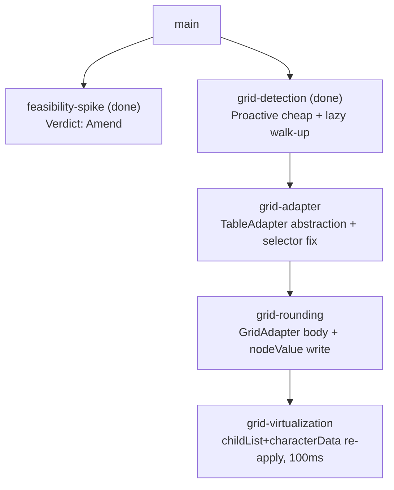

# Sprint Plan: Virtualized Data Grid Support — Revision (post-spike)

**Created:** 2026-06-11
**Base branch:** main
**Slug:** grid-support-v2
**Supersedes:** sprints 2–4 of `docs/sprint-plans/grid-support.md`

## 0. Why this revision exists

The original plan (`grid-support.md`) marked sprints 2–4 **provisional** pending
the `feasibility-spike` (Sprint 0). The spike has run. Its verdict is **Amend**
(full findings in `docs/sprint-logs/grid-support-feasibility-spike.md`).

Per the original plan's own rule and the `sprint-plan` skill (Phase 4b), the
merged `grid-support.md` is read-only — its provisional sprints are **not edited
in place**. This file is the fresh artifact that supersedes them. The original
plan, the spike log, and this revision together form the auditable decision
trail.

**What is settled and unchanged (do not re-execute):**

- **Sprint 0 `feasibility-spike`** — done; verdict recorded (PR #114, merged).
- **Sprint 1 `grid-detection`** — done; merged (PR #112). The spike explicitly
  notes it is **unaffected** by the verdict (detection-only; it performs no
  writes). One *cheap* selector touch-up lands in `grid-adapter` below (the
  `role="cell"` delta) but detection logic itself stands.

**What this revision changes (the three amendments from the spike):**

1. **Write model.** Replace in-place `cell.textContent = …` with **text-node
   `nodeValue` patching**. The `textContent` model crashes React's reconciler on
   the next re-render of a written cell (column resize reproduced a
   `removeChild` `NotFoundError` → error boundary → host results panel
   destroyed). `nodeValue` patching preserves the node identity the framework
   tracks and was validated crash-free against every re-render tested, including
   the previously-fatal column resize. A rounding tool that can crash the host
   app is not shippable, so this is a hard requirement, not a preference.
2. **Selectors.** Use `role="cell"` / `.dg--cell` for cells and `data-row` /
   `data-index` for the stable row key. The original D3 selectors
   `role="gridcell"` and `data-row-index` match **nothing** on Databricks. A
   stable row id *does* exist (`data-row` / `data-index`), so S7's reset model
   keeps its real key — the "no stable id" limitation the original plan hedged
   on does not apply here.
3. **Virtualization re-apply.** Keep the sprint-4 observer but also watch
   **`characterData`** mutations, not `childList` alone. An in-place **sort**
   reverts a cell's text by rewriting the existing text node (no node add/remove
   and the cell keeps our `.dr-ext-rounded` class), so a `childList`-only,
   class-gated handler misses it entirely. See D4 for the loop-guard and the
   value-based (not class-gated) re-round this forces.

Everything else from `grid-support.md` — the Context (§1), Strategy S1–S7 (§2,
with the S7 storage tweak noted in D3), Repo Survey (§3), and Sprint 1's design
(D1) — carries forward unchanged and is not repeated in full here.

## 1. Repo Conventions

(Carried from `grid-support.md` §3; restated so this artifact is self-contained
for the executor.)

- **Version files:** `chrome-extension/manifest.json` — MV3 `version`, 1–4
  dot-separated integers, no pre-release suffix. Sprint branches **must not**
  bump it.
- **Test command:** `node chrome-extension/tests.js`
- **Lint / Format:** none configured in-repo (no eslint/prettier config present).
- **Build:** none — the extension is loaded unbuilt from `chrome-extension/`.
- **Branch naming:** `feature/<label>` / `refactor/<label>` (never `claude/`).
- **Commit convention:** Conventional Commits (`feat:`, `fix:`, `refactor:`).
- **PR template:** none present.
- **Version-bump workflow:** detected at `.github/workflows/bump-version.yml`
  (bumps `manifest.json` on merge to main).

## 2. Design (amended)

D1 (detection) is unchanged from `grid-support.md`. D2–D4 below replace their
originals.

### D2 — TableAdapter abstraction (grid-adapter)

Two classes in `content.js`, unchanged in shape from the original D2:

```
NativeTableAdapter(tableElement)
  .getRows()        → [{ getCells() → [{ getText(), setText(s), el }] }]
  .getElement()     → the <table> element
  .isVirtualized()  → false

GridAdapter(wrapperElement)
  .getRows()        → visible rows, stitched from pinned + scrollable
  .getElement()     → the wrapper element
  .isVirtualized()  → true
```

`NativeTableAdapter.getRows()` wraps `table.rows` / `row.cells` verbatim — zero
behavior change, all existing tests stay green. `GridAdapter.getRows()` is a
stub returning `[]` in this sprint (filled in `grid-rounding`). `makeAdapter(el)`
factory: `NativeTableAdapter` if `el.tagName === 'TABLE'`, else `GridAdapter`.
The four engine functions (`isDataTable`, `roundTable`, `resetTable`,
`extractPreviewSamples`) are rewritten to consume the adapter; no caller
signature changes. `tableOptions` WeakMap stays keyed by the raw element;
adapters are ephemeral per-call (grids change row count on scroll — never cache
an adapter).

**Amendment note (cheap, lands here):** wherever Sprint 1's detection or any
new adapter scaffolding referenced `role="gridcell"` / `data-row-index`, correct
it to `role="cell"` / `data-row` (`data-index`) per the spike. This is a
search-replace-scale touch-up; it carries no behavioral risk in this sprint
because `GridAdapter.getRows()` is still stubbed.

### D3 — GridAdapter read + `nodeValue` write (grid-rounding)

`GridAdapter.getRows()` — structural first, ARIA/library selectors as shortcuts
(S1). **Selectors corrected per the spike:**

- **Scroll container:** prefer known library selectors
  (`.dg--grid-scroll-container`, `.dg--grid-container`,
  `.ag-center-cols-viewport`, `[role="grid"]`); else the descendant holding the
  repetitive aligned-column children; else `this.el`.
- **Pinned pane** (`.dg--pinned-grid`, `.ag-pinned-left-cols-container`, or a
  sibling with matching row count) — may be `null` for single-pane grids.
  (Databricks' result grid observed in the spike is single-pane; keep pinned
  support for AG Grid but do not assume it exists.)
- **Rows:** `[role="row"]` / `.dg--virtual-row` when present, else repetitive
  children of the scroll container.
- **Stitch:** for each row, collect the same-index row from the pinned pane by
  **`data-row`** (fallback **`data-index`**, then DOM index). **Not**
  `data-row-index`. Pinned cells first.
- **Cells:** `[role="cell"]` / `.dg--cell` when present, else repetitive row
  children. **Not** `[role="gridcell"]`.

**`setText(s)` — the new write model (replaces in-place `textContent`):**

1. Locate the cell's **target text node**: the deepest non-empty `Text` node
   (`nodeType === 3`, non-whitespace `nodeValue`) under the cell. A small
   `findCellTextNode(cellEl)` helper does a depth-first descent and returns the
   first such node (or `null` if the cell has no text node — then no-op).
2. Store the original on the cell once: `cell.dataset.drOriginal =
   textNode.nodeValue` (only if not already set).
3. **Patch in place:** `textNode.nodeValue = s`. **Never** replace the node,
   never set `cell.textContent`, never `removeChild`/`appendChild` on it — that
   is exactly what crashes the reconciler.
4. Add `.dr-ext-rounded` to the cell.

**`resetTable` via `GridAdapter`:** for each `.dr-ext-rounded` cell currently in
the DOM, re-locate its text node and restore `textNode.nodeValue =
cell.dataset.drOriginal`; clear the class and `dataset.drOriginal`. Rows recycled
out of view already show the framework's own text — no action needed (S7;
node-only storage remains sufficient, and now the stitch key `data-row` gives a
real identity if one is ever needed).

### D4 — Virtualization re-apply observer (grid-virtualization)

When a virtualized grid is rounded: find the scroll container (same logic as
`GridAdapter.getRows()` step 1) and attach a `MutationObserver` **debounced to
`GRID_REAPPLY_DEBOUNCE_MS` (100 ms)** (S5). Two amendments over the original D4:

**(a) Observe `characterData`, not `childList` alone.** Observer options:
`{ childList: true, characterData: true, subtree: true }`. `childList` catches
**row recycling** (scroll: rows added/removed). `characterData` catches
**in-place revert** — chiefly an in-column **sort**, where the framework rewrites
the existing text node's value while the node (and our `.dr-ext-rounded` class)
stays put. Without `characterData`, sort silently drops back to the host's
unrounded text and never re-rounds.

**(b) The handler re-rounds by value, not by class, and guards against its own
writes.** Two consequences of (a):

- *Class-gating no longer suffices.* On sort, the reverted cell still carries
  `.dr-ext-rounded`, so "round only rows lacking the class" skips it. The
  debounced `reapplyGridRounding(wrapperEl)` therefore re-rounds any visible
  cell whose **current text node value does not equal the value rounding would
  produce** from `tableOptions.get(wrapperEl)` — covering both freshly-recycled
  rows (no class yet) and sort-reverted cells (class present, value stale).
- *Our own `nodeValue` writes fire `characterData` mutations.* To avoid an
  infinite re-apply loop, **disconnect the observer for the duration of the
  re-apply writes and reconnect after** (a per-grid re-entrancy flag is the
  fallback if disconnect/reconnect churn proves costly). The initial
  `roundTable` pass must do the same so it does not immediately re-trigger
  itself.

Observer stored in `gridObservers: WeakMap<Element, MutationObserver>`; the
pending debounce timer in a parallel `WeakMap<Element, number>`. Torn down
(timer cleared, observer disconnected) on `resetTable`, toggle-off, and grid
removal (the existing removed-node MutationObserver, L493).

**Known re-apply scope.** Vertical row recycle and in-place sort are handled.
Column (horizontal) virtualization remains out of scope (§5) — a cell scrolled
out of the horizontal viewport is removed from the DOM and re-enters fresh; the
same `childList` path would catch it, but stitching across horizontally-recycled
columns is a separate problem deferred to a follow-up.

## 3. Sprint List & Dependency Graph

Sprints 0 (`feasibility-spike`) and 1 (`grid-detection`) are **done and merged**
and are shown only for context. This revision executes the three superseding
sprints, **strictly sequentially** — each branches from `main` after the prior
merges. The chain is linear because each sprint edits the same `content.js`
engine surface (`isDataTable` / `roundTable` / `resetTable`), so parallel
branches would conflict; and because each later sprint depends on the prior's
code (the adapter contract, then its body, then the observer that drives it).

### Sprint List

0. **feasibility-spike** *(done — PR #114)* — verdict **Amend**; this plan is the
   amendment.
1. **grid-detection** *(done — PR #112)* — proactive cheap pass + lazy walk-up;
   unaffected by the verdict.
2. **grid-adapter** — `NativeTableAdapter` / `GridAdapter` stub interface;
   refactor the four engine functions onto adapters; correct `role="gridcell"`
   → `role="cell"` / `data-row-index` → `data-row` selector references.
   _Depends on:_ grid-detection (merged). _Branch from:_ `main`.
3. **grid-rounding** — implement `GridAdapter.getRows()` with corrected
   selectors; round visible rows via **text-node `nodeValue` patching**.
   _Depends on:_ grid-adapter merged.
4. **grid-virtualization** — 100 ms-debounced `MutationObserver` watching
   `childList` **and** `characterData`; value-based re-round with a write-guard.
   _Depends on:_ grid-rounding merged.

### Dependency Graph



## 4. Sprint Definitions

### grid-adapter

- **Goal:** Refactor the rounding engine onto a `TableAdapter` interface.
  `NativeTableAdapter` is behavior-identical to today (all existing tests stay
  green). `GridAdapter` defines the contract with a stubbed body. Correct the
  spike's selector deltas in any existing references.
- **Branch:** `refactor/grid-adapter` off `main` after grid-detection merged.
- **Scope — `chrome-extension/content.js`:**
  - `NativeTableAdapter` class: `constructor(el)`, `getElement()`,
    `isVirtualized() → false`, `getRows()` wrapping `Array.from(el.rows)` →
    `getCells()` → `getText()`, `setText(s)`, `el`, `tagName`, reproducing
    current logic verbatim.
  - `GridAdapter` stub: `getElement() → this.el`, `isVirtualized() → true`,
    `getRows() → []`.
  - `makeAdapter(el)` factory.
  - Rewrite `isDataTable`, `roundTable`, `resetTable`, `extractPreviewSamples`
    to use `makeAdapter(el).getRows()` / `row.getCells()`. `roundTable` returns
    early when `getRows()` is empty (clean stub path).
  - **Selector correction (spike amendment 2):** replace any `role="gridcell"`
    with `role="cell"` and any `data-row-index` with `data-row` across detection
    / adapter scaffolding. (No live grid write path exists yet, so this is safe.)
  - `tableOptions` WeakMap stays keyed by raw element; adapters built per call.
- **Scope — `chrome-extension/tests.js`:** all existing tests unchanged; add a
  `NativeTableAdapter` round-trip test and a `GridAdapter` stub no-throw test.
- **Out of scope:** `GridAdapter.getRows()` body; the `nodeValue` write (that is
  grid-rounding); sidebar; defaults.
- **Acceptance criteria:**
  - `node chrome-extension/tests.js` passes with zero regressions.
  - Native `<table>` rounding byte-identical to pre-refactor build.
  - `roundTable` on a grid element returns without throwing.
  - No `role="gridcell"` or `data-row-index` literal remains in `content.js`.
- **Depends on:** grid-detection (merged).
- **Complexity:** M
- **Dev notes:**
  - `NativeTableAdapter.getRows()` is a thin wrapper — zero behavior change.
  - Do not bump `manifest.json`.

---

### grid-rounding

- **Goal:** Implement `GridAdapter.getRows()` with the corrected selectors, and
  round the currently-visible rows of a data grid using **text-node `nodeValue`
  patching** — never `cell.textContent`.
- **Branch:** `feature/grid-rounding` off `main` after grid-adapter merged.
- **Scope — `chrome-extension/content.js`:**
  - Implement `GridAdapter.getRows()` per D3: scroll container → pinned pane
    (nullable) → rows (`[role="row"]` / `.dg--virtual-row`) → stitch by
    `data-row` / `data-index` / DOM index → cells (`[role="cell"]` /
    `.dg--cell`).
  - Add `findCellTextNode(cellEl)` helper: depth-first, returns the deepest
    non-empty `Text` node, or `null`.
  - `cell.setText(s)`:
    1. `const tn = findCellTextNode(this.el)`; if `null`, no-op.
    2. `if (this.el.dataset.drOriginal === undefined) this.el.dataset.drOriginal
       = tn.nodeValue;`
    3. `tn.nodeValue = s;` — **in place; never replace the node.**
    4. `this.el.classList.add('dr-ext-rounded')`.
  - `resetTable` via `GridAdapter`: for each in-DOM `.dr-ext-rounded` cell,
    re-locate its text node, restore `nodeValue` from `dataset.drOriginal`, clear
    class + attribute. Recycled rows need no action.
  - `isDataTable` via `GridAdapter`: sample ≤ 10 cells; true if any parses finite.
  - `createToggleForTable` grid path: replace Sprint 1's `looksLikeGrid` gate
    with `isDataTable(makeAdapter(el))` now that `getRows()` works.
- **Scope — `chrome-extension/tests.js`:**
  - Unlabelled variable-row-height grid (no roles): structural extraction +
    `nodeValue` rounding applies. Headline.
  - `.dg--`-shaped grid: `.dg--virtual-row` / `.dg--cell` + `data-row` path.
  - **`nodeValue` write asserts node identity:** capture the cell's `Text` node
    reference, round, assert the *same node object* now holds the rounded value
    (i.e. the node was patched, not replaced). This is the regression guard for
    the reconciler crash.
  - `resetTable`: restores originals on visible rows; a simulated recycled row
    (node removed + re-added by the framework) shows framework text with no
    `.dr-ext-rounded` and needs no restore.
  - `extractPreviewSamples`: expected structure.
- **Out of scope:** the scroll/sort re-apply observer (grid-virtualization).
- **Known limitation (until grid-virtualization):** rounding is lost when rows
  recycle on scroll or when a column is sorted — they revert to host text.
  Document in release notes.
- **Acceptance criteria:**
  - On a live Databricks result grid: right-click + apply rounds all visible
    cells; toggle off restores them.
  - **No host crash** on column resize / re-render of a rounded cell (the
    `textContent` model's failure mode; the `nodeValue` model must not reproduce
    it). Verify manually on Databricks, since the crash was reconciler-level.
  - `node chrome-extension/tests.js` passes.
- **Depends on:** grid-adapter merged.
- **Complexity:** M
- **Dev notes:**
  - The whole point of this sprint is **node identity preservation**. If a review
    diff shows `textContent =`, `innerText =`, `appendChild`, or `removeChild` on
    a grid cell, it is wrong — only `someTextNode.nodeValue = …` is permitted for
    the write.
  - Column (horizontal) virtualization stays out of scope; do not scroll-trigger
    extra rendering.
  - Do not bump `manifest.json`.

---

### grid-virtualization

- **Goal:** Keep a rounded grid rounded as the user scrolls **and as they sort** —
  re-apply rounding to rows recycled into the viewport and to cells reverted in
  place, via a `MutationObserver` watching `childList` and `characterData`.
- **Branch:** `feature/grid-virtualization` off `main` after grid-rounding merged.
- **Scope — `chrome-extension/content.js`:**
  - Add module constant `GRID_REAPPLY_DEBOUNCE_MS = 100`.
  - Add `gridObservers: WeakMap<Element, MutationObserver>` and
    `gridReapplyTimers: WeakMap<Element, number>` at module level.
  - In `roundTable`, when `adapter.isVirtualized()`:
    1. Find the scroll container (same logic as `GridAdapter.getRows()` step 1).
    2. Create a `MutationObserver` whose callback (re)schedules a single
       `setTimeout(…, GRID_REAPPLY_DEBOUNCE_MS)` per grid; on fire it calls
       `reapplyGridRounding(wrapperEl)`.
    3. `observer.observe(scrollContainer, { childList: true, characterData:
       true, subtree: true })`.
    4. `gridObservers.set(wrapperEl, observer)`.
  - `reapplyGridRounding(wrapperEl)`:
    - **Disconnect the grid's observer first** (so our own writes don't
      re-trigger it), perform the pass, then **reconnect** with the same options.
    - For each visible cell, compute the value rounding would produce from
      `tableOptions.get(wrapperEl)`; if the cell's current text-node value differs
      (covers recycled rows lacking the class **and** sort-reverted cells that
      still carry it), re-apply via the `nodeValue` write.
  - The initial `roundTable` pass must likewise not let its own writes re-trigger
    the observer (attach the observer *after* the first pass, or wrap the first
    pass in the same disconnect/reconnect).
  - In `resetTable`: if virtualized and observed, clear `gridReapplyTimers`,
    disconnect + delete the observer, then restore cells.
  - In the removed-node MutationObserver (L493): disconnect any `gridObservers`
    entry for a removed grid and clear its timer.
- **Scope — `chrome-extension/tests.js`:**
  - **Recycle (childList):** round a grid; append a new (unrounded) row; advance
    past 100 ms; assert the new row is rounded.
  - **Sort revert (characterData):** round a grid; rewrite a rounded cell's text
    node value back to its original (simulating an in-place sort, node identity
    preserved, class retained); advance past 100 ms; assert the cell is
    re-rounded. This is the amendment's headline test.
  - **Debounce:** N rapid mutations fire `reapplyGridRounding` once.
  - **No self-trigger loop:** a single round/re-apply does not schedule an
    unbounded cascade (assert the timer fires a bounded number of times).
  - **After `resetTable`:** a subsequent mutation does not trigger rounding.
- **Out of scope:** column (horizontal) virtualization.
- **Acceptance criteria:**
  - Scrolling a rounded Databricks result rounds newly-visible rows with no
    visible stutter.
  - **Sorting a rounded column keeps it rounded** (the `characterData` path).
  - Re-application does not loop or thrash (observer disconnected during writes).
  - Toggling off stops all re-application.
  - No perf regression on native `<table>` pages (observer attaches only for
    `isVirtualized()` adapters).
  - `node chrome-extension/tests.js` passes.
- **Depends on:** grid-rounding merged.
- **Complexity:** M
- **Dev notes:**
  - Use `setTimeout` for the debounce, not `requestAnimationFrame`.
  - The `characterData` observer **will** see our own writes — the
    disconnect/reconnect around `reapplyGridRounding` (and the first
    `roundTable` pass) is mandatory, not optional. A re-entrancy boolean is an
    acceptable alternative if disconnect churn shows up in profiling.
  - Named constant: `GRID_REAPPLY_DEBOUNCE_MS` in `content.js`.
  - If `characterData` mutation volume on a real page proves too high, narrow
    `subtree`/scope before abandoning the sort case — accepting sort as a gap is
    the last resort, not the first.
  - Do not bump `manifest.json`.

## 5. Open Questions

- **AG Grid / Cloudscape / Azure Data Studio selectors.** The corrected selector
  list is validated only on Databricks (the one grid the spike exercised live).
  AG Grid selectors (`.ag-…`) are carried from research, not spike-verified;
  confirm against a live AG Grid before relying on the pinned-pane stitch there.
- **Sort detection cost.** `characterData: true, subtree: true` on a large scroll
  container may be chatty. The 100 ms debounce plus disconnect-during-write
  should contain it, but measure on a real Databricks result before finalizing
  `grid-virtualization`.
- **Column virtualization** remains unhandled (§6).

## 6. Out of Scope

- Column (horizontal) virtualization.
- Google Sheets / Excel Online (partially canvas-rendered).
- Python / `js/` sibling implementations — grid support is browser-only.
- An overlay-rendering write model — considered and rejected in the spike as
  fragile and too host-specific; `nodeValue` patching supersedes it.

## 7. Decisions Log

- 2026-06-11: Revision created from the `feasibility-spike` verdict (**Amend**;
  `docs/sprint-logs/grid-support-feasibility-spike.md`). Supersedes the
  provisional sprints 2–4 of `grid-support.md`, which stays read-only.
- 2026-06-11: **Write model** changed from in-place `cell.textContent =` to
  **text-node `nodeValue` patching**. Rationale: `textContent` removes/recreates
  the cell's text node while React holds a fiber reference to the original, so
  the next reconcile (column resize reproduced it) throws `removeChild`
  `NotFoundError` and an error boundary destroys the host results panel.
  `nodeValue` patching preserves node identity and was validated crash-free,
  including on the previously-fatal column resize.
- 2026-06-11: **Selectors** corrected: cells are `role="cell"` / `.dg--cell`
  (not `role="gridcell"`); stable row key is `data-row` / `data-index` (not
  `data-row-index`). A real stable row id exists, so S7's reset model keeps a
  genuine key and the "no stable id" hedge is dropped.
- 2026-06-11: **Re-apply observer** widened to watch `characterData` in addition
  to `childList`, because an in-place sort reverts cell text without node
  add/remove and while keeping our `.dr-ext-rounded` class. This forces (a) a
  value-based rather than class-gated re-round, and (b) a mandatory
  disconnect-during-write guard so our own `nodeValue` writes don't self-trigger.
- 2026-06-11: Sprint 1 (`grid-detection`) confirmed **unaffected** by the verdict
  (detection-only, no writes); kept as merged, with only the cheap
  `role="cell"` selector touch-up folded into `grid-adapter`.
