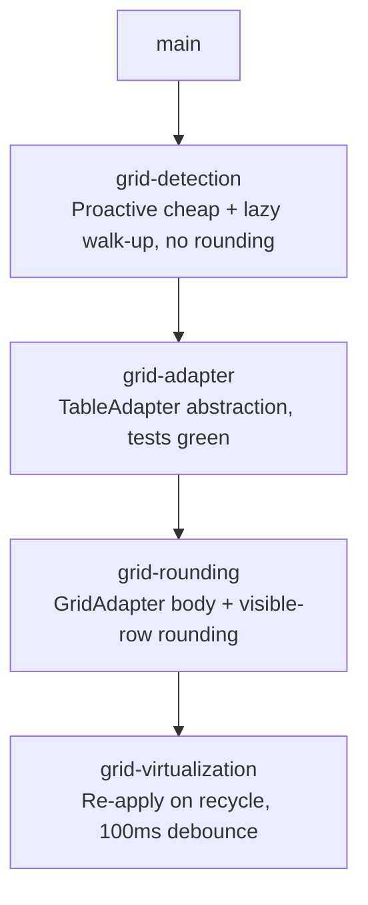

# Sprint Plan: Virtualized Data Grid Support

**Created:** 2026-06-10
**Base branch:** main
**Slug:** grid-support

## 1. Context

The dynamic-rounding Chrome extension rounds numbers in native HTML `<table>`
elements. Modern web apps — Databricks SQL, AG Grid dashboards, Azure Data
Studio, AWS Cloudscape — render results as **data grids** built from plain
`<div>` containers, often virtualized (only visible rows exist in the DOM) and
often split into pinned (frozen columns) and scrollable panes. Many such grids
carry no `<table>` tag and no ARIA roles. These grids are invisible to the
extension today.

Research is in `docs/research/databricks-grid-detection.md`. Key structural
facts:

- **Databricks SQL:** `.dg--table-wrapper` wraps `.dg--pinned-grid` +
  `.dg--grid-scroll-container` (both happen to carry `role="grid"`).
- **AG Grid:** `.ag-pinned-left-cols-container` + `.ag-center-cols-viewport`.
- Many grids expose **no** roles or recognizable classes — they must be found
  by structure alone.
- **Virtualization:** only visible rows are in the DOM; nodes are recycled as
  the user scrolls — there is no single "full table" in the DOM at any time.

Every layer of `content.js` is hard-wired to the `<table>` DOM API, so adding
detection alone is not sufficient. The four sprints below address discovery,
abstraction, rounding, and virtualization in dependency order.

## 2. Strategy

These decisions were finalized before planning and shape every sprint.

### S1 — Two extraction paths, four detection signals

There are only **two** ways to *read* a table once found: the native table API
(`.rows`/`.cells`, handles `colspan`/`th`) and div-walking (everything else).
Native `<table>` is its own path. ARIA grids and unlabelled grids share the
div-walk path; they differ only in how they are detected.

Detection signals, in decreasing precision / increasing recall:
`<table>` tag → library class (`dg--`, `ag-`) → ARIA `role` → raw structure.
The cheap signals are also the precise ones, so they run first; the expensive
structural heuristic runs last and rarely.

### S2 — Column structure, not row height, is the heuristic's spine

Row-height uniformity is a **bad** signal: any table with a text column that
wraps produces variable row heights (most Wikipedia tables, most non-purely-
numeric Databricks results). The heuristic instead keys on:

- **Consistent cell count** — every candidate row has the same number of
  children. Cheap, no geometry.
- **Column-width alignment** — cells in the same column position share a
  width; columns line up vertically. Robust to text wrapping.
- **Repetitive row structure** — near-identical class names / child shape.
- **Numeric content** — at least one cell parses as a finite number. The
  single most important false-positive guard.

Row height is not tested.

### S3 — Lazy discovery for unlabelled grids; proactive only where it's free

The structural heuristic measures geometry (`offsetWidth`) which forces
synchronous layout — expensive on large, dynamic pages, exactly the pages
that have these grids. So:

- **Proactive (page load + MutationObserver):** only cheap signals —
  `querySelectorAll('table')` and `[role="grid"], [role="table"]`. Badge the
  dot immediately at negligible cost.
- **Lazy (right-click only):** the structural heuristic. Walks **up** from
  the clicked element, testing a bounded set of ancestors (see S6).

### S4 — Geometry measured last and narrowest

Within the heuristic, cheap checks gate the expensive one: child count →
class repetition → layout → numeric content **first**; only candidates
surviving these get column widths measured. Lazy discovery further limits
this to the right-clicked element's ancestors — never a page-wide scan.

### S5 — Debounce re-apply at 100 ms

The sprint-4 re-apply observer batches the row-recycle mutations fired during
scroll and reacts at most once per **100 ms** — well under the ~100 ms "feels
instant" threshold while doing ~6× less work than per-frame reaction.

### S6 — Walk-up stopping rule

Lazy discovery walks up from the clicked element calling `looksLikeGrid` at
each ancestor. It keeps going as long as the **parent also passes** —
returning the **outermost** matching container, not the innermost. This
naturally selects the wrapper element (e.g., `.dg--table-wrapper` containing
both the pinned and scroll panes) over an inner pane, because the wrapper
inherits the structural properties of its children. Stops when the parent
fails the test, is `<body>`, or depth exceeds 15.

### S7 — Original values stored on the node only

When rounding a grid cell, the pre-round text is stored in
`cell.dataset.drOriginal` on the cell node. This is sufficient: the only
cells that ever need resetting are those currently in the DOM and marked
`.dr-ext-rounded` — i.e., currently-visible rows. When a row scrolls out of
view the framework recycles the node and overwrites our text; from our
perspective the node is gone and no restoration is needed. The sprint-4
re-apply observer re-rounds newly-visible rows from the stored *options*
(`tableOptions` WeakMap), not from stored originals. No separate logical-
coordinate originals map is needed.

## 3. Repo Survey

- Chrome extension (MV3) at `chrome-extension/`: `content.js` (~1800 lines,
  all table logic), `sidebar.js` / `sidebar.html` (options UI), `defaults.js`
  (shared `DR_DEFAULTS`), `tests.js` (~6 k lines, Node test runner).
- Key functions and their DOM coupling:

| Function | Line | Coupling |
|---|---|---|
| `injectTableToggles` | 434 | `querySelectorAll('table')` |
| MutationObserver | 469–494 | `querySelectorAll('table')` |
| right-click handler | 49, 71 | `closest('table')` |
| `isDataTable` | 288 | `.rows`, `.cells` |
| `roundTable` | 740 | `table.rows`, `row.cells`, `cell.tagName !== 'TD'` |
| `resetTable` | 636 | `table.rows` |
| `extractPreviewSamples` | 681 | `table.rows`, `row.cells` |
| `positionToggle` | 261 | `table.getBoundingClientRect()` |

- Test command: `node chrome-extension/tests.js`
- Branch naming: `feature/<label>` / `fix/<label>` / `refactor/<label>` (never `claude/`)
- Commit convention: Conventional Commits (`feat:`, `fix:`, `refactor:`)
- Version bumps: handled by `.github/workflows/bump-version.yml` on merge to
  main; sprint branches must **not** bump versions.

## 4. Design

### D1 — Detection: proactive cheap pass + lazy structural walk-up (sprint 1)

Two entry points, per S3 + S6:

**Proactive — `injectTableToggles` + MutationObserver:** keep the existing
`querySelectorAll('table')` pass; add one cheap selector pass
`querySelectorAll('[role="grid"], [role="table"]')`. Both badge the toggle dot
on load. No structural scanning, no geometry.

**Lazy — `looksLikeGrid(el)` walk-up on right-click:** `findTargetTable(el)`
replaces `closest('table')` in the right-click handler. It returns the nearest
`<table>` ancestor first; else the nearest ancestor already carrying
`dr-ext-grid`; else walks up calling `looksLikeGrid`, per S6 (outermost match,
depth cap 15, stop at `<body>`). On a new match: add `dr-ext-grid` and badge.

`looksLikeGrid(el)` applies the S2/S4 cheap-first ladder:

1. **Child count** — ≥ 5 children. Cheap.
2. **Repetitive structure** — children share class / child shape. Cheap.
3. **Consistent cell count** — candidate rows have equal child counts. Cheap.
4. **Layout** — `getComputedStyle(el).display` is `grid` or `flex`. One read.
5. **Numeric content** — ≥ 1 cell parses as a finite number. Mandatory.
6. **Column-width alignment** — only for candidates surviving 1–5: measure
   `offsetWidth` of column-0 cells across a sample of rows; expect uniform
   widths. The only geometry probe; runs on a bounded set.

Row height is **not** tested (S2). An ARIA role or recognized library class on
`el` (e.g., `role="grid"`, `.dg--`, `.ag-`) short-circuits to accept before
step 6, skipping the geometry probe.

### D2 — TableAdapter abstraction (sprint 2)

Two classes in `content.js`:

```
NativeTableAdapter(tableElement)
  .getRows()        → [{ getCells() → [{ getText(), setText(s), el }] }]
  .getElement()     → the <table> element
  .isVirtualized()  → false

GridAdapter(wrapperElement)
  .getRows()        → visible rows, stitched from pinned + scrollable
  .getElement()     → the wrapper element
  .isVirtualized()  → true
```

`NativeTableAdapter.getRows()` wraps `table.rows` / `row.cells` verbatim.
`GridAdapter.getRows()` is a stub returning `[]` in sprint 2 (filled in sprint
3). `makeAdapter(el)` factory: `NativeTableAdapter` if `el.tagName === 'TABLE'`,
else `GridAdapter`. `roundTable`, `resetTable`, `extractPreviewSamples`, and
`isDataTable` rewritten to use the adapter; no caller signature changes.
`tableOptions` WeakMap stays keyed by the raw element; adapters are ephemeral
per-call (grids change row count on scroll — never cache).

### D3 — GridAdapter read/write + visible-row rounding (sprint 3)

`GridAdapter.getRows()` — structural first, ARIA/library as shortcuts (S1):

- **Scroll container:** prefer known library selectors
  (`.dg--grid-scroll-container`, `.ag-center-cols-viewport`,
  `[role="grid"]:not(.dg--pinned-grid)`); else the descendant holding the
  repetitive aligned-column children; else `this.el`.
- **Pinned pane** (`.dg--pinned-grid`, `.ag-pinned-left-cols-container`, or a
  sibling with matching row count) — may be `null` for single-pane grids.
- **Rows:** `[role="row"]` when present, else repetitive children of scroll
  container.
- **Stitch:** for each row, collect the same-index row from the pinned pane
  by `data-row-index` when available, else DOM index. Pinned cells first.
- **Cells:** `[role="gridcell"]` when present, else repetitive row children.
- **`setText(s)`:** writes `cell.textContent`, adds `.dr-ext-rounded`, stores
  pre-round text in `cell.dataset.drOriginal` (S7 — node-only storage is
  sufficient).

`resetTable` via `GridAdapter`: restore only cells currently in the DOM with
`.dr-ext-rounded` from their `dataset.drOriginal`; clear the class and attribute.
Non-visible rows already show the framework's original text — no action needed.

### D4 — Virtualization re-apply observer (sprint 4)

When a virtualized grid is rounded: find the scroll container, attach a
`MutationObserver` on `childList` **debounced to 100 ms** (S5). The debounced
handler `reapplyGridRounding(wrapperEl)` re-rounds only rows lacking
`.dr-ext-rounded`, using `tableOptions.get(wrapperEl)`. Observer stored in
`gridObservers: WeakMap<Element, MutationObserver>`. Torn down on reset,
toggle-off, and grid removal.

## 5. Sprint List & Dependency Graph

### Sprint List

**Execute strictly sequentially — one branch at a time, each off the updated
`main` after the prior sprint merges.** Although sprints 1 and 2 are *logically*
independent, both edit `content.js` and both touch `createToggleForTable` and
`isDataTable`, so developing them on parallel branches would create avoidable
merge conflicts. Do them in order.

1. **grid-detection** — Proactive cheap pass (native + ARIA) and lazy
   right-click structural walk-up; toggle placement; no rounding.
   _Depends on:_ none. _Branch from:_ `main`.
2. **grid-adapter** — `NativeTableAdapter` / `GridAdapter` stub interface;
   refactor the four engine functions to use adapters. Existing tests stay green.
   _Depends on:_ grid-detection merged to main (shared edits to
   `createToggleForTable` / `isDataTable`). _Branch from:_ updated `main`.
3. **grid-rounding** — Implement `GridAdapter.getRows()`; round currently-
   visible grid rows. _Depends on:_ grid-adapter merged to main.
4. **grid-virtualization** — 100 ms-debounced MutationObserver to re-apply
   rounding on row recycle. _Depends on:_ grid-rounding merged to main.

### Dependency Graph



The chain is linear: each sprint branches from `main` only after the previous
one has merged. Sprints 1 and 2 have no *logical* dependency, but the file-level
overlap in `content.js` (`createToggleForTable`, `isDataTable`) makes sequential
execution the conflict-free path for a single developer/session.

## 6. Sprint Definitions

### grid-detection

- **Goal:** Discover data grids and badge them with the existing toggle dot.
  Proactive cheap pass for native/ARIA grids on page load; lazy right-click
  structural walk-up for unlabelled div-grids. No rounding this sprint.
- **Branch:** `feature/grid-detection` off `main`
- **Scope — `chrome-extension/content.js`:**
  - Add module-level `looksLikeGrid(el)`: cheap-first ladder per D1.
    Short-circuit accept on `role="grid"` / known library class. No row-height
    test. Returns boolean.
  - Add module-level `findTargetTable(el)`: returns nearest `<table>` ancestor;
    else nearest ancestor carrying `dr-ext-grid`; else walks up per S6
    (outermost `looksLikeGrid` match, depth cap 15, stop at `<body>`); on new
    match adds `dr-ext-grid`, calls `createToggleForTable`, returns the element.
    Returns `null` if nothing found.
  - `injectTableToggles` (L434): keep `querySelectorAll('table')` pass; add
    `querySelectorAll('[role="grid"], [role="table"]')` pass. Skip elements
    already carrying `dr-ext-grid` or containing an already-handled `<table>`.
    **No `looksLikeGrid` scan here** — proactive pass is cheap selectors only.
  - MutationObserver (L469–494): mirror only the two cheap selector passes for
    added nodes; mirror removal handling for grids.
  - Right-click handler (L49, L71): replace `closest('table')` with
    `findTargetTable(event.target)`.
  - `createToggleForTable`: when element is not `<table>`, gate on
    `looksLikeGrid(el)` instead of `isDataTable()` (which reads `.rows`).
  - Mark discovered grids: `el.classList.add('dr-ext-grid')`.
  - `positionToggle`: no change — `getBoundingClientRect()` works on any element.
- **Scope — `chrome-extension/tests.js`:**
  - `looksLikeGrid()` unit tests:
    - **Pass — unlabelled, variable row heights:** `<div>` rows with mixed
      text+numbers, column widths aligned but row heights vary. (Headline — S2.)
    - **Pass — ARIA short-circuit:** same structure plus `role="grid"`.
    - **Pass — Databricks shape:** pinned + scrollable sibling panes.
    - **Reject — layout grid:** CSS card grid, no numeric cells.
    - **Reject — nav menu:** repetitive rows, no numbers.
  - `findTargetTable()` walk-up: returns the outermost matching ancestor (S6),
    not an inner pane; does not overshoot to `<body>`.
- **Out of scope:** Rounding grid contents. Toggle click fires but `roundTable`
  no-ops on a div (`.rows` undefined) — acceptable this sprint.
- **Acceptance criteria:**
  - Native `<table>` and `[role="grid"]` get a dot on page load (proactive).
  - An unlabelled div-grid with variable row heights gets a dot after right-
    click; dot is on the outermost grid root (S6), not an inner pane.
  - No structural scan runs on page load or in the MutationObserver.
  - No dot on a CSS layout grid with no numeric rows.
  - `node chrome-extension/tests.js` passes.
- **Depends on:** none
- **Complexity:** M
- **Dev notes:**
  - Numeric-content guard is mandatory (guards against nav bars / card grids).
  - Do not rename `lastRightClickedTable`; its type widens to "table or grid
    root". Add a comment documenting the widened contract.
  - Do not bump `manifest.json` version.

---

### grid-adapter

- **Goal:** Refactor the rounding engine onto a `TableAdapter` interface.
  `NativeTableAdapter` must be behavior-identical to today (all existing tests
  stay green). `GridAdapter` defines the contract with a stubbed body (sprint 3
  fills it in).
- **Branch:** `refactor/grid-adapter` off `main` after grid-detection merges
- **Scope — `chrome-extension/content.js`:**
  - `NativeTableAdapter` class (near `isDataTable`):
    - `constructor(el)` — `this.el = el`
    - `getElement()` — returns `this.el`
    - `isVirtualized()` — returns `false`
    - `getRows()` — wraps `Array.from(el.rows)` → each row exposes
      `getCells()` → each cell exposes `getText()`, `setText(s)`, `el`,
      `tagName` — reproducing current logic verbatim.
  - `GridAdapter` stub class:
    - `getElement()` → `this.el`; `isVirtualized()` → `true`; `getRows()` → `[]`
  - `makeAdapter(el)` factory: `new NativeTableAdapter(el)` if
    `el.tagName === 'TABLE'`, else `new GridAdapter(el)`.
  - Rewrite `isDataTable`, `roundTable`, `resetTable`, `extractPreviewSamples`
    to use `makeAdapter(el).getRows()` / `row.getCells()`. `roundTable` returns
    early when `getRows()` is empty (handles stub path cleanly).
  - `tableOptions` WeakMap stays keyed by raw element; adapters constructed
    fresh per call.
- **Scope — `chrome-extension/tests.js`:** all existing tests unchanged; add
  `NativeTableAdapter` round-trip test and `GridAdapter` stub no-throw test.
- **Out of scope:** `GridAdapter.getRows()` body; sidebar; defaults.
- **Acceptance criteria:**
  - `node chrome-extension/tests.js` passes with zero regressions.
  - Native `<table>` rounding byte-identical to pre-refactor build.
  - `roundTable` on a grid element returns without throwing.
- **Depends on:** grid-detection merged to main (avoids `content.js` conflicts
  in `createToggleForTable` / `isDataTable`)
- **Complexity:** M
- **Dev notes:**
  - `NativeTableAdapter.getRows()` is a thin wrapper — zero behavior change.
  - Do not bump `manifest.json` version.

---

### grid-rounding

- **Goal:** Implement `GridAdapter.getRows()` so rounding, reset, and preview
  extraction work on the currently-visible rows of a data grid.
- **Branch:** `feature/grid-rounding` off `main` after grid-adapter merges
- **Scope — `chrome-extension/content.js`:**
  - Implement `GridAdapter.getRows()` per D3:
    1. Scroll container: library selectors first, then structural, then `this.el`.
    2. Pinned pane: library selectors or same-row-count sibling; may be `null`.
    3. Rows: `[role="row"]` when present, else repetitive children.
    4. Stitch: same-index row from pinned pane by `data-row-index` or DOM index.
       Log `console.debug` warning and fall back to DOM index when `data-row-index`
       is absent.
    5. Cells: `[role="gridcell"]` when present, else repetitive row children;
       pinned cells first.
    6. `setText(s)`: write `textContent`, add `.dr-ext-rounded`, store original
       in `cell.dataset.drOriginal` (S7 — node-only; sufficient because only
       currently-visible rounded cells ever need resetting).
  - `resetTable` via `GridAdapter`: iterate cells currently in the DOM with
    `.dr-ext-rounded`; restore from `dataset.drOriginal`; clear class + attr.
    Non-visible rows show the framework's original text — no action needed.
  - `isDataTable` via `GridAdapter`: sample ≤ 10 cells; true if any is finite.
  - `createToggleForTable` grid path: replace the sprint-1 `looksLikeGrid` gate
    with `isDataTable(makeAdapter(el))` now that `getRows()` works.
- **Scope — `chrome-extension/tests.js`:**
  - **Unlabelled, variable row heights** (no roles): structural extraction +
    rounding applies. Headline.
  - ARIA grid: `[role="row"]`/`[role="gridcell"]` shortcut path.
  - Pinned pane: correct stitched column order.
  - `resetTable`: restores originals on currently-visible rows; simulated
    recycled row (removed + re-added by framework) shows framework text (no
    `.dr-ext-rounded`, no restore needed).
  - `extractPreviewSamples`: returns expected structure.
- **Known limitation (until sprint 4):** rounding state is lost when rows scroll
  out of view — they re-enter the DOM fresh. Document in release notes.
- **Acceptance criteria:**
  - Right-click + apply rounding on a Databricks result rounds all visible cells;
    toggle off restores them.
  - **Framework clobbering validation:** manually verify on a live Databricks
    page that rounding survives same-position re-renders; if the framework
    overwrites our text faster than we can re-apply, escalate before sprint 4
    (may require overlay rendering instead of in-place text replacement).
  - `node chrome-extension/tests.js` passes.
- **Depends on:** grid-adapter merged to main
- **Complexity:** M
- **Dev notes:**
  - Do not attempt to scroll-trigger additional row rendering.
  - Do not bump `manifest.json` version.

---

### grid-virtualization

- **Goal:** Keep a rounded grid rounded as the user scrolls — re-apply rounding
  to rows recycled into the viewport.
- **Branch:** `feature/grid-virtualization` off `main` after grid-rounding merges
- **Scope — `chrome-extension/content.js`:**
  - Add `gridObservers: WeakMap<Element, MutationObserver>` at module level.
  - In `roundTable`, when `adapter.isVirtualized()`:
    1. Find scroll container (same logic as `GridAdapter.getRows()` step 1).
    2. Create `MutationObserver` with handler debounced to **100 ms**:
       `setTimeout`-based debounce (one pending timer per grid); on fire calls
       `reapplyGridRounding(wrapperEl)`.
    3. `reapplyGridRounding`: calls `roundTable(wrapperEl,
       tableOptions.get(wrapperEl))` scoped to rows lacking `.dr-ext-rounded`.
    4. `observe(scrollContainer, { childList: true, subtree: true })`.
    5. `gridObservers.set(wrapperEl, observer)`.
  - In `resetTable`, if virtualized and observed: clear the debounce timer,
    disconnect and delete the observer before restoring cells.
  - In the removed-node MutationObserver (L493): disconnect any `gridObservers`
    entry for a removed element.
- **Scope — `chrome-extension/tests.js`:**
  - Round a grid; append a new row (simulated recycle); advance past 100 ms
    debounce; assert new row is rounded.
  - N rapid row-additions fire only one `reapplyGridRounding` (debounce).
  - After `resetTable`: appending a row does **not** trigger rounding.
- **Out of scope:** Column (horizontal) virtualization — cells entering the
  horizontal viewport. Warrants a follow-up sprint if reported.
- **Acceptance criteria:**
  - Scrolling a rounded Databricks result rounds newly-visible rows
    automatically with no visible stutter.
  - Toggling off stops re-application.
  - No perf regression on native `<table>` pages.
  - `node chrome-extension/tests.js` passes.
- **Depends on:** grid-rounding merged to main
- **Complexity:** M
- **Dev notes:**
  - Use `setTimeout` for the 100 ms debounce, not `requestAnimationFrame`
    (rAF fires at ~16 ms; we want 100 ms).
  - Clear the pending timer in `resetTable` to avoid a stale re-apply after
    toggle-off.
  - Narrow from `subtree: true` to direct-child-only if mutation volume on a
    real page proves too high.
  - Do not bump `manifest.json` version.

## 7. Open Questions

- **AG Grid / Cloudscape / Azure Data Studio selectors.** Sprint 3's selector
  list covers Databricks and AG Grid. Add others (`.awsui-table-wrapper`, Azure
  Data Studio Monaco grid) if a test environment is available before sprint 3
  ships.
- **Column virtualization.** Wide grids may virtualize columns (off-screen cells
  absent). Not handled; warrants a follow-up sprint if reported by users.

## 8. Out of Scope

- Column (horizontal) virtualization.
- Google Sheets / Excel Online (partially canvas-rendered — a different approach).
- Python / `js/` sibling implementations — grid support is browser-only.

## 9. Decisions Log

- 2026-06-10: Initial draft. Sprints 1 and 2 independent; 3 depends on 2; 4 on 3.
- 2026-06-10: Reoriented detection/extraction around structural heuristics for
  unlabelled grids; ARIA/library classes demoted to optional accelerators;
  numeric-content the primary false-positive guard.
- 2026-06-10: Strategy finalized —
  (a) **Column structure** (consistent cell count + column-width alignment),
  not row height, is the heuristic's spine. Variable row heights are the common
  case (text wrapping); row-height tests removed.
  (b) **Lazy right-click discovery** for unlabelled grids; proactive badging
  only for cheap native/ARIA signals.
  (c) Geometry probe (column-width `offsetWidth`) measured **last and narrowest**
  — only after cheap checks pass, only on right-clicked ancestors.
  (d) Re-apply observer **debounced to 100 ms**.
  (e) **Walk-up returns outermost match** (S6) — keeps going while parent also
  passes `looksLikeGrid`, ensuring the wrapper is selected over an inner pane.
  (f) **Original values stored on the node only** (S7) — no logical-coordinate
  map needed; only currently-visible `.dr-ext-rounded` cells ever need resetting.
  (g) Framework-clobbering flagged as the highest feasibility risk; live
  validation required before sprint 4 commitment.
- 2026-06-10: Switched to **strictly sequential execution** (1 → 2 → 3 → 4, each
  branched from `main` after the prior merges). Sprints 1 and 2 are logically
  independent but both edit `content.js` `createToggleForTable` / `isDataTable`,
  so parallel branches would conflict. Linear chain is the conflict-free path for
  a single developer/session.
