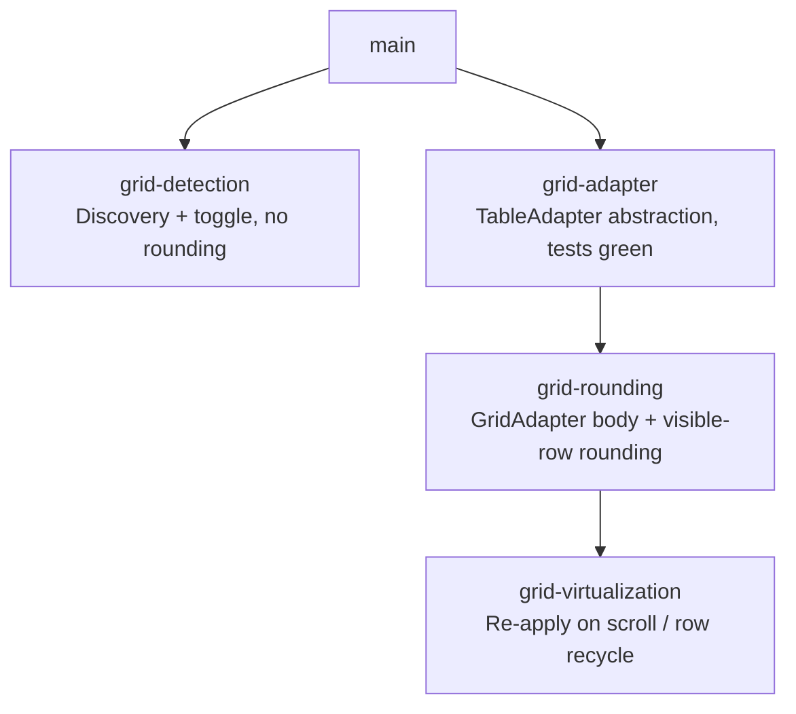

# Sprint Plan: Virtualized Data Grid Support

**Created:** 2026-06-10
**Base branch:** main
**Slug:** grid-support

## Context

The dynamic-rounding Chrome extension rounds numbers in native HTML `<table>`
elements. Modern web apps — Databricks SQL, AG Grid dashboards, Azure Data
Studio, AWS Cloudscape — render query results as virtualized data grids built
from `<div role="grid">` containers split into **pinned** (frozen columns) and
**scrollable** panes. These grids are completely invisible to the extension
today.

Research is in `docs/research/databricks-grid-detection.md`. The key structural
facts:

- **Databricks SQL:** `.dg--table-wrapper` wraps `.dg--pinned-grid` +
  `.dg--grid-scroll-container` (both `role="grid"`).
- **AG Grid:** `.ag-pinned-left-cols-container` + `.ag-center-cols-viewport`.
- Grids use `role="grid"` / `role="row"` / `role="gridcell"` ARIA attributes.
- **Virtualization:** only visible rows are in the DOM; nodes are recycled as
  the user scrolls — so there is no single "full table" in the DOM at any time.

Every layer of `content.js` is hard-wired to the `<table>` DOM API, so adding
detection alone is not sufficient. The four sprints below address: discovery,
abstraction, rounding, and virtualization — in dependency order.

## 1. Repo Survey

- Chrome extension (MV3) at `chrome-extension/`: `content.js` (~1800 lines,
  all table logic), `sidebar.js` / `sidebar.html` (options UI), `defaults.js`
  (shared `DR_DEFAULTS`), `tests.js` (~6 k lines, Node test runner).
- Key functions and their DOM coupling:

| Function | Line | Coupling |
|---|---|---|
| `injectTableToggles` | 434 | `querySelectorAll('table')` |
| MutationObserver | 469–494 | `querySelectorAll('table')` |
| right-click handler | 49, 71 | `closest('table')` |
| `isDataTable` | 288 | `.rows`, `.cells` |
| `roundTable` | 740 | `table.rows`, `row.cells`, `cell.tagName !== 'TD'` |
| `resetTable` | 636 | `table.rows` |
| `extractPreviewSamples` | 681 | `table.rows`, `row.cells` |
| `positionToggle` | 261 | `table.getBoundingClientRect()` |

- Test command: `node chrome-extension/tests.js`
- Branch naming: `feature/<label>` (never `claude/`)
- Commit convention: Conventional Commits
- Version bumps: handled by `.github/workflows/bump-version.yml` on merge to
  main; sprint branches must NOT bump versions.

## 2. Design

### D1 — Grid discovery (sprint 1 only)

The target is **unlabelled** data grids — `<div>`-based tables that use neither
the `<table>` tag nor ARIA roles. These are the grids the extension misses and
that no selector can find. Detection is therefore **structural/heuristic
first**; ARIA roles and library-specific class prefixes (`dg--`, `ag-`) are
treated as optional accelerators that boost confidence and provide precise
selectors *when present*, never as a requirement.

**Primary mechanism — `findDataGrids()` (research doc §2, §4):** scan
`div`/`section` containers and score each against structural signals:

1. **Repetitive siblings** — ≥ ~5 direct children with near-identical class
   names / child structure (candidate rows).
2. **Uniform geometry** — those children share a uniform `offsetHeight > 0`;
   their children (candidate cells) share uniform widths across rows.
3. **Tabular layout** — container uses `display: grid` (multi-column
   `grid-template-columns`) or `display: flex` column with flex-row children.
4. **Numeric content** — at least one candidate cell contains a finite parseable
   number (this is the strongest guard against matching nav menus / card lists).

A container passing the structural test is treated as a data grid. **No ARIA and
no `<table>` is required.**

**Optional confidence boosters (used when present, never required):**
- `role="grid"` / `role="row"` / `role="gridcell"` attributes.
- Library class prefixes (`dg--`, `ag-`, `awsui-`).
- Virtualization markers — rows positioned via `transform: translateY(...)` /
  `position: absolute`, large `scrollHeight` vs small `offsetHeight`.
- A pinned + scrollable container pair under one parent (the Databricks/AG-Grid
  split). This raises confidence but is **not** a precondition — single-pane
  unlabelled grids must still be detected.

**False-positive mitigation:** the gate is *uniform geometry + repetitive
siblings + numeric cell content*, optionally scoped to a results/scroll context.
A plain CSS layout grid (no repeating numeric rows) fails the numeric-content
guard and is rejected. Library hints, when present, further raise confidence.

In sprint 1, a discovered grid gets a toggle button and toggle positioning; no
rounding is attempted yet. A sentinel class `dr-ext-grid` is added to the root
element so later sprints can locate it without re-running discovery.

### D2 — TableAdapter abstraction (sprint 2)

Introduce two classes in `content.js`:

```
NativeTableAdapter(tableElement)
  .getRows()        → [{ getCells() → [{ getText(), setText(s), el }] }]
  .getElement()     → the <table> element
  .isVirtualized()  → false

GridAdapter(wrapperElement)
  .getRows()        → visible rows, stitched from pinned + scrollable
  .getElement()     → the wrapper element
  .isVirtualized()  → true
```

`getRows()` for `GridAdapter` identifies rows and cells **structurally**, the
same way `findDataGrids()` detected the grid — it does not depend on ARIA:

- **Rows** = the repetitive, uniform-height direct children of the grid's
  scrollable content container.
- **Cells** = the repetitive children of each row.
- **ARIA shortcut (when present):** if the grid exposes `[role="row"]` /
  `[role="gridcell"]`, use those selectors directly — they are faster and more
  precise than positional enumeration. Fall back to structural child
  enumeration when roles are absent.
- **Pinned pane (when present):** for each scrollable row, also collect the
  same-index row from the pinned pane and merge cells in DOM order (pinned
  columns first). When there is no pinned pane (single-pane grid), rows come
  from the one container.

This stitching and structural extraction is the interface contract — callers
never know whether they are reading one DOM tree or two, labelled or unlabelled.

`NativeTableAdapter.getRows()` wraps `table.rows` / `row.cells` exactly as
today. All existing behavior is preserved verbatim.

`roundTable`, `resetTable`, `extractPreviewSamples`, and `isDataTable` are
rewritten to call `adapter.getRows()` instead of `table.rows`. No caller is
changed; the adapter is constructed at the call site based on element type.

### D3 — GridAdapter read/write + visible-row rounding (sprint 3)

Implement `GridAdapter` fully (sprint 2 defines the interface; sprint 3 fills
in the body). Key concerns:

- `getText()` reads `cell.textContent` (grids use no `<td>`; cells are plain
  divs, with or without a `role="gridcell"` attribute).
- `setText(s)` writes `cell.textContent` and applies `.dr-ext-rounded` just as
  `roundTable` does today — but only to visible (currently-rendered) cells.
- `resetTable` via the adapter clears `.dr-ext-rounded` only from nodes
  currently in the DOM; sprint 4 handles persistence across scroll.

### D4 — Virtualization re-apply observer (sprint 4)

When a grid is rounded, attach a `MutationObserver` to each scroll container
that watches for `childList` changes (row recycling). On each mutation, re-run
the rounding pass for newly-added rows, using the stored `tableOptions`
WeakMap entry for the grid's wrapper element. Unrounded grids get no observer.

The observer is torn down when the toggle is switched off (same path that calls
`resetTable`).

## 3. Sprint List & Dependency Graph

### Sprint List

1. **grid-detection** — Discovery + toggle placement for ARIA grids; no
   rounding. _Depends on:_ none.
2. **grid-adapter** — `NativeTableAdapter` / `GridAdapter` interface;
   refactor `roundTable`, `resetTable`, `extractPreviewSamples`, `isDataTable`
   to use adapters. Existing tests must stay green. _Depends on:_ none (can
   overlap with sprint 1 on a separate branch; merges to main independently).
3. **grid-rounding** — Implement `GridAdapter` body; enable rounding for
   currently-visible grid rows. _Depends on:_ grid-adapter merged to main.
4. **grid-virtualization** — MutationObserver on scroll containers to re-apply
   rounding on row recycle. _Depends on:_ grid-rounding merged to main.

### Dependency Graph



Sprints 1 and 2 are independent of each other (different files, no shared
interface) and can be developed in parallel. Sprint 1 can also merge to main
before sprint 2 — the toggle will appear on grids but do nothing until sprint 3.

## 4. Sprint Definitions

### grid-detection

- **Goal:** Make the extension discover and badge **unlabelled** data grids
  (div-based tables with no `<table>` tag and no ARIA roles) with the existing
  toggle button, using a structural/heuristic detector. ARIA roles and library
  class prefixes are used as optional accelerators when present. No rounding
  happens yet; this sprint validates that heuristic discovery and toggle
  positioning work on real pages (Databricks, AG Grid, and at least one
  unlabelled grid).
- **Scope — `chrome-extension/content.js`:**
  - Add a module-level `findDataGrids(root = document)` (based on research doc
    §4) that returns candidate grid root elements. It scores each `div`/`section`
    container on: repetitive uniform-height children (rows), uniform-width
    grandchildren (cells), `display: grid`/`flex` layout, and **at least one
    cell containing a finite number** (the primary false-positive guard). A
    container passing the structural test qualifies with no ARIA required.
  - Confidence boosters (raise score, never required): `role="grid"/"row"/"gridcell"`
    attributes, library prefixes (`dg--`, `ag-`, `awsui-`), virtualization
    markers (`transform: translateY`, `position: absolute`, large `scrollHeight`
    vs small `offsetHeight`), and a pinned + scrollable sibling pair. Define a
    score threshold; document it inline so it can be tuned against real pages.
  - `injectTableToggles` (L434): after the `querySelectorAll('table')` pass, run
    `findDataGrids()`; for each result call `createToggleForTable` with a guard
    that skips elements already carrying `dr-ext-grid` (idempotency). Also skip
    any element that *is* or *contains* a native `<table>` already handled.
  - MutationObserver (L469–494): re-run `findDataGrids(node)` for added nodes;
    mirror removal handling for grids.
  - Right-click handler (L49, L71): replace `closest('table')` with a helper
    `findTargetTable(el)` that returns the nearest `<table>` OR the nearest
    ancestor carrying `dr-ext-grid` (set during discovery). This avoids relying
    on a role/class selector that unlabelled grids won't have.
  - `createToggleForTable`: add an early branch — if the element is not a
    `<table>`, skip `isDataTable()` (it reads `.rows`) and instead confirm via a
    lightweight structural check (`findDataGrids` already validated it; re-use
    the same numeric-content probe). If it passes, attach the toggle.
  - Mark discovered grids with `el.classList.add('dr-ext-grid')`.
  - `positionToggle`: already uses `getBoundingClientRect()`, which works for
    any element — no change needed.
- **Scope — `chrome-extension/tests.js`:**
  - Unit tests for `findDataGrids()` against synthetic DOM fixtures:
    - **Pass — unlabelled grid:** plain `<div>` rows, no roles, uniform height,
      numeric cells. (This is the headline case.)
    - **Pass — ARIA grid:** same structure plus `role="grid"`.
    - **Pass — pinned+scrollable:** Databricks-shaped split.
    - **Reject — layout grid:** CSS `display: grid` cards with no numeric rows
      (fails the numeric-content guard).
    - **Reject — nav menu:** repetitive uniform children but no numbers.
- **Out of scope:** Any actual rounding of grid contents. The toggle's click
  handler will fire but `roundTable` will no-op (`.rows` is undefined on a
  div) — that is acceptable for this sprint.
- **Acceptance criteria:**
  - On a page with an **unlabelled** div-grid (no `<table>`, no `role`), the
    extension detects it via `findDataGrids()` and injects a correctly
    positioned toggle button.
  - The same works for ARIA grids and the Databricks pinned+scrollable shape.
  - Right-clicking a cell inside a detected grid sets `lastRightClickedTable`
    to the grid root (via the `dr-ext-grid` ancestor walk).
  - No toggle appears on a plain CSS layout grid with no numeric data rows.
  - `node chrome-extension/tests.js` passes.
- **Depends on:** none
- **Complexity:** M _(raised from S — the heuristic scorer and its
  false-positive tuning are the real work, not a selector query.)_
- **Dev notes:**
  - The numeric-content guard is the single most important false-positive
    filter — without it the structural heuristic lights up on nav bars, card
    grids, and toolbars. Keep it mandatory.
  - Do not rename `lastRightClickedTable` — its type widens to "table or grid
    root" but renaming would touch too many call sites. Document the widened
    contract in a comment.
  - Do not bump `manifest.json` version.

---

### grid-adapter

- **Goal:** Refactor the rounding engine to operate on a `TableAdapter`
  interface rather than raw `<table>` DOM. `NativeTableAdapter` must be
  behavior-identical to today — all existing tests stay green. `GridAdapter`
  defines the interface contract but its body is a stub (sprint 3 fills it in).
- **Scope — `chrome-extension/content.js`:**
  - Define `NativeTableAdapter` class at module level (near `isDataTable`):
    - `constructor(el)` — stores `this.el = el`.
    - `getElement()` — returns `this.el`.
    - `isVirtualized()` — returns `false`.
    - `getRows()` — returns `Array.from(el.rows).map(row => ({ getCells: () =>
      Array.from(row.cells).map(cell => ({ getText: () => cell.innerText ||
      cell.textContent, setText: (s) => { /* existing write logic */ },
      el: cell, tagName: cell.tagName })) }))`.
  - Define `GridAdapter` class stub:
    - `constructor(el)` — stores `this.el = el`.
    - `getElement()` — returns `this.el`.
    - `isVirtualized()` — returns `true`.
    - `getRows()` — returns `[]` (stub; sprint 3 implements).
  - Add `makeAdapter(el)` factory: returns `new NativeTableAdapter(el)` if
    `el.tagName === 'TABLE'`, else `new GridAdapter(el)`.
  - Rewrite `isDataTable(table)`: accept an adapter (or element — wrap in
    `makeAdapter` if an element is passed). Replace `.rows` / `.cells` access
    with `adapter.getRows()` / `row.getCells()`.
  - Rewrite `roundTable(table, options)`: call `makeAdapter(table)` at the top;
    replace all `table.rows` / `row.cells` / `cell.tagName` access with adapter
    calls. Return early if `adapter.getRows().length === 0` (handles the stub).
  - Rewrite `resetTable(table)`: replace `table.rows` access with
    `makeAdapter(table).getRows()`.
  - Rewrite `extractPreviewSamples(table)`: same.
  - The `tableOptions` WeakMap key remains the raw element (not the adapter) —
    adapters are ephemeral per-call, elements are stable.
- **Scope — `chrome-extension/tests.js`:**
  - All existing tests must pass unchanged. Add two adapter unit tests:
    `NativeTableAdapter` round-trips `getText`/`setText` correctly;
    `GridAdapter` stub `getRows()` returns `[]` without throwing.
- **Out of scope:** `GridAdapter.getRows()` implementation (sprint 3). Any
  changes to `sidebar.js`, `defaults.js`, or the toggle UI.
- **Acceptance criteria:**
  - `node chrome-extension/tests.js` passes with zero regressions.
  - Rounding a native `<table>` produces byte-identical results to the
    pre-refactor build (verified by the existing test suite).
  - `roundTable` called on a `[role="grid"]` element returns without throwing
    (stub path).
- **Depends on:** none
- **Complexity:** M
- **Dev notes:**
  - The adapter is constructed fresh on each `roundTable` / `resetTable` call —
    no caching. Grids change their row count on scroll; a cached adapter would
    return stale rows.
  - Keep `NativeTableAdapter.getRows()` implementation as a thin wrapper around
    the existing logic — do not simplify or restructure the row/cell iteration.
    The goal is zero behavior change, not cleanup.
  - Do not bump `manifest.json` version.

---

### grid-rounding

- **Goal:** Implement `GridAdapter.getRows()` so that rounding, reset, and
  preview-sample extraction work on the currently-visible rows of a data grid.
- **Scope — `chrome-extension/content.js`:**
  - Implement `GridAdapter.getRows()` — **structural first, ARIA as shortcut:**
    1. Find the scrollable content container. Prefer known library selectors
       when present (`.dg--grid-scroll-container`, `.ag-center-cols-viewport`,
       `[role="grid"]:not(.dg--pinned-grid)`); otherwise pick the descendant
       holding the repetitive uniform-height children that `findDataGrids`
       identified. Fall back to `this.el`.
    2. Find the pinned pane if one exists (`.dg--pinned-grid`,
       `.ag-pinned-left-cols-container`, or a sibling container with matching
       row count) — may be `null` for single-pane / unlabelled grids.
    3. Collect rows. **ARIA shortcut:** if `[role="row"]` elements exist, use
       them. **Structural fallback (unlabelled grids):** take the repetitive
       uniform-height direct children of the scroll container as rows.
    4. For each scrollable row at index `i`, collect the pinned row at the same
       index (if a pinned pane exists): match by `data-row-index` when present,
       otherwise by DOM index.
    5. Cells per row: prefer `[role="gridcell"]` when present; otherwise the
       row's repetitive child elements (structural). Merge pinned cells first.
    6. Return row objects: `{ getCells: () => [...pinnedCells, ...scrollableCells].map(cell => ({ getText: () => cell.textContent, setText: (s) => { cell.textContent = s; cell.classList.add('dr-ext-rounded'); cell.dataset.drOriginal = cell.dataset.drOriginal || cell.textContent; }, el: cell, tagName: 'TD' /* normalized */ })) }`.
  - `setText` in `GridAdapter` must store the original value in
    `cell.dataset.drOriginal` before overwriting (for reset), mirroring how
    `NativeTableAdapter` stores it.
  - `resetTable` via `GridAdapter`: clear `.dr-ext-rounded`, restore
    `cell.textContent` from `cell.dataset.drOriginal`, delete
    `cell.dataset.drOriginal`.
  - `isDataTable` via `GridAdapter`: sample up to 10 cells from `getRows()`;
    return `true` if any contains a finite parseable number.
  - Update `createToggleForTable` grid path (from sprint 1): now that
    `getRows()` works, replace the stub check with `isDataTable(makeAdapter(el))`.
- **Scope — `chrome-extension/tests.js`:**
  - Add tests with synthetic grid DOM fixtures — both labelled and unlabelled:
    - **Unlabelled grid** (no roles): plain `<div>` rows/cells with numbers —
      structural extraction finds rows/cells and rounding applies. (Headline.)
    - **ARIA grid:** `role="grid"`/`row`/`gridcell` — shortcut path used.
    - A grid with a pinned pane: cell stitching produces correct column order.
    - `resetTable` on a rounded grid restores original values.
    - `extractPreviewSamples` on a grid returns the expected sample structure.
- **Out of scope:** Re-applying rounding on scroll / row recycle (sprint 4).
  The rounding state is lost when rows leave the viewport — that is acceptable
  and documented as a known limitation until sprint 4.
- **Acceptance criteria:**
  - Right-clicking a cell in a Databricks SQL result grid and choosing "Apply
    rounding" visibly rounds the numbers in all currently-visible cells.
  - Toggling off restores original values.
  - `node chrome-extension/tests.js` passes.
- **Depends on:** grid-adapter merged to main
- **Complexity:** M
- **Dev notes:**
  - The pinned/scrollable stitching by DOM index is fragile if the two panes
    have different row counts (e.g., header rows in one but not the other). Use
    `data-row-index` matching when available; log a `console.debug` warning and
    fall back to index matching otherwise.
  - Do not attempt to scroll-trigger additional row rendering — only round what
    is visible.
  - Do not bump `manifest.json` version.

---

### grid-virtualization

- **Goal:** Keep a rounded grid rounded as the user scrolls: re-apply (or
  un-apply) rounding to rows that are recycled into the viewport.
- **Scope — `chrome-extension/content.js`:**
  - Add `gridObservers: WeakMap<Element, MutationObserver>` at module level
    (parallel to `tableToggles`).
  - In `roundTable`, after applying rounding, check `adapter.isVirtualized()`.
    If `true`:
    1. Find the scroll container element (same query as `GridAdapter.getRows()`,
       step 1).
    2. Create a `MutationObserver` that, on each `childList` mutation, calls a
       helper `reapplyGridRounding(wrapperEl)`.
    3. `reapplyGridRounding`: re-runs `roundTable(wrapperEl, tableOptions.get(wrapperEl))`
       but only processes rows that do **not** already have `.dr-ext-rounded`
       cells — avoids double-rounding already-visible rows.
    4. `observe(scrollContainer, { childList: true, subtree: true })`.
    5. Store in `gridObservers.set(wrapperEl, observer)`.
  - In `resetTable`, if `adapter.isVirtualized()` and `gridObservers.has(el)`:
    disconnect and delete the observer before clearing cells.
  - In the MutationObserver that watches for removed tables (L493): also check
    `gridObservers` for the removed element and disconnect.
- **Scope — `chrome-extension/tests.js`:**
  - Synthetic test: create a grid wrapper, round it, simulate row recycling via
    `appendChild` of a new `role="row"` child, verify `reapplyGridRounding` is
    called and the new row is rounded.
  - Verify that after `resetTable`, appending a new row does NOT trigger
    rounding (observer disconnected).
- **Out of scope:** Handling horizontal scroll (new columns entering the
  viewport) — column virtualization is rare and adds significant complexity;
  defer to a follow-up sprint.
- **Acceptance criteria:**
  - In a Databricks SQL result, scrolling down after rounding causes newly-
    visible rows to be rounded automatically.
  - Turning off rounding stops re-application.
  - No observable performance regression on pages with native `<table>` elements
    (the observer is never attached to non-virtualized tables).
  - `node chrome-extension/tests.js` passes.
- **Depends on:** grid-rounding merged to main
- **Complexity:** M
- **Dev notes:**
  - `reapplyGridRounding` must be debounced (e.g., 50 ms `requestAnimationFrame`
    or `setTimeout`) — grids can fire dozens of DOM mutations in a single scroll
    tick and we don't want to re-run rounding synchronously for each one.
  - The `subtree: true` option is necessary because grids often wrap rows in an
    intermediate container. Monitor observed mutation counts in practice; if the
    observer is too noisy, narrow to `childList: true` without `subtree` and
    instead watch only direct children of the scroll container.
  - Do not bump `manifest.json` version.

## 5. Open Questions

- **Synchronized-scroll verification:** The research doc flags this as
  unresolved. Before sprint 3 ships, manually verify on a live Databricks page
  that scrolling the scrollable pane does move the pinned pane in sync (it
  almost certainly does, but the stitching logic in `GridAdapter.getRows()`
  depends on row index alignment being maintained at all times).
- **AG Grid and Cloudscape selectors:** The sprint 3 `GridAdapter` selector
  list covers Databricks and AG Grid. AWS Cloudscape (`.awsui-table-wrapper`)
  and Azure Data Studio have not been tested. Add their selectors before sprint
  3 ships if a test environment is available.
- **Column virtualization:** Some grids (especially wide ones) also virtualize
  columns — cells outside the horizontal viewport are not rendered. Sprint 4
  does not address this. If it becomes a user report, it warrants a sprint 5.
- **Right-click targeting depth:** `closest('[role="grid"]')` walks up from the
  clicked cell. If the grid library wraps cells in extra divs, the walk may
  overshoot to a parent grid. Add a depth limit or prefer the closest match.

## 6. Out of Scope (Separate Sprint-Stack)

- Column virtualization (horizontal scroll recycling).
- Google Sheets / Excel Online (these use canvas rendering in some browsers, not
  DOM nodes — a fundamentally different approach is needed).
- Python / `js/` sibling implementations — grid support is browser-only.

## Decisions Log

- 2026-06-10: Initial draft. Sprints 1 and 2 are independent; 3 depends on 2;
  4 depends on 3.
- 2026-06-10: Reoriented detection and extraction around **structural
  heuristics** for unlabelled grids (the research doc's actual focus). ARIA
  roles and library class prefixes demoted from required selectors to optional
  accelerators used when present. Dropped the pinned+scrollable co-occurrence as
  a hard requirement (single-pane unlabelled grids must still be detected);
  numeric-content + uniform-geometry is now the primary false-positive guard.
  Sprint 1 complexity raised S → M.
