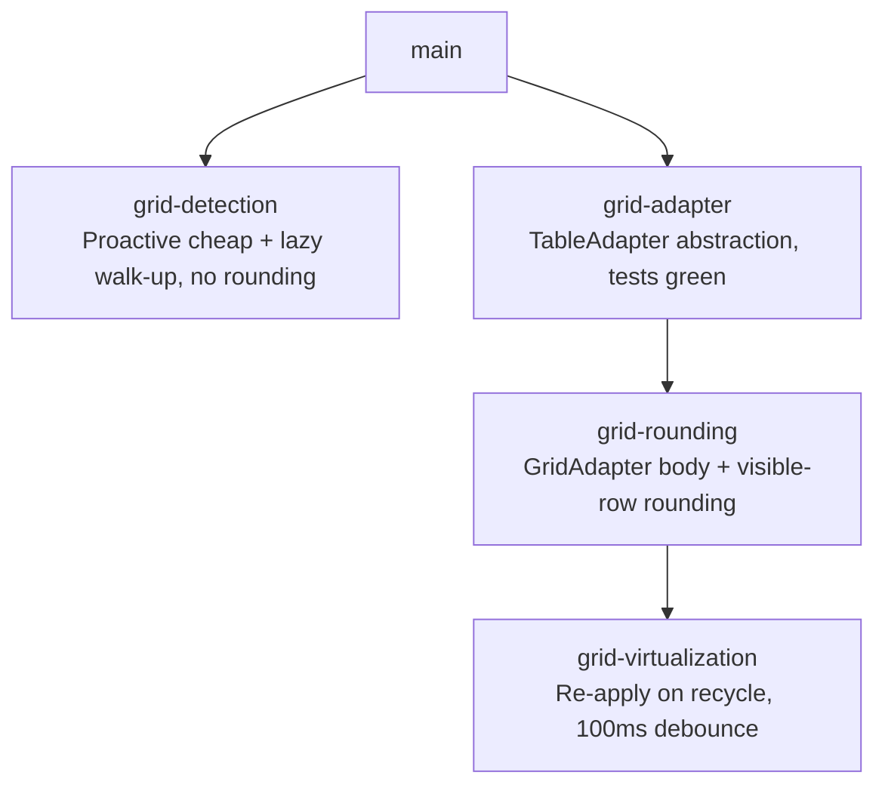

# Sprint Plan: Virtualized Data Grid Support

**Created:** 2026-06-10
**Base branch:** main
**Slug:** grid-support

## Context

The dynamic-rounding Chrome extension rounds numbers in native HTML `<table>`
elements. Modern web apps — Databricks SQL, AG Grid dashboards, Azure Data
Studio, AWS Cloudscape — render results as **data grids** built from plain
`<div>` containers, often virtualized (only visible rows exist in the DOM) and
often split into pinned (frozen columns) and scrollable panes. Many such grids
carry no `<table>` tag and no ARIA roles at all. These grids are invisible to
the extension today.

Research is in `docs/research/databricks-grid-detection.md`. Key structural
facts:

- **Databricks SQL:** `.dg--table-wrapper` wraps `.dg--pinned-grid` +
  `.dg--grid-scroll-container` (both happen to carry `role="grid"`).
- **AG Grid:** `.ag-pinned-left-cols-container` + `.ag-center-cols-viewport`.
- Many grids expose **no** roles or recognizable classes — they must be found
  by structure alone.
- **Virtualization:** only visible rows are in the DOM; nodes are recycled as
  the user scrolls — there is no single "full table" in the DOM at any time.

Every layer of `content.js` is hard-wired to the `<table>` DOM API, so adding
detection alone is not sufficient. The four sprints below address discovery,
abstraction, rounding, and virtualization in dependency order.

## 2. Strategy (agreed before planning)

These decisions were worked out up front and shape every sprint:

### S1 — Two extraction paths, four detection signals

There are only **two** ways to *read* a table once found: the native table API
(`.rows`/`.cells`, handles `colspan`/`th`) and div-walking (everything else).
Native `<table>` is therefore its own path. ARIA grids and unlabelled grids
share the div-walk path; they differ only in how they're *detected*.

Detection signals, in decreasing precision / increasing recall:
`<table>` tag → library class (`dg--`, `ag-`) → ARIA `role` → raw structure.
The cheap signals are also the precise ones, so they run first and the
expensive structural heuristic runs last (and rarely).

### S2 — Column structure, not row height, is the heuristic's spine

Row-height uniformity is a **bad** signal: any table with a text column that
wraps to a second line has variable row heights (most Wikipedia tables, most
non-numeric Databricks results). The heuristic instead keys on:

- **Consistent cell count** — every candidate row has the same number of
  children. (Cheap, no geometry.)
- **Column-width alignment** — cells in the same position share a width;
  columns line up vertically. (Robust to text wrapping — a column's width is
  independent of how many lines its text occupies.)
- **Repetitive row structure** — near-identical class names / child shape.
- **Numeric content** — at least one cell parses as a finite number. This is
  the single most important false-positive guard.

Row height is demoted to an optional weak hint, never a requirement.

### S3 — Lazy discovery for unlabelled grids; proactive only where it's free

The structural heuristic measures geometry (`offsetWidth` / `getComputedStyle`),
which forces synchronous layout and is expensive on large, dynamic pages — which
are exactly the pages that have these grids. So:

- **Proactive (on page load + cheap MutationObserver passes):** only the cheap
  signals — `querySelectorAll('table')` and `[role="grid"], [role="table"]`.
  These badge the toggle dot immediately and cost almost nothing.
- **Lazy (on right-click only):** the structural heuristic. It does **not**
  scan the page. It walks **up** from the clicked element, testing a handful of
  ancestors, and badges the grid the first time the user interacts with it.

Net effect: free dots where the signal is free; on-demand dots for the
expensive unlabelled case, scoped to the one element the user clicked.

### S4 — Geometry measured last and narrowest

Within the heuristic, cheap checks gate the expensive one: child count → class
repetition → layout (`display`) → numeric content **first**; only the few
candidates that survive get their column widths measured. Because lazy discovery
already limits this to the right-clicked element's ancestors, the geometry probe
touches a bounded handful of elements, never the page.

### S5 — Debounce re-apply at 100 ms

The sprint-4 re-apply observer batches the row-recycle mutations a virtualized
grid fires during scroll and reacts at most once per **100 ms**. That is well
under the ~100 ms "feels instant" threshold yet does ~6× less work than
per-frame (16 ms) reaction.

## 3. Repo Survey

- Chrome extension (MV3) at `chrome-extension/`: `content.js` (~1800 lines,
  all table logic), `sidebar.js` / `sidebar.html` (options UI), `defaults.js`
  (shared `DR_DEFAULTS`), `tests.js` (~6 k lines, Node test runner).
- Key functions and their DOM coupling:

| Function | Line | Coupling |
|---|---|---|
| `injectTableToggles` | 434 | `querySelectorAll('table')` |
| MutationObserver | 469–494 | `querySelectorAll('table')` |
| right-click handler | 49, 71 | `closest('table')` |
| `isDataTable` | 288 | `.rows`, `.cells` |
| `roundTable` | 740 | `table.rows`, `row.cells`, `cell.tagName !== 'TD'` |
| `resetTable` | 636 | `table.rows` |
| `extractPreviewSamples` | 681 | `table.rows`, `row.cells` |
| `positionToggle` | 261 | `table.getBoundingClientRect()` |

- Test command: `node chrome-extension/tests.js`
- Branch naming: `feature/<label>` (never `claude/`)
- Commit convention: Conventional Commits
- Version bumps: handled by `.github/workflows/bump-version.yml` on merge to
  main; sprint branches must NOT bump versions.

## 4. Design

### D1 — Detection: proactive cheap pass + lazy structural walk-up (sprint 1)

Two entry points, per strategy S3:

**Proactive — `injectTableToggles` + MutationObserver:** keep the existing
`querySelectorAll('table')` pass and add one cheap selector pass
`querySelectorAll('[role="grid"], [role="table"]')`. Both badge the toggle dot
on load. No structural scanning, no geometry. Native tables and ARIA grids are
covered here.

**Lazy — `looksLikeGrid(el)` on right-click:** the right-click handler walks up
from the clicked element; at each ancestor it calls `looksLikeGrid`, stopping at
the **first** ancestor that passes (the tightest grid root). A depth cap (~15
ancestors / stop at `<body>`) bounds the walk.

`looksLikeGrid(el)` applies the S2/S4 cheap-first ladder:

1. **Child count** — ≥ ~5 children (candidate rows). Cheap.
2. **Repetitive structure** — children share class / child shape. Cheap.
3. **Consistent cell count** — candidate rows have equal child counts. Cheap.
4. **Layout** — `getComputedStyle(el).display` is `grid` or `flex` (one read).
5. **Numeric content** — ≥ 1 cell parses as a finite number. Cheap, mandatory.
6. **Column-width alignment** — only for candidates surviving 1–5: measure
   `offsetWidth` of column-0 cells across a few rows; expect uniform widths.
   This is the only geometry probe, and it runs on a bounded set.

Row height is **not** tested (S2). ARIA role / library class, when present on a
walked ancestor, short-circuit to "accept" and skip the geometry probe.

Discovered grids are marked `el.classList.add('dr-ext-grid')` so later sprints
and the right-click handler locate them without re-running detection. In sprint
1 a discovered grid gets the toggle dot and positioning only — no rounding.

### D2 — TableAdapter abstraction (sprint 2)

Introduce two classes in `content.js`:

```
NativeTableAdapter(tableElement)
  .getRows()        → [{ getCells() → [{ getText(), setText(s), el }] }]
  .getElement()     → the <table> element
  .isVirtualized()  → false

GridAdapter(wrapperElement)
  .getRows()        → visible rows, stitched from pinned + scrollable
  .getElement()     → the wrapper element
  .isVirtualized()  → true
```

`NativeTableAdapter.getRows()` wraps `table.rows` / `row.cells` exactly as
today — zero behavior change. `GridAdapter.getRows()` is a stub returning `[]`
in this sprint (sprint 3 fills it in). `roundTable`, `resetTable`,
`extractPreviewSamples`, and `isDataTable` are rewritten to call
`adapter.getRows()`; no caller signature changes. A `makeAdapter(el)` factory
picks the class by `el.tagName === 'TABLE'`.

### D3 — GridAdapter read/write + visible-row rounding (sprint 3)

`GridAdapter.getRows()` extracts rows/cells **structurally** (S2), with ARIA /
library selectors as shortcuts when present:

- **Rows** = repetitive children of the scrollable content container (or
  `[role="row"]` when present).
- **Cells** = repetitive children of each row (or `[role="gridcell"]`).
- **Pinned pane**, when present, is stitched per row by `data-row-index` (or DOM
  index) with pinned columns first. Single-pane grids skip this.

`setText` writes `cell.textContent` and adds `.dr-ext-rounded`. **Original
values are keyed by logical (rowIndex, colIndex)** in a per-grid Map (see Open
Question on recycling), not stored solely on the cell node. Rounding applies
only to currently-visible rows.

### D4 — Virtualization re-apply observer (sprint 4)

When a virtualized grid is rounded, attach a `MutationObserver` to its scroll
container watching `childList`. Mutations are **debounced to 100 ms** (S5); on
fire, `reapplyGridRounding` rounds only rows lacking `.dr-ext-rounded`. The
observer is torn down on reset / toggle-off and when the grid is removed.

## 5. Sprint List & Dependency Graph

### Sprint List

1. **grid-detection** — Proactive cheap pass (native + ARIA) and lazy
   right-click structural walk-up; toggle placement; no rounding.
   _Depends on:_ none.
2. **grid-adapter** — `NativeTableAdapter` / `GridAdapter` interface; refactor
   the four engine functions to use adapters. Existing tests stay green.
   _Depends on:_ none.
3. **grid-rounding** — Implement `GridAdapter` body; round currently-visible
   grid rows. _Depends on:_ grid-adapter merged to main.
4. **grid-virtualization** — 100 ms-debounced MutationObserver to re-apply
   rounding on row recycle. _Depends on:_ grid-rounding merged to main.

### Dependency Graph



Sprints 1 and 2 are independent (different concerns, no shared interface) and
can be developed in parallel. Sprint 1 can merge before sprint 2 — the dot
appears on grids but does nothing until sprint 3.

## 6. Sprint Definitions

### grid-detection

- **Goal:** Discover data grids and badge them with the existing toggle dot,
  using a proactive cheap pass for native/ARIA grids and a lazy right-click
  structural walk-up for unlabelled div-grids. No rounding yet; this validates
  discovery and dot placement on real pages (Databricks, AG Grid, and a
  role-less div-grid).
- **Scope — `chrome-extension/content.js`:**
  - Add module-level `looksLikeGrid(el)` implementing the D1 cheap-first ladder:
    child count → repetitive structure → consistent cell count → layout →
    numeric content → (only then) column-width alignment. Returns a boolean.
    **Do not test row height.** ARIA role / library class on `el` short-circuits
    to accept and skips the geometry probe.
  - **Proactive pass:** in `injectTableToggles` (L434), keep
    `querySelectorAll('table')`; add a second cheap pass
    `querySelectorAll('[role="grid"], [role="table"]')`. For each, call
    `createToggleForTable`, skipping anything already carrying `dr-ext-grid` or
    that is / contains an already-handled `<table>`. No structural scan here.
  - MutationObserver (L469–494): mirror only the two cheap selector passes for
    added nodes; mirror removal handling. **No structural scanning in the
    observer** (that would re-introduce the cost lazy discovery avoids).
  - **Lazy pass:** add `findTargetTable(el)` used by the right-click handler
    (L49, L71): return the nearest `<table>`; else the nearest ancestor carrying
    `dr-ext-grid`; else walk up calling `looksLikeGrid` (depth cap ~15, stop at
    `<body>`), and on first match add `dr-ext-grid`, badge it, and return it.
  - `createToggleForTable`: when the element is not a `<table>`, skip
    `isDataTable()` (reads `.rows`) and gate on `looksLikeGrid` instead.
  - Mark discovered grids `el.classList.add('dr-ext-grid')`.
  - `positionToggle` already uses `getBoundingClientRect()` — no change.
- **Scope — `chrome-extension/tests.js`:**
  - Unit tests for `looksLikeGrid()`:
    - **Pass — unlabelled grid:** plain `<div>` rows/cells, no roles, **mixed
      text+number with varying row heights**, aligned columns, numeric cells.
      (Headline — proves the column-structure spine, S2.)
    - **Pass — ARIA grid:** same plus `role="grid"` (short-circuit path).
    - **Pass — pinned+scrollable:** Databricks-shaped split.
    - **Reject — layout grid:** CSS cards, no numeric rows (numeric guard).
    - **Reject — nav menu:** repetitive rows, no numbers.
  - Test `findTargetTable` walk-up: returns the tightest grid ancestor and stops
    (does not overshoot to a page-level container).
- **Out of scope:** Any rounding. The toggle click fires but `roundTable`
  no-ops on a div (`.rows` undefined) — acceptable this sprint.
- **Acceptance criteria:**
  - A native `<table>` and an ARIA `[role="grid"]` both get a correctly placed
    dot on page load (proactive).
  - An **unlabelled** div-grid with **variable row heights** gets a dot after a
    right-click on one of its cells (lazy), and the dot is placed on the tightest
    grid root.
  - No structural scanning runs on page load or in the MutationObserver
    (verified by test/inspection — the heavy path is right-click-only).
  - No dot on a CSS layout grid with no numeric rows.
  - `node chrome-extension/tests.js` passes.
- **Depends on:** none
- **Complexity:** M
- **Dev notes:**
  - Numeric-content guard is mandatory — it's what keeps the heuristic off nav
    bars and card grids.
  - Do not rename `lastRightClickedTable`; its type widens to "table or grid
    root". Document the widened contract in a comment.
  - Do not bump `manifest.json` version.

---

### grid-adapter

- **Goal:** Refactor the rounding engine onto a `TableAdapter` interface.
  `NativeTableAdapter` is behavior-identical to today (all existing tests stay
  green). `GridAdapter` defines the contract with a stubbed body (sprint 3 fills
  it in).
- **Scope — `chrome-extension/content.js`:**
  - `NativeTableAdapter` (near `isDataTable`): `getElement()`,
    `isVirtualized() → false`, and `getRows()` wrapping `Array.from(el.rows)` /
    `row.cells` with `getText`/`setText`/`el`/`tagName` per cell, reproducing the
    current logic verbatim.
  - `GridAdapter` stub: `getElement()`, `isVirtualized() → true`,
    `getRows() → []`.
  - `makeAdapter(el)` factory: `NativeTableAdapter` if `el.tagName === 'TABLE'`,
    else `GridAdapter`.
  - Rewrite `isDataTable`, `roundTable`, `resetTable`, `extractPreviewSamples`
    to read via `adapter.getRows()` / `row.getCells()`. `roundTable` returns
    early if `getRows()` is empty (handles the stub).
  - `tableOptions` WeakMap stays keyed by the raw element; adapters are
    constructed fresh per call (grids change row count on scroll — never cache).
- **Scope — `chrome-extension/tests.js`:** all existing tests pass unchanged;
  add `NativeTableAdapter` round-trip test and a `GridAdapter` stub test.
- **Out of scope:** `GridAdapter.getRows()` body; UI / sidebar / defaults.
- **Acceptance criteria:**
  - `node chrome-extension/tests.js` passes, zero regressions.
  - Native `<table>` rounding is byte-identical to the pre-refactor build.
  - `roundTable` on a grid element returns without throwing (stub path).
- **Depends on:** none
- **Complexity:** M
- **Dev notes:**
  - Keep `NativeTableAdapter.getRows()` a thin wrapper — zero behavior change,
    not a cleanup.
  - Do not bump `manifest.json` version.

---

### grid-rounding

- **Goal:** Implement `GridAdapter.getRows()` so rounding, reset, and preview
  extraction work on the currently-visible rows of a data grid.
- **Scope — `chrome-extension/content.js`:**
  - Implement `GridAdapter.getRows()` — structural first, ARIA/library as
    shortcut:
    1. Scroll container: prefer library selectors
       (`.dg--grid-scroll-container`, `.ag-center-cols-viewport`,
       `[role="grid"]:not(.dg--pinned-grid)`); else the descendant holding the
       repetitive aligned-column children `looksLikeGrid` keyed on; else `this.el`.
    2. Pinned pane (`.dg--pinned-grid`, `.ag-pinned-left-cols-container`, or a
       sibling with matching row count) — may be `null`.
    3. Rows: `[role="row"]` when present, else the repetitive children of the
       scroll container.
    4. Stitch pinned row at matching `data-row-index` (or DOM index) per row.
    5. Cells: `[role="gridcell"]` when present, else repetitive row children;
       pinned cells first.
    6. Per cell: `getText() → cell.textContent`; `setText(s)` writes
       `textContent`, adds `.dr-ext-rounded`, and records the original keyed by
       **logical (rowIndex, colIndex)** in a per-grid originals Map.
  - `resetTable` via `GridAdapter`: restore visible cells from the originals Map
    and clear `.dr-ext-rounded`; non-visible rows already show the framework's
    original text.
  - `isDataTable` via `GridAdapter`: sample ≤ 10 cells; true if any is a finite
    number.
  - `createToggleForTable` grid path: replace the sprint-1 `looksLikeGrid` gate
    with `isDataTable(makeAdapter(el))` now that `getRows()` works.
- **Scope — `chrome-extension/tests.js`:**
  - Unlabelled grid (no roles, variable row heights): structural extraction +
    rounding applies. (Headline.)
  - ARIA grid: shortcut path.
  - Pinned pane: correct stitched column order.
  - Reset restores originals.
  - `extractPreviewSamples` returns the expected structure.
- **Out of scope:** Re-apply on scroll / recycle (sprint 4). Rounding state is
  lost when rows leave the viewport — documented limitation until sprint 4.
- **Acceptance criteria:**
  - Right-clicking a cell in a Databricks result and applying rounding rounds
    all currently-visible cells; toggling off restores originals.
  - `node chrome-extension/tests.js` passes.
- **Depends on:** grid-adapter merged to main
- **Complexity:** M
- **Dev notes:**
  - Stitch by `data-row-index` when available; `console.debug` and fall back to
    DOM index otherwise.
  - Only round what is visible — never scroll-trigger extra rendering.
  - Do not bump `manifest.json` version.

---

### grid-virtualization

- **Goal:** Keep a rounded grid rounded as the user scrolls — re-apply rounding
  to rows recycled into the viewport.
- **Scope — `chrome-extension/content.js`:**
  - Add `gridObservers: WeakMap<Element, MutationObserver>`.
  - In `roundTable`, when `adapter.isVirtualized()`: find the scroll container,
    create a `MutationObserver` on `childList`, **debounced to 100 ms** (S5),
    whose handler `reapplyGridRounding(wrapperEl)` re-rounds only rows lacking
    `.dr-ext-rounded`, using `tableOptions.get(wrapperEl)` and the per-grid
    originals Map. Store in `gridObservers`.
  - In `resetTable`: if virtualized and observed, disconnect and delete the
    observer before restoring cells.
  - In the removed-node observer (L493): disconnect any `gridObservers` entry
    for a removed grid.
- **Scope — `chrome-extension/tests.js`:**
  - Round a grid, append a new row (simulated recycle), advance past the 100 ms
    debounce, assert the new row is rounded.
  - After reset, appending a row does **not** trigger rounding (observer gone).
  - Debounce: N rapid mutations cause a single `reapplyGridRounding`.
- **Out of scope:** Horizontal/column virtualization — see Open Questions.
- **Acceptance criteria:**
  - Scrolling a rounded Databricks result rounds newly-visible rows
    automatically, with no visible stutter (100 ms debounce).
  - Toggling off stops re-application.
  - No perf regression on native `<table>` pages (observer never attached to
    non-virtualized tables).
  - `node chrome-extension/tests.js` passes.
- **Depends on:** grid-rounding merged to main
- **Complexity:** M
- **Dev notes:**
  - Debounce coalesces a scroll burst's mutations into one 100 ms-spaced
    re-round; keep each pass cheap by touching only un-rounded rows.
  - `subtree: true` is likely needed (grids wrap rows in intermediate
    containers); narrow to direct children if mutation volume is high.
  - Do not bump `manifest.json` version.

## 7. Open Questions & Risks

- **Framework clobbering (highest feasibility risk).** A grid cell is owned by
  React/Angular; writing `cell.textContent` can be overwritten on the
  framework's next render — not only on scroll-recycle (which sprint 4 handles)
  but on any same-position re-render. The 100 ms re-apply observer is the
  mitigation, but this is a "fight the framework" pattern. Validate on a live
  Databricks page during sprint 3 before committing to the approach; if same-
  position re-renders wipe rounding faster than we can re-apply, reconsider
  (e.g., overlay rendering instead of in-place text replacement).
- **Original-value persistence across recycle.** Originals must be keyed by
  logical (rowIndex, colIndex), not stored only on the cell node (recycled away
  on scroll). This needs a stable logical row id — `data-row-index` when the
  grid provides it. Grids without any stable row id can round visible rows but
  cannot reliably reset after scrolling; document as a limitation and detect the
  no-id case.
- **Walk-up stopping rule.** Lazy discovery returns the first ancestor passing
  `looksLikeGrid`. Confirm this picks the grid root and not an inner pane
  (pinned/scroll) — prefer the innermost match but verify it's the element that
  owns both panes. Depth cap prevents overshoot to page-level containers.
- **Synchronized-scroll assumption.** Pinned+scroll stitching assumes the two
  panes keep row-index alignment at all times. Verify on a live Databricks page
  before sprint 3 ships.
- **AG Grid / Cloudscape / Azure Data Studio selectors.** Sprint 3's selector
  list covers Databricks and AG Grid; add others if a test environment exists.
- **Column virtualization.** Wide grids may also virtualize columns
  (off-screen cells absent). Not handled; warrants a follow-up sprint if
  reported.

## 8. Out of Scope (Separate Sprint-Stack)

- Column (horizontal) virtualization.
- Google Sheets / Excel Online (canvas-rendered in places, not DOM — a
  different approach entirely).
- Python / `js/` sibling implementations — grid support is browser-only.

## Decisions Log

- 2026-06-10: Initial draft. Sprints 1 and 2 independent; 3 depends on 2; 4 on 3.
- 2026-06-10: Reoriented detection/extraction around structural heuristics for
  unlabelled grids; ARIA/library classes demoted to optional accelerators;
  numeric-content the primary false-positive guard.
- 2026-06-10: Strategy finalized after design discussion —
  (a) **column-structure**, not row-height, is the heuristic spine (variable row
  heights are normal); (b) **lazy right-click discovery** for unlabelled grids,
  proactive badging only for the cheap native/ARIA signals; (c) geometry probe
  measured last and narrowest; (d) re-apply observer **debounced to 100 ms**.
  Added framework-clobbering, original-value-persistence, and walk-up-stopping
  as tracked risks.
