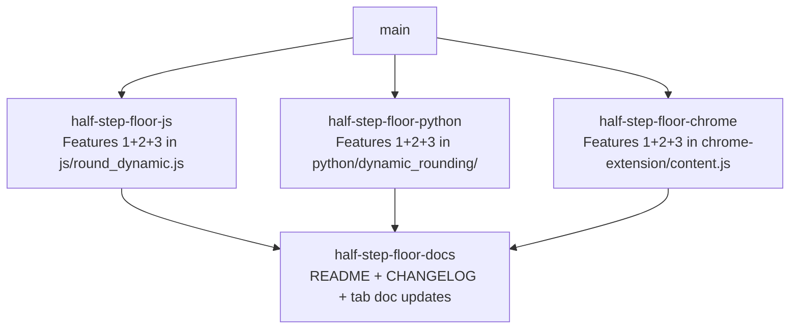

# Sprint Plan: Redefine x.5 Offset Semantics + Add OoM Floor + Configurable x-Floor

**Created:** 2026-05-28
**Base branch:** main
**Slug:** offset-semantics-v2

## 1. Repo Survey

Monorepo with three independent implementations of dynamic rounding, each with its own copy of `roundWithOffset` / `_round_with_offset`:

- `js/round_dynamic.js` (190 LoC) — Google Sheets Apps Script port. Core function `roundWithOffset` at `js/round_dynamic.js:142`. Public entry `ROUND_DYNAMIC` (single + dataset modes) at `js/round_dynamic.js:34`. Tested via `node js/tests.js`. Defaults: `DEFAULT_OFFSET_TOP = -0.5`.
- `python/dynamic_rounding/__init__.py` (190 LoC) — pip package. Core `_round_with_offset` at `python/dynamic_rounding/__init__.py:146`. Public `round_dynamic(...)` at `:19`. Tests in `python/tests/test_core.py`, `test_pandas.py`. Default: `DEFAULT_OFFSET = -0.5`.
- `chrome-extension/content.js` (1431 LoC) — Manifest V3 extension. Carries its **own** copy of `roundWithOffset` at `chrome-extension/content.js:1205` (not a shared module). Public `ROUND_DYNAMIC` at `:1132`. Tests via `node chrome-extension/tests.js`. Defaults pulled from `chrome-extension/defaults.js` (`offsetTop: null`, falling back to internal default of `-0.5`).

Root `README.md` carries the canonical narrative + parameter tables (currently documents pre-change semantics, including the misleading `-0.5` example). `js/README.md`, `js/CHANGELOG.md`, and `js/tests-googlesheets-tab.md` mirror the JS-specific story. Each implementation directory has its own `README.md`.

Recent merges (`git log --oneline -20`) show the team has been shipping a `Sprint <label>: <subject>` commit cadence via the `sprint-plan` → `sprint-stack` workflow, with merges into `main` and a CI version-bump on close.

## 2. Repo Conventions

- **Version files:**
  - `python/pyproject.toml` — semver in `version = "x.y.z"`.
  - `chrome-extension/manifest.json` — `"version": "x.y.z[.w]"` (integers only, 1–4 components; no pre-release suffixes).
  - `js/CHANGELOG.md` — informational changelog (not bumped automatically; section headings like `## [0.2.5] - YYYY-MM-DD` curated by hand).
- **Test command:** `node js/tests.js` and `node chrome-extension/tests.js` (per `.github/workflows/tests.yml`); `python -m pytest python/tests` for the Python package.
- **Lint:** none configured.
- **Format:** none configured.
- **Build:** none (Chrome extension loaded unpacked; pip package built from `pyproject.toml`).
- **Branch naming:** `feature/<label>` per `CLAUDE.md`. Never `claude/` or `session/`.
- **Commit convention:** `Sprint <label>: <subject>` for execution sprints; `plan: <slug>` for plan branches.
- **PR template:** none.
- **Version-bump workflow:** **detected at `.github/workflows/bump-version.yml`** — triggers on `pull_request: types: [closed]` with `if: github.event.pull_request.merged == true`, uses `dorny/paths-filter` to bump `python/pyproject.toml` when `python/**` changes and `chrome-extension/manifest.json` when `chrome-extension/**` changes. The `js/` folder has **no automated bump** — its CHANGELOG is updated by hand inside the sprint. Sprint commits must **not** touch `python/pyproject.toml` or `chrome-extension/manifest.json`.

## 3. Design

### 3.1 The three features (verified against the user's test grid)

**Feature 1 — Half-step (`x.5`) semantics.** Today `roundWithOffset` decomposes the offset via `Math.trunc` and treats the fractional part as a multiplier on `10^(current_mag + oom_offset)`. Because `Math.trunc(-0.5) == Math.trunc(+0.5) == 0`, both `+0.5` and `-0.5` produce the same step — a latent bug surfaced by the user's `162,583 / 400,000 / 63,538` row inversion. The new rule encodes sign as direction:

| offset | step | example (`v = 87,054,321`, OoM=7) |
| --- | --- | --- |
| `-0.5` | `0.5 × 10^OoM` (half of current OoM step) | 5,000,000 |
| `+0.5` | `0.5 × 10^(OoM+1)` (half of next-larger OoM step) | 50,000,000 |
| `+1.5` | `0.5 × 10^(OoM+2)` | 500,000,000 |
| `-1.5` | `0.5 × 10^(OoM-1)` | 500,000 |

Cleanest expression: for any half-step offset, `target_mag = current_mag + ceil(offset)`; `step = 0.5 × 10^target_mag`. Verify: `ceil(+0.5)=1`, `ceil(-0.5)=0`, `ceil(+1.5)=2`, `ceil(-1.5)=-1`. ✓ All four rows.

Integer offsets keep current semantics: `step = 10^(current_mag + offset)`.

Implementation note: today's `Math.trunc` + `|frac|||1` trick must be replaced. The new branch:
```
if offset is integer:
    target_mag = current_mag + offset
    step       = 10^target_mag
else:  # half-step
    target_mag = current_mag + ceil(offset)
    step       = 0.5 × 10^target_mag
```

**Feature 2 — Value-OoM floor (always on).** After raw rounding, the result magnitude must be at least `10^floor(log10(|value|))`. This keeps a tens-of-millions value from collapsing to `0`. Sign is preserved.

```
floor_oom = sign(value) × 10^floor(log10(|value|))
result    = sign(value) × max(|raw|, |floor_oom|)
```

**Feature 3 — Configurable "no-coarser-than-x" floor for half-steps.** For `offset = x + 0.5*sign`, also floor at `round_dynamic(value, x_int)` where `x_int = trunc(offset)` — but only when `|x_int| ≥ floor_threshold` (default `1`). Rationale (from conversation): the user-visible "small number simplifies to a bigger value than a bigger number" inversion only becomes noticeable at `|x| ≥ 1`; the threshold is parameterized so the team can later loosen it without a code change.

```
if half_step and |trunc(offset)| >= floor_threshold:
    floor_x = round_dynamic(value, trunc(offset))   # recursive: integer path
    result  = sign(value) × max(|result|, |floor_x|)
```

Combined floor:
```
raw       = sign(v) × round(|v| / step) × step
floor_oom = sign(v) × 10^floor(log10(|v|))
result    = max(|raw|, |floor_oom|)
if half_step and |trunc(offset)| >= floor_threshold:
    result = max(result, |round_dynamic(v, trunc(offset))|)
result    = sign(v) × result
```

Verification (user's 9-cell grid):

| value | offset | raw | floor_oom | floor_x (x≥1) | result |
| --- | --- | --- | --- | --- | --- |
| 87M | +2 | 0 | 10M | n/a | **10M** ✓ |
| 87M | +1.5 | 0 (step 500M) | 10M | rd(87M,1)=100M | **100M** ✓ |
| 87M | +1 | 100M | 10M | n/a | **100M** ✓ |
| 87M | +0.5 | 100M (step 50M) | 10M | (x=0, skipped) | **100M** ✓ |
| 87M | 0 | 90M | 10M | n/a | **90M** ✓ |
| 87M | −0.5 | 85M (step 5M) | 10M | (x=0, skipped) | **85M** ✓ |
| 87M | −1 | 87M | 10M | n/a | **87M** ✓ |
| 87M | −1.5 | 87M (step 500K) | 10M | rd(87M,−1)=87M | **87M** ✓ |
| 87M | −2 | 87.1M | 10M | n/a | **87.1M** ✓ |

The 47M and 17M columns of the user's grid resolve identically. The originating bug rows (`162,583`, `400,000`, `63,538`, `4,591`, `73`) also pass — e.g. for `offset=1`: `rd(73, 1) = max(round(73, 100), 10^1) = max(100, 10) = 100`, `rd(63538, 1) = max(round(63538, 100000), 10^4) = max(100000, 10000) = 100000`; ordering is preserved across magnitudes, no inversion.

### 3.2 Public API: where does `floor_threshold` live?

Three viable surfaces — pick one for monorepo consistency:

- **(A) New optional kwarg on the public function**, e.g. `round_dynamic(values, offset, *, floor_threshold=1)` (and matching `ROUND_DYNAMIC(values, offset_top, offset_other, num_top, floor_threshold)` in JS).
- **(B) Module-level config** (`set_default_floor_threshold(...)`).
- **(C) Both** — kwarg overrides module-level.

**Decision: (A) — new optional final positional/kwarg argument with default `1`**, applied to all three public entry points. Rationale:
- *Simple interactions* (microservices.io): a single per-call argument keeps state out of the module and avoids order-of-import surprises in Google Sheets (Apps Script reloads per cell calc).
- *Minimize runtime coupling*: callers that don't pass it get default behavior; no global mutation.
- *Backward-compatible at the call site*; the **behavior** change for existing half-step calls is breaking and gated by the version bump.

Signatures after change:

- JS: `function ROUND_DYNAMIC(values, offset_top, offset_other, num_top, floor_threshold)` and `function roundWithOffset(num, offset, floor_threshold)`.
- Python: `round_dynamic(data, offset=None, offset_top=None, offset_other=None, num_top=1, *, floor_threshold=1, enforce_numeric=True)`.
- Chrome `content.js`: same as JS shape, mirrored.

The dataset-mode path threads `floor_threshold` through `roundCellSetAware` → `roundWithOffset`. Sidebar UI for the Chrome extension does **not** expose `floor_threshold` in this plan (out of scope; surface it later if the team decides to flip the default).

### 3.3 Default-offset implications

Current `DEFAULT_OFFSET[_TOP] = -0.5` is **preserved**. Under the new semantics `-0.5` keeps its old behavior (step = `0.5 × 10^OoM`), so the change is invisible to users on the default path. This is intentional: the breaking surface is callers passing `+0.5`, `+1.5`, or `+0.5` via dataset modes — which the new semantics align with user intuition for the first time.

### 3.4 Versioning (breaking change)

This changes the *meaning* of `+x.5` parameters that previously worked but produced surprising values. Treat as breaking:

- **Python (`python/pyproject.toml`)**: `0.1.4` → **`0.2.0`** at merge time. *Note:* the existing `bump-version.yml` only bumps patch. The three implementation sprints below must ride that patch bump (e.g. `0.1.5`); whoever cuts the next release should manually retag to `0.2.0` and call out the break in release notes. Flagged in Open Questions.
- **Chrome extension (`chrome-extension/manifest.json`)**: `1.12.7` → **`2.0.0`** for the same reason. Same caveat — auto-bump produces `1.12.8`; manual minor/major bump after merge.
- **JS / Google Sheets (`js/CHANGELOG.md`)**: open a new `## [0.3.0] - YYYY-MM-DD` section (current top is `[0.2.5]`). Hand-edited inside the docs sprint.

If the team prefers the auto-bumped patch versions and accepts the breaking change inside a patch, drop the manual retag — note in Open Questions.

### 3.5 Decoupling strategy

The three implementations share zero code at runtime. Each can be modified and reviewed independently. The docs sprint depends on the three implementation sprints only because the README examples must match the implemented behavior, but it does **not** depend on them in code (no merge conflict surface) — execution-wise it can run last. We model the docs sprint with `depends_on: implementations-finished` only at the human-review level; mechanically, sprint-stack can execute it in parallel with the others if the user prefers (flagged in Open Questions).

## 4. Sprint List & Dependency Graph

### Sprint List

1. **`half-step-floor-js`** — Implement Features 1+2+3 in `js/round_dynamic.js` and update `js/tests.js`. **Depends on:** none. *Decoupling:* JS impl is self-contained; no shared module with Python or Chrome.
2. **`half-step-floor-python`** — Implement Features 1+2+3 in `python/dynamic_rounding/__init__.py` and update `python/tests/test_core.py` (+ `test_pandas.py` if it exercises half-steps). **Depends on:** none. *Decoupling:* independent package.
3. **`half-step-floor-chrome`** — Implement Features 1+2+3 in `chrome-extension/content.js` (`roundWithOffset`, dispatcher, dataset-mode threading) and update `chrome-extension/tests.js`. **Depends on:** none. *Decoupling:* independent code path; the extension carries its own copy.
4. **`half-step-floor-docs`** — Rewrite root `README.md` parameter tables to reflect Features 1+2+3, refresh `js/README.md`, `chrome-extension/README.md`, `python/` package docstrings, update `js/CHANGELOG.md` with a `[0.3.0]` section, refresh `js/tests-googlesheets-tab.md`. **Depends on:** all three implementation sprints (review-level only, not code-level). *Decoupling:* docs-only; no functional code.

### Dependency Graph



## 5. Sprint Definitions

### half-step-floor-js

- **Goal:** Replace `roundWithOffset` semantics in `js/round_dynamic.js` to implement Features 1 (sign-aware half-step), 2 (value-OoM floor), and 3 (configurable x-floor with `floor_threshold` default 1), and add coverage in `js/tests.js`.
- **Scope:**
  - `js/round_dynamic.js`:
    - `roundWithOffset(num, offset)` → `roundWithOffset(num, offset, floor_threshold = 1)`: replace `Math.trunc`/`fraction` decomposition with the integer-vs-half-step branch (`target_mag = current_mag + ceil(offset)` for halves), apply Feature 2 floor, apply Feature 3 floor when `Math.abs(Math.trunc(offset)) >= floor_threshold`.
    - `ROUND_DYNAMIC(values, offset_top, offset_other, num_top)` → add trailing `floor_threshold` parameter, thread through.
    - `singleValueMode`, `datasetMode`, `roundCellSetAware` → thread `floor_threshold`.
    - Keep `DEFAULT_OFFSET_TOP = -0.5` unchanged.
    - Update JSDoc on `roundWithOffset` to reflect the new step formula (remove the `-1.5 = half of one OoM finer`-style comments that describe today's behavior and replace with the new table).
  - `js/tests.js`: add the 9-cell `{87M, 47M, 17M} × {+2, +1.5, +1, +0.5, 0, −0.5, −1, −1.5, −2}` matrix; add the originating-bug rows (`162583 / 400000 / 63538 / 4591 / 73` at offsets `1` and `0.5`); add `floor_threshold = 0` cases that re-enable the x-floor for `±0.5` (e.g. `rd(17M, 0.5, floor_threshold=0) → rd(17M, 0) = 20M`).
- **Out of scope:** Changing the default offset, changing the JS public-API shape beyond a new trailing optional argument, touching `js/CHANGELOG.md` (docs sprint), touching `js/README.md` or `tests-googlesheets-tab.md` (docs sprint).
- **Acceptance criteria:**
  - `node js/tests.js` exits 0.
  - All 9 grid cells return the expected values from the user's table.
  - All originating-bug rows produce monotonic results (no smaller original > larger original after rounding).
  - `floor_threshold = 0` flips the x-floor on for `±0.5` and the test for `rd(17M, 0.5, 0) → 20M` passes.
  - `rd(v, -0.5)` returns the same value it did before this sprint for every existing test case (regression check on the default-path users).
- **Depends on:** none.
- **Complexity:** M.
- **Dev notes:** Watch for the existing `EPSILON` adjustment inside `Math.round(num / rounding_base + EPSILON)` — preserve it. The recursive call inside the x-floor branch must pass `floor_threshold` unchanged (the inner call is on the integer `x_int`, which won't re-trigger the branch, but still propagate for safety). For negative `value`, do the work on `Math.abs(value)` and reapply the sign at the end. Do not modify `validateOffset` bounds.

### half-step-floor-python

- **Goal:** Mirror Features 1+2+3 in `python/dynamic_rounding/__init__.py` and lock in coverage in `python/tests/`.
- **Scope:**
  - `python/dynamic_rounding/__init__.py`:
    - `_round_with_offset(value, offset)` → `_round_with_offset(value, offset, floor_threshold=1)`: new integer-vs-half-step branch; Feature 2 floor; Feature 3 conditional floor.
    - `round_dynamic(...)` public signature gains keyword-only `floor_threshold: float = 1`. Thread through `_single_mode`, `_dataset_mode`, `_round_with_offset`.
    - Docstrings updated; keep `DEFAULT_OFFSET = -0.5`.
  - `python/tests/test_core.py`: add the same 9-cell grid; add originating-bug rows; add `floor_threshold=0` cases; add a regression group asserting `rd(v, -0.5)` is unchanged for the existing fixtures.
  - `python/tests/test_pandas.py`: add a small smoke test that `floor_threshold` is honored when passed through `apply`-style usage (no shape change to existing tests).
- **Out of scope:** `python/README.md` (docs sprint); `pyproject.toml` version bump (CI handles patch; manual minor/major in docs sprint or post-merge).
- **Acceptance criteria:**
  - `python -m pytest python/tests` exits 0.
  - 9-cell grid matches the user's table.
  - Default-path (`-0.5`) behavior unchanged on existing fixtures.
  - `floor_threshold=0` reproduces the parallel JS behavior on the same inputs.
- **Depends on:** none.
- **Complexity:** M.
- **Dev notes:** Use `math.ceil` for the half-step `target_mag` calculation. `_preserve_type` must run after the floor logic, not before. Recursive call inside the x-floor branch must respect `enforce_numeric`.

### half-step-floor-chrome

- **Goal:** Mirror Features 1+2+3 in `chrome-extension/content.js`'s embedded `roundWithOffset` and dataset-mode dispatch, plus tests.
- **Scope:**
  - `chrome-extension/content.js`:
    - `roundWithOffset` (`content.js:1205`) → same change as JS sprint, plus the new `floor_threshold` parameter (default 1).
    - `ROUND_DYNAMIC` (`content.js:1132`), `singleValueMode` (`:1142`), `datasetMode` (`:1155`), `roundCellSetAware` (`:1189`) → thread `floor_threshold`.
    - `roundTable` (`content.js:505`) call site: pass `floor_threshold` from `options` if present, else default 1. No change to `defaults.js` or `sidebar.html` (sidebar UI for the threshold is out of scope).
  - `chrome-extension/tests.js`: add the 9-cell grid, originating-bug rows, `floor_threshold=0` cases.
- **Out of scope:** `chrome-extension/README.md` (docs sprint); `manifest.json` version (CI handles patch; manual minor/major post-merge); sidebar UI surface for `floor_threshold`.
- **Acceptance criteria:**
  - `node chrome-extension/tests.js` exits 0.
  - 9-cell grid matches.
  - Default-path (`-0.5`) behavior unchanged on existing fixtures.
  - In-page rounding of a sample table (manual smoke per sprint-stack's verify step) produces the new values on a row with mixed magnitudes.
- **Depends on:** none.
- **Complexity:** M.
- **Dev notes:** The extension's `roundWithOffset` is a near-duplicate of `js/round_dynamic.js`'s function; copy the JS sprint's logic verbatim once it's reviewed to minimize drift. `roundTable`'s `options` object already carries `offsetTop`/`offsetOther`; add `floorThreshold` alongside without breaking existing callers (default to `1` when undefined).

### half-step-floor-docs

- **Goal:** Update prose, tables, changelog, and tab doc so all user-facing surfaces describe the new semantics.
- **Scope:**
  - Root `README.md`: rewrite the parameter table in the "Declaring a lens" section so `+0.5`, `+1.5`, etc. show the new step; add a short "Floor at the value's order of magnitude" subsection; add a one-paragraph "Backward compatibility" note flagging the breaking change. The "Adaptive precision" example (using `-0.5, 0`) is unchanged in behavior — verify the numbers still match.
  - `js/README.md`: update the parameter explanation and any example tables.
  - `js/CHANGELOG.md`: add a new top-of-file section `## [0.3.0] - YYYY-MM-DD` with `### Changed` (Feature 1 semantics, Feature 3 default behavior), `### Added` (Feature 2 floor, `floor_threshold` parameter), `### Breaking` (callers passing `+x.5` will see different values).
  - `js/tests-googlesheets-tab.md`: regenerate any example cells affected by `+x.5` behavior.
  - `chrome-extension/README.md`: short note describing the parameter change and pointing at root `README.md`.
  - `python/dynamic_rounding/__init__.py` module/function docstrings: refresh `>>> round_dynamic(...)` examples.
- **Out of scope:** Editing `pyproject.toml` or `manifest.json` version strings (handled by CI auto-bump on each impl sprint; a post-merge manual major bump is tracked in Open Questions).
- **Acceptance criteria:**
  - Root `README.md` "Declaring a lens" table reflects the new semantics and renders cleanly on GitHub.
  - `js/CHANGELOG.md` has a new dated `[0.3.0]` section above `[0.2.5]`.
  - All code examples in updated docs evaluate to the documented output when run against the new implementations.
- **Depends on:** half-step-floor-js, half-step-floor-python, half-step-floor-chrome (so the documented values are guaranteed to match implementation).
- **Complexity:** S.
- **Dev notes:** Sanity-check every parameter-table cell against `node js/tests.js` output. Don't introduce a `floor_threshold` example in the root README — keep it as an "advanced" note in `js/README.md` so the main story stays simple.

## 6. Open Questions

1. **Major-version bump vs. CI patch bump.** The existing `bump-version.yml` only increments patch. Three options: (a) accept patch bumps inside each impl sprint and have a maintainer manually retag a coordinated `0.2.0` / `2.0.0` / `0.3.0` release post-merge; (b) extend `bump-version.yml` with a `breaking:` label that triggers a minor/major bump (out-of-scope code change); (c) accept a breaking change inside a patch and document it loudly. Recommend (a) for this plan, noted explicitly in the docs sprint changelog.
2. **Sidebar surfacing of `floor_threshold` in the Chrome extension.** Currently kept internal. Should a future sprint expose it as a sidebar toggle ("preserve granularity at high offsets")? Recommend a follow-up sprint after live usage shows whether anyone needs to flip it.
3. **Docs-sprint dependency.** Mechanically, the docs sprint can run in parallel with the three impl sprints (no file overlap). I modeled it as dependent because the documented numbers must match the merged implementations; if the user prefers true parallel execution, drop the edges and accept that the docs PR may need a fixup commit after the three impl PRs land.
4. **Negative-x-floor symmetry.** The plan applies the x-floor symmetrically (`|trunc(offset)| ≥ floor_threshold`), so `-1.5` is also floored at `round_dynamic(v, -1)`. In practice this is a no-op because `-1.5`'s step is strictly finer than `-1`'s step. Leave the symmetric implementation in place for cleanliness; flag here only because the user-facing motivation was framed around positive offsets.

## 7. Out of Scope (Separate Sprint-Stack)

- Sidebar UI control for `floor_threshold` in the Chrome extension.
- A shared core JS module to eliminate the duplication between `js/round_dynamic.js` and `chrome-extension/content.js` — worthwhile refactor, but orthogonal and would couple all three impl sprints.
- Revisiting the `num_top` semantics or `offset_other` defaults.

## Decisions Log

- 2026-05-28: Initial draft generated by sprint-plan skill.
