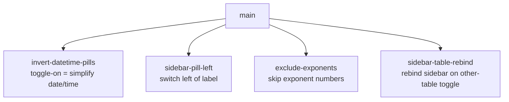

# Sprint Plan: Date/Time Pills, Exponent Exclusion & Sidebar Rebind

**Created:** 2026-06-05
**Base branch:** main
**Slug:** pill-exponent-rebind

## 1. Repo Survey

Monorepo with three independent implementations of the Dynamic Rounding algorithm:

- `js/` — Google Sheets Apps Script port (`round_dynamic.js`) plus a Node test harness.
- `python/` — `pip`-installable package (`dynamic_rounding`).
- `chrome-extension/` — Manifest V3 extension. **All four items in this plan target this directory only.**

Chrome-extension files of interest:

- `manifest.json` — version source (1–4 dot-separated integers).
- `background.js` — service worker; owns the context menu and tracks `sidebarTabId` (whether the side panel is open).
- `content.js` (1631 lines) — DOM logic + inlined rounding algorithm. Holds `lastRightClickedTable` (the table the sidebar is "bound" to), the per-table morph-toggle infrastructure (`createToggleForTable`, `tableToggles` WeakMap, `trackedTables` Set), the cell-classification pass (`roundTable`), date/time detection & rounding, and inline-number extraction (`extractNumbersInText`, `NUMBER_IN_TEXT_REGEX_GLOBAL`).
- `defaults.js` — `DR_DEFAULTS`, the single source of truth shared by the content script and the sidebar.
- `sidebar.html` / `sidebar.js` — the side-panel options UI (iOS-style toggle switches per option, two granularity `<select>`s, dual-thumb offset sliders, live preview bands).
- `tests.js` (4213 lines) — Node harness that `eval`s `content.js` against stubbed `document` / `chrome` / `window`.

Languages: vanilla JavaScript, no bundler, no framework. Styles injected via `<style>` tags or inline in `sidebar.html`.

Visible patterns: shared-defaults indirection (`DR_DEFAULTS`), message-passing between background ↔ content ↔ sidebar, WeakMap-keyed per-table state, named char-class/regex constants for date parsing (`SUPERSCRIPT_DIGITS`, `DATE_NOISE_CLASS`, etc.).

## 2. Repo Conventions

- **Version files:**
  - `chrome-extension/manifest.json` — `version` key, 1–4 dot-separated integers (no pre-release suffixes).
  - `python/pyproject.toml` — semver in `version =` line (untouched by this plan).
  - `js/CHANGELOG.md` — informational only (not auto-bumped).
- **Test command:** `node chrome-extension/tests.js`
- **Lint / Format / Build:** none configured.
- **Branch naming:** `fix/<label>` for bug fixes, `feature/<label>` for new functionality (per `CLAUDE.md` / `CONTRIBUTING.md`). **Never** `claude/` or `session/`.
- **Commit convention:** plain prefixed Conventional-Commit style (`fix: …`, `feat: …`, `test: …`, `docs: …`); sprint-stack execution commits use `Sprint <label>: <subject>`.
- **PR template:** none.
- **Version-bump workflow:** **detected** at `.github/workflows/bump-version.yml` — triggers on `pull_request: types: [closed]` to `main`, gated by `github.event.pull_request.merged == true`, and bumps `chrome-extension/manifest.json`'s patch component when files under `chrome-extension/**` change. Sprint commits in this plan **must not** modify `manifest.json`.

## 3. Design

### 3.1 Invert date/time pill semantics (Sprint `invert-datetime-pills`)

**What.** Today the `dates` / `times` rows mean *exclude*. In `content.js` the cell is skipped when `excludeDates`/`excludeTimes` is true (`getExclusionReason`, `content.js:1005-1006`) and date/time *simplification* is only applied when the flag is `false` (`content.js:752`, `761`). Meanwhile `updateDisabledState` (`sidebar.js:262-272`) **enables** the granularity dropdown when the toggle is **on** — i.e. the dropdown is editable precisely when, under current semantics, no simplification happens. The control reads backwards.

The fix inverts the meaning so that **toggle on = simplify this type, and its granularity dropdown becomes editable**; toggle off = leave cells untouched.

**Why.** Aligns the control's affordance (an editable granularity dropdown) with its effect (simplification at that granularity). *Simple components / minimize design-time coupling* — one consistent mental model instead of two contradictory ones.

**Decision — rename the keys, don't just flip the boolean.** Leaving a key named `excludeDates` whose `true` value means "simplify" is a landmine for every future reader. Rename the settings to `simplifyDates` / `simplifyTimes` everywhere: `defaults.js`, `sidebar.js` (`CHECKBOX_TO_SETTING` + the `excludeDates`/`excludeTimes` reads), `sidebar.html` (checkbox `id`s), `content.js` (the three read sites above), and `tests.js`. These keys are passed live via messages and seeded from `DR_DEFAULTS` on each sidebar open — there is **no** persisted `chrome.storage` of the old key names — so the rename is safe with no migration shim.

**Default behaviour.** Preserve today's *observable* defaults under the new names: dates are not simplified by default, times are. Current `DR_DEFAULTS` is `excludeDates: true, excludeTimes: false`, which under current semantics means dates excluded (not simplified) and times simplified. The equivalent under the new names is `simplifyDates: false, simplifyTimes: true`. (Whether the product actually wants times-on-by-default is raised in Open Questions — but this sprint's job is the semantic flip, not a default-behaviour change.)

**Alternatives considered.** (a) Flip the boolean meaning while keeping the `exclude*` names — rejected: permanently confusing. (b) Flip the `updateDisabledState` direction instead of the cell logic — rejected: that would make the dropdown editable when *excluding*, doubling down on the wrong model.

**Implications.** `getExclusionReason` no longer carries date/time logic; the date/time branches in the classification pass switch from `=== false` to truthy `simplify*` checks. Tests referencing the old keys must be renamed.

### 3.2 Move the option toggle to the left of its label (Sprint `sidebar-pill-left`)

**What.** In each `.toggle-row` the label text sits left and the iOS switch sits right (`sidebar.html:251-308`, with `justify-content: space-between` and `.toggle-label { flex-grow: 1 }`). Move the switch to the **left**, where a checkbox would normally sit, with the label to its right.

**Why.** Matches the conventional checkbox-then-label reading order the request asks for. Pure presentation.

**Decision.** CSS/markup-only. Reorder each row so the `<label class="switch">` precedes the `.toggle-label`, and adjust the flex rule (drop `space-between`, give the label `flex-grow` so the row still fills width, add a small gap). The granularity `<select>` for the `dates`/`times` rows stays on the right. No `sidebar.js` change — element `id`s are unchanged, so all wiring (`getElementById`, `CHECKBOX_TO_SETTING`) keeps working.

**Alternatives considered.** Reverse the flex container with `flex-direction: row-reverse` — rejected: it would also flip the granularity dropdown to the wrong side and invert DOM/tab order vs. visual order (an a11y trap). Explicit reordering is clearer.

**Implications.** Fully independent of every other sprint — touches only `sidebar.html`.

### 3.3 Exclude exponent numbers from simplification (Sprint `exclude-exponents`)

**What.** Numbers that are exponents must pass through untouched. From the Chronology-of-the-universe examples:

| raw | current (buggy) | should be |
| --- | --- | --- |
| `20×10^−12 s` | `20×10^−10 s` | `20×10^−12 s` |
| `20×10^15` | `20×10^00` | `20×10^15` |
| `10^12` | `1,^000` | `10^12` |
| `6×10^9` | `6×10^0` | `6×10^9` |
| `~ 10^−32 sec` | `~ 10^−30 sec` | `~ 10^−32 sec` |

The simplification happens in `extractNumbersInText` (`content.js:1285-1297`) via `NUMBER_IN_TEXT_REGEX_GLOBAL = /-?\d[\d,]*(?:\.\d+)?/g` (`content.js:12`). The exponent digits (e.g. `12`, `15`, `9`, `−32`) are being matched and rounded like ordinary inline numbers. Note the mantissa base (`10`, `20`, `6`) is correctly left alone in the "should be" column — only the exponent must be excluded.

**Why.** Exponents are positional notation, not magnitudes to coarsen; rounding them corrupts the value's meaning (and produces nonsense like `1,^000`). *Robustness* — the extension already guards dates/quotes/links; exponents are the same class of "don't touch."

**Decision.** Detect-and-skip in the extraction step. After the regex finds a candidate match, drop it if it is an exponent:
1. **Caret form** — the matched run is immediately preceded by `^` (optionally with a sign `+`/`-`/unicode-minus `−` between the caret and the digits). Look back from `m.index` past an optional sign character to a `^`.
2. **Unicode-superscript form** — the candidate is a run of superscript digits (reuse the existing `SUPERSCRIPT_DIGITS` constant), which the ASCII-digit regex won't match anyway but is documented here for completeness; the real work is the caret look-behind.

A new named constant `EXPONENT_LOOKBEHIND_RE` (home: `content.js`, near `NUMBER_IN_TEXT_REGEX_GLOBAL`) expresses "optional sign then caret immediately before this index." Skip the match when the text ending at `m.index` matches it.

**Alternatives considered.** (a) Bake a negative-look-behind into `NUMBER_IN_TEXT_REGEX_GLOBAL` — rejected: JS look-behind support is fine in MV3 Chrome, but folding it into the shared global regex risks affecting the pure-number and date paths that also reference magnitude logic; a post-match filter is surgical and easy to unit-test. (b) Strip exponent spans before extraction — rejected: index bookkeeping for the right-to-left splice in `roundTable` becomes fragile.

**Implications.** Touches `content.js` (extraction + one constant) and `tests.js` (add the five rows above as fixtures). Independent of the other three sprints.

### 3.4 Rebind the open sidebar when a different table is toggled (Sprint `sidebar-table-rebind`)

**What.** The sidebar is "bound" to `lastRightClickedTable`. When the sidebar is open and the user clicks the per-table morph toggle on a **different** table, the sidebar should switch its binding to that newly toggled table and reset to **default** settings.

**Why.** Keeps the visible options in sync with whatever table the user is now acting on, instead of silently applying the old table's settings or leaving the sidebar stale. *Minimize runtime coupling* between which table is active and what the panel shows.

**Decision.**
- **Track sidebar-open state in `content.js`.** Add a module flag `sidebarOpen`, set `true` on the `SIDEBAR_OPENED` message and `false` on `CLOSE_SIDEBAR`/`SIDEBAR_CLOSED`-equivalent. (Background already tracks `sidebarTabId`; the content script needs its own view to decide whether to rebind.)
- **In the toggle path** (`createToggleForTable`'s click handler / `runToggleAction`), when `sidebarOpen && table !== lastRightClickedTable`: set `lastRightClickedTable = table`, tell the sidebar to reset its UI to defaults, then run the normal toggle/apply against the new table.
- **Reset the sidebar UI to defaults.** Add a `RESET_SIDEBAR_TO_DEFAULTS` message handled in `sidebar.js` that calls the existing `applyDefaultsToUI()` and `fetchPreviewSamples()`. Reuse the existing `PREVIEW_SAMPLES_CHANGED` plumbing so the preview bands re-pull against the new table.

**Alternatives considered.** (a) Rebind on right-click only (status quo) — rejected: the request is specifically about the *toggle* action. (b) Preserve the previous table's settings on rebind — rejected: the request explicitly says "with the default settings."

**Implications.** Touches `content.js` (open-state flag + toggle handler) and `sidebar.js` (reset handler). Logically independent of the other three; shares files with Sprints 3.1 (sidebar.js/content.js) and 3.3 (content.js) but in different regions, so no `depends_on` edge is warranted.

### 3.5 Named constants

Per the delivery principle, new literals that carry cross-call-site meaning get names:

- `EXPONENT_LOOKBEHIND_RE` — `content.js` (Sprint `exclude-exponents`).
- `RESET_SIDEBAR_TO_DEFAULTS` — message-action string used in both `content.js` and `sidebar.js` (Sprint `sidebar-table-rebind`); define once and reuse. (Existing action strings are inline literals shared by convention; follow that same convention but keep the name consistent across both files.)

## 4. Sprint List & Dependency Graph

### Sprint List

1. **`invert-datetime-pills`** — Flip date/time controls so toggle-on simplifies and enables the granularity dropdown; rename `exclude*` → `simplify*`. *Depends on: none.*
2. **`sidebar-pill-left`** — Move each option's toggle switch left of its label in the sidebar. *Depends on: none.* (CSS/markup-only; the most isolated sprint.)
3. **`exclude-exponents`** — Skip exponent numbers (caret/superscript) during inline-number simplification. *Depends on: none.*
4. **`sidebar-table-rebind`** — When the open sidebar's bound table differs from a just-toggled table, rebind to the new table with default settings. *Depends on: none.*

All four are rooted at `main`. They were deliberately kept independent: 1 and 4 both touch `sidebar.js`/`content.js` and 3 touches `content.js`, but in non-overlapping regions, so no dependency edge is justified — if any one fails, the others still merge on their own merits (*team autonomy*, *minimize design-time coupling*).

### Dependency Graph

## 5. Sprint Definitions

### invert-datetime-pills

- **Goal:** Make the `dates`/`times` sidebar toggles mean "simplify this type (dropdown editable)" instead of "exclude it."
- **Scope:**
  - `defaults.js` — rename `excludeDates`→`simplifyDates`, `excludeTimes`→`simplifyTimes`; set values to preserve current behaviour (`simplifyDates: false`, `simplifyTimes: true`).
  - `sidebar.html` — rename checkbox `id`s `excludeDates`→`simplifyDates`, `excludeTimes`→`simplifyTimes`.
  - `sidebar.js` — update `CHECKBOX_TO_SETTING` and the two `getElementById('excludeDates'/'excludeTimes')` reads in `updateDisabledState`; verify the dropdown-enable direction now reads correctly (enabled when toggle on).
  - `content.js` — `getExclusionReason` drops the date/time branches (lines 1005-1006); the classification pass (lines 752, 761) switches to `opts.simplifyDates && isDateLike(...)` / `opts.simplifyTimes && isTimeLike(...)`.
  - `tests.js` — rename old keys in fixtures/assertions; add a test asserting that a date cell **is** simplified when `simplifyDates: true` and **is not** when `false` (and the symmetric time case).
- **Out of scope:** Changing the set of granularity options; any default-behaviour change beyond the rename-preserving mapping (see Open Questions); the pill's visual position (that's `sidebar-pill-left`).
- **Acceptance criteria:**
  - With `simplifyDates: true`, a `YYYY-MM-DD` cell is rounded to the chosen granularity; the `dateGranularity` `<select>` is enabled.
  - With `simplifyDates: false`, the same cell is unchanged and the dropdown is disabled. Symmetric for times.
  - No occurrence of `excludeDates`/`excludeTimes` remains in `chrome-extension/` or `tests.js`.
  - `node chrome-extension/tests.js` passes.
- **Depends on:** none
- **Complexity:** M
- **Dev notes:** No `chrome.storage` migration needed (keys are transient). Watch the inverted comparison: old code applied simplification on `=== false`; new code applies on truthy `simplify*`. Keep `getExclusionReason` returning `null` for date/time (they're no longer an exclusion reason).

### sidebar-pill-left

- **Goal:** Render each option's toggle switch to the left of its label, checkbox-style.
- **Scope:** `sidebar.html` only — reorder each `.toggle-row` so `<label class="switch">` precedes `.toggle-label`, and update the `.toggle-row` flex rule (remove `justify-content: space-between`, keep `.toggle-label { flex-grow: 1 }` and the gap so the row still fills width). For the `dates`/`times` rows, keep the granularity `<select>` on the far right (switch · label · …spacer… · select).
- **Out of scope:** Any `sidebar.js` change; renaming `id`s; the top title-row master switch (it stays where it is unless trivially consistent).
- **Acceptance criteria:**
  - In all option rows the switch appears left of the label.
  - On the `dates`/`times` rows the granularity dropdown remains right-aligned.
  - Element `id`s are unchanged; toggling still applies (manual load-unpacked check) and `node chrome-extension/tests.js` still passes.
- **Depends on:** none
- **Complexity:** S
- **Dev notes:** Avoid `flex-direction: row-reverse` (breaks select placement and DOM/visual order for a11y). Reorder the actual elements.

### exclude-exponents

- **Goal:** Leave exponent numbers untouched during inline-number simplification.
- **Scope:**
  - `content.js` — in `extractNumbersInText` (1285-1297), after each regex match, skip it when it is an exponent. Add `EXPONENT_LOOKBEHIND_RE` near `NUMBER_IN_TEXT_REGEX_GLOBAL` matching an optional sign (`+`/`-`/`−`) preceded by `^` immediately before the match start. Reuse `SUPERSCRIPT_DIGITS` for the superscript-run case.
  - `tests.js` — add the five Chronology-of-the-universe rows as fixtures asserting "should be" outputs; include a control row proving an ordinary inline number on the same page is still simplified.
- **Out of scope:** Rewriting `NUMBER_IN_TEXT_REGEX_GLOBAL`; changing pure-number-cell or date handling; rendering superscripts (display untouched).
- **Acceptance criteria:**
  - `20×10^−12 s`, `20×10^15`, `10^12`, `6×10^9`, and `~ 10^−32 sec` all pass through unchanged.
  - A normal inline number (e.g. `45 ka` in the same cell as an exponent) is still simplified.
  - `node chrome-extension/tests.js` passes.
- **Depends on:** none
- **Complexity:** M
- **Dev notes:** Look-behind from `m.index`: inspect the substring ending at `m.index` (skip one optional sign char, then require `^`). Cover both ASCII `-` and unicode `−` signs. The base (`10`, `20`, `6`) must remain eligible for rounding — don't over-broaden the skip to the whole `N×10^M` group.

### sidebar-table-rebind

- **Goal:** When the open sidebar is bound to one table and a different table's toggle is clicked, rebind the sidebar to the new table with default settings.
- **Scope:**
  - `content.js` — add `sidebarOpen` flag set `true` on `SIDEBAR_OPENED`, `false` on `CLOSE_SIDEBAR` (and any sidebar-closed signal the content script can observe). In the morph-toggle click path (`createToggleForTable` / `runToggleAction`), when `sidebarOpen && table !== lastRightClickedTable`: set `lastRightClickedTable = table`, post `RESET_SIDEBAR_TO_DEFAULTS`, then run the toggle/apply against the new table. Reuse `PREVIEW_SAMPLES_CHANGED`.
  - `sidebar.js` — handle `RESET_SIDEBAR_TO_DEFAULTS` by calling `applyDefaultsToUI()` then `fetchPreviewSamples()`.
- **Out of scope:** Preserving the previous table's settings on rebind (request says use defaults); rebinding on right-click (already works); multi-table simultaneous binding.
- **Acceptance criteria:**
  - With the sidebar open on table A, clicking table B's toggle rebinds the sidebar to B, resets all controls to `DR_DEFAULTS`, and the preview bands re-pull from B.
  - Toggling table A's own toggle while bound to A does **not** reset the sidebar.
  - With the sidebar closed, toggle behaviour is unchanged.
  - `node chrome-extension/tests.js` passes.
- **Depends on:** none
- **Complexity:** M
- **Dev notes:** `content.js` has no sidebar-open flag today — add one rather than round-tripping to the background. Define the `RESET_SIDEBAR_TO_DEFAULTS` action string consistently in both files. Guard the rebind with `table !== lastRightClickedTable` so same-table toggles are untouched.

## 6. Open Questions

- **Default for `simplifyTimes`.** Preserving today's behaviour makes times simplified by default (`simplifyTimes: true`) while dates are not (`simplifyDates: false`). Is times-on-by-default actually desired, or should both default to off now that the control is positive-framed? The plan preserves current behaviour; confirm if a default change is wanted (trivial follow-up in `defaults.js`).
- **Exponent notation coverage.** The examples use caret (`^`) notation. Do real target pages also present exponents as HTML `` elements or pre-rendered unicode superscripts (`10⁻³²`)? The plan handles caret + unicode-superscript runs; if `` DOM is in scope, the extraction step may need to consult cell structure, which would enlarge `exclude-exponents`.
- **Master switch position.** `sidebar-pill-left` moves the per-option switches; should the top-level `enabled` switch in the title row also move, or stay right-aligned next to the `<h1>`? Plan leaves it as-is.

## 7. Out of Scope (Separate Sprint-Stack)

- No cross-platform (`js/`, `python/`) changes — all four items are Chrome-extension-only.
- Broader exponent/scientific-notation *rendering* (e.g. normalizing `1e9` ↔ `10^9`) is a distinct concern.

## Decisions Log

- 2026-06-05: Initial draft generated by sprint-plan skill.
