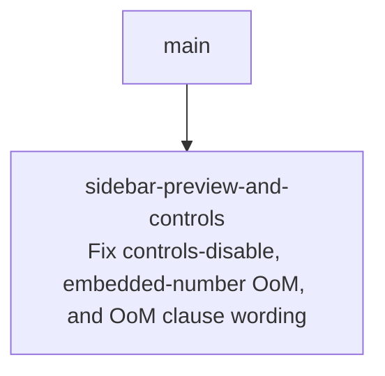

# Sprint Plan: Sidebar Preview & Controls Bug-Fix Trio

**Created:** 2026-06-25
**Base branch:** main
**Slug:** sidebar-preview-and-controls

## 1. Repo Survey

Monorepo with three implementations of Dynamic Rounding (Google Sheets `js/`,
Python `python/`, and the Manifest V3 `chrome-extension/`). All three bugs in
this plan live entirely in `chrome-extension/`; the JS and Python ports are not
touched.

Relevant chrome-extension modules (load order per `manifest.json`):
`defaults.js → rounding.js → core.js → parsing.js → dom-adapters.js →
ui-toggle.js → content.js`, plus the side-panel scripts `sidebar.html` /
`sidebar.js` (which also `<script>`-loads `rounding.js` + `core.js`).

Key code touched:

- **`content.js`**
  - `chrome.runtime.onMessage` listener (`content.js:68`) — routes
    `MENU_CLICKED`, `SIDEBAR_OPENED`, `CLOSE_SIDEBAR`, `APPLY_SIDEBAR_SETTINGS`,
    `GET_PREVIEW_SAMPLES`. The `APPLY_SIDEBAR_SETTINGS` branch
    (`content.js:103-108`) does its work but **never calls `sendResponse`** and
    the listener returns `undefined`.
  - `collectNumericCells(table)` (`content.js:323`) — walks every `<td>` and
    keeps a cell only when its **entire** trimmed text parses as one number via
    `toNumber(trimmed)`. Cells with numbers embedded in surrounding text
    (`₹2,000 crore`, `2,000–2,000 crore`) yield `null` and are dropped. A
    header comment already flags this as a deferred limitation.
  - `extractPreviewSamples(table)` (`content.js:347`) — buckets the collected
    cells by magnitude, computes `maxMag`, and returns `{samples, maxMag}` to
    the sidebar over `GET_PREVIEW_SAMPLES`.
  - `roundTable` (the live rounding pass) already computes `max_mag` over **both**
    `pure` cells and in-text `extracted` matches (`content.js:908-917` via
    `extractNumbersInText`). So the live rounding and the preview currently
    disagree about what the "largest number" is.
- **`sidebar.js`**
  - `fetchPreviewSamples()` (`sidebar.js:346`) caches `cachedSamples` /
    `cachedMaxMag` and calls `setTableBound(...)`.
  - `sendToActiveTab(message)` (`sidebar.js:483`) — the only caller is
    `applyNow()`; its `chrome.tabs.sendMessage` callback treats any
    `chrome.runtime.lastError` as "table gone" and calls `setTableBound(false)`,
    which adds `body.no-table` (CSS sets `pointer-events:none; opacity:0.4` on
    `#optionsSection` / `#advancedSection`, disabling the controls).
  - `formatStrategyHeader(maxMag, offset)` (`sidebar.js:199`) — builds the top
    band's "OoM → nearest step (i.e. …)" header. Computes
    `ratio = step / oomVal` and looks it up in `STRATEGY_RATIO_PHRASES`
    (`sidebar.js:202-212`), which currently carries both sub-1 descriptive
    phrases (`a quarter of`, …) and ≥1 multiplier phrases (`5× …`, `10× …`).

Test harness: `chrome-extension/tests.js` (Node, ~1425 assertions) `eval`s the
extension sources against stubbed `document` / `chrome` / `window`. It already
contains a "sidebar-no-table-state" block exercising `setTableBound`, and
"advanced-preview-redesign" coverage for `formatStrategyHeader` /
`extractPreviewSamples`.

## 2. Repo Conventions

- **Version files:**
  - `chrome-extension/manifest.json` — `version` key, integer-dot format (1-4
    components; only integers, no pre-release suffix). **Do not bump in this
    sprint** — the merge-time workflow owns it.
  - `python/pyproject.toml` — semver in `version =` line (not touched here).
  - `js/CHANGELOG.md` — informational only.
- **Test command:** `node chrome-extension/tests.js` (and `node js/tests.js`,
  unaffected).
- **Lint:** none configured.
- **Format:** none configured.
- **Build:** none (extension loaded unpacked).
- **Branch naming:** `feature/<label>` / `fix/<label>` per `CLAUDE.md` and
  `.agent/rules/git-workflow-policy.md`. **Never** `claude/` or `session/`.
- **Commit convention:** plain, descriptive Conventional-Commit-ish subjects
  (recent history uses `feature/…`, `fix/…`, `chore(version): …`). **No** agent
  /session footers, `Co-Authored-By` trailers, or "Generated with" lines (repo
  git-workflow-policy §4).
- **PR template:** none.
- **Version-bump workflow:** detected at `.github/workflows/bump-version.yml` —
  triggers on `pull_request: types: [closed]` to `main`, gated on
  `github.event.pull_request.merged == true`, and bumps
  `chrome-extension/manifest.json`'s patch when `chrome-extension/**` changes.
  Sprint commits must not modify `manifest.json`.

## 3. Design

The three reported defects are independent in their root cause but share one
small surface area — the sidebar preview pipeline and its content-script IPC.
Each is a single-spot fix verifiable by the existing Node harness. See §3.5 for
why they are bundled into one sprint rather than three.

### 3.1 Bug #2 — controls disable after any sidebar edit (root cause first)

**Symptom:** toggling any checkbox or moving the slider greys out / disables the
whole controls panel.

**Root cause:** every edit calls `applyNow()` →
`sendToActiveTab({action:'APPLY_SIDEBAR_SETTINGS', …})`. On the content-script
side, the `APPLY_SIDEBAR_SETTINGS` branch (`content.js:103-108`) applies the
rounding and returns without calling `sendResponse`. Because the listener
returns a falsy value and never responds, Chrome closes the message port and
sets `chrome.runtime.lastError` ("The message port closed before a response was
received") on the sidebar's callback. That callback
(`sendToActiveTab`, `sidebar.js:489-495`) interprets **any** `lastError` as "no
content script / table gone" and calls `setTableBound(false)`, which adds
`body.no-table` and disables the panel. So a perfectly successful apply looks
like a lost table.

**Decision:** acknowledge `APPLY_SIDEBAR_SETTINGS` from the content script with
a synchronous `sendResponse`. Add, as the last statement of that branch:

```js
if (request.action === 'APPLY_SIDEBAR_SETTINGS') {
  if (lastRightClickedTable) {
    applySidebarRounding(lastRightClickedTable, request.settings || DR_DEFAULTS);
  }
  sendResponse({ ok: true });
  return;
}
```

The response is synchronous, mirroring the existing `GET_PREVIEW_SAMPLES`
branch, so no `return true` is needed. When the content script genuinely is not
present (an unsupported page), the message still produces a `lastError` and
`setTableBound(false)` still fires — the legitimate "table gone" path is
preserved. We fix the false negative without weakening the true one.

*Principle: simple interactions — the acknowledgement closes the request/response
loop at its natural endpoint rather than papering over `lastError` in the
sidebar, which would also suppress the real "no content script" signal.*

*Alternative considered:* make `sendToActiveTab`'s callback ignore the
"message port closed" error string. Rejected — it's brittle (matches on a
locale-dependent message), and it would also swallow the genuine no-content-
script case that `setTableBound(false)` exists to handle.

### 3.2 Bug #1 — "largest number" ignores numbers embedded in text

**Symptom:** on a page whose biggest values are embedded in text (e.g. a
Wikipedia cell `₹2,000 crore`), the sidebar's top-band strategy header reports a
tiny order of magnitude (`1+`) because it only "sees" small stand-alone numbers;
the real magnitude (`1k+`) is missed.

**Root cause:** `collectNumericCells` keeps a cell only when `toNumber(trimmed)`
parses the **whole** cell as one number. `toNumber("₹2,000 crore")` strips
currency/commas/spaces but leaves `crore`, so `Number("2000crore")` → `NaN` →
`null`, and the cell is dropped. `maxMag` is then computed only over stand-alone
numeric cells. Meanwhile the live `roundTable` pass already folds in-text
`extracted` matches into its `max_mag` (`content.js:912-913`), so the preview's
OoM disagrees with the rounding that actually runs.

**Decision:** make `collectNumericCells` recognise in-text numbers, mirroring
`roundTable`'s `extracted` mode. For each cell, after the existing date/time/
bare-year guards, first try the whole-cell `toNumber` (mode `pure`); if that
fails, fall back to `extractNumbersInText(text)` and emit one `{text, num}`
entry per extracted value. This makes `extractPreviewSamples`'s `maxMag` — and
therefore `cachedMaxMag` and the strategy header — consistent with the live
rounding.

Guards preserved exactly as today (a cell is skipped before extraction when):
- trimmed text is empty,
- `isDateLike(trimmed)` or `isTimeLike(trimmed)`,
- it matches the bare-year guard `/^(19|20)\d{2}$/`.

These guards already run on the *whole* trimmed cell and keep dates/years from
inflating the magnitude; extraction only applies to the cells that survive them
and are not pure numbers.

*Principle: minimize design-time coupling — collapse the two divergent sources of
truth for "largest number" (preview vs. live rounding) onto the same in-text
extraction (`extractNumbersInText`) that `roundTable` already uses, so they can
never drift again.*

*Alternative considered:* only fix `maxMag` (compute it over extracted numbers)
without surfacing extracted cells as sample rows. Rejected as a half-measure —
it leaves `collectNumericCells` returning an incomplete cell set that the band
bucketing also consumes, so the bands would still under-represent the page.
Emitting the extracted entries fixes both `maxMag` and bucket membership in one
move. Per-cell duplication (a multi-number cell contributing several entries) is
acceptable: the bands pick ≤2 top / ≤3 bottom samples preferring distinct
magnitudes, so duplicates rarely both surface, and the entry's `text` still
shows the cell verbatim.

### 3.3 Bug #3 — strategy clause should be phrased against the OoM

**Symptom:** for a `1k+` band rounding to a `5k` step, the header reads
`1k+ → nearest 5k (i.e. 5× 1k)`. A step that is *larger* than the band's OoM
should be described relative to the next decade, i.e. `… (i.e. a half of 10k)`.

**Root cause:** `formatStrategyHeader` computes `ratio = step / oomVal` and looks
it up directly. When `step > oomVal` (ratios 2.5 / 5 / 7.5 / 10 — produced by the
positive slider stops) the multiplier exceeds 1, so the phrase table falls back
to the `N×` forms anchored on the band's own OoM (`5× 1k`).

**Decision:** when `step > oomVal`, re-base the clause onto `10 × oomVal`:

- `rebasedRatio = ratio / 10` → `{2.5,5,7.5,10}` become `{0.25,0.5,0.75,1.0}`.
- the clause's base label becomes the next decade,
  `formatOomLabel(maxMag + 1)` with the trailing `+` stripped (e.g. `10k`).
- look `rebasedRatio` up in the **descriptive** phrase table; `1.0` (the
  re-based ratio for an exact `10×` step) has no entry, so the clause is omitted
  — consistent with how `ratio == 1` already omits it.

When `step ≤ oomVal` (ratios `{0.1,0.25,0.5,0.75,1}` from the centre/negative
stops) behaviour is unchanged: look the ratio up against the band's own OoM
(`a half of 1k`, `a tenth of 1k`, `ratio 1` omitted).

Because every reachable ratio now resolves through the descriptive vocabulary,
the now-unreachable `N×` rows (`2.5`, `5`, `7.5`, `10`) are removed from
`STRATEGY_RATIO_PHRASES`, leaving exactly
`{0.1: 'a tenth of', 0.25: 'a quarter of', 0.5: 'a half of', 0.75: 'three quarters of'}`.
The band label and the `nearest <step>` text are unchanged — only the
parenthetical clause re-bases.

Worked examples (band `1k+`, `oomVal = 1000`):

| offset | step | ratio | clause |
| :-- | :-- | :-- | :-- |
| −1 | 100 | 0.1 | a tenth of 1k |
| −0.25 | 250 | 0.25 | a quarter of 1k |
| −0.5 | 500 | 0.5 | a half of 1k |
| −0.75 | 750 | 0.75 | three quarters of 1k |
| 0 | 1k | 1 | *(omitted)* |
| 0.25 | 2.5k | 2.5 | a quarter of 10k |
| 0.5 | 5k | 5 | a half of 10k |
| 0.75 | 7.5k | 7.5 | three quarters of 10k |
| 1 | 10k | 10 | *(omitted — equals 10k)* |

*Principle: named constants over magic numbers / simple components — the re-base
factor is the single decade ratio `10`; the phrase vocabulary stays one table,
now used for both regimes.*

*Decision (user-confirmed 2026-06-25):* use the descriptive wording
(`a half of 10k`) for consistency with the existing sub-1 phrases, not the
multiplier form (`0.5× 10k`).

### 3.4 Reset / re-pull interaction

`fetchPreviewSamples` already re-reads `maxMag` after any `PREVIEW_SAMPLES_CHANGED`
/ `RESET_SIDEBAR_TO_DEFAULTS`, so the §3.2 change flows through to the header on
the next pull with no extra wiring. No change to the IPC shape (`{samples,
maxMag}`) — `maxMag` simply becomes correct for embedded-number pages.

### 3.5 One sprint, not three

The three fixes touch three non-overlapping spots —
`content.js` IPC branch (§3.1), `content.js collectNumericCells` (§3.2), and
`sidebar.js formatStrategyHeader` (§3.3) — but they are all small, single-region
edits on the same sidebar-preview/IPC feature, each verified by the same Node
harness in one run. Splitting them into three sprints would create three PRs and
three review cycles for what is collectively a few dozen lines, with no
independent release value and overlapping edits to `content.js` / `tests.js`
that would only manufacture merge friction. Bundling keeps the change atomic and
the pipeline fast.

*Principle: fast deployment pipeline / simple components — one small, cohesive,
test-passing unit merged once.*

## 4. Sprint List & Dependency Graph

### Sprint List

1. **`sidebar-preview-and-controls`** — fix the three sidebar defects:
   (a) acknowledge `APPLY_SIDEBAR_SETTINGS` so edits stop disabling the controls,
   (b) recognise in-text numbers in `collectNumericCells` so the largest-number /
   OoM detection matches the live rounding, and (c) re-base the strategy clause
   onto the next decade (`a half of 10k`). *Depends on: none.*

### Dependency Graph



## 5. Sprint Definitions

### sidebar-preview-and-controls

- **Goal:** Stop sidebar edits from disabling the controls, make the
  largest-number/OoM detection recognise numbers embedded in text, and phrase the
  top-band strategy clause relative to the order of magnitude.
- **Scope:**
  - `chrome-extension/content.js`
    - `APPLY_SIDEBAR_SETTINGS` branch (`content.js:103-108`): call
      `sendResponse({ ok: true })` synchronously before returning (§3.1).
    - `collectNumericCells` (`content.js:323`): keep the existing empty /
      date-like / time-like / bare-year guards; after them, try whole-cell
      `toNumber` (mode `pure`) and, on failure, fall back to
      `extractNumbersInText(text)`, pushing one `{ text: trimmed, num }` entry per
      extracted value (§3.2).
  - `chrome-extension/sidebar.js`
    - `formatStrategyHeader` (`sidebar.js:199`): when `step > oomVal`, re-base the
      clause onto `10 × oomVal` (`rebasedRatio = ratio / 10`, base label
      `formatOomLabel(maxMag + 1)` sans `+`); otherwise keep the band's OoM.
      Reduce `STRATEGY_RATIO_PHRASES` to the four descriptive entries
      `{0.1, 0.25, 0.5, 0.75}` and drop the now-dead `{2.5, 5, 7.5, 10}` rows
      (§3.3).
  - `chrome-extension/tests.js`
    - Bug #2: assert the `APPLY_SIDEBAR_SETTINGS` handler calls `sendResponse`
      (dispatch a stubbed message to the registered `onMessage` listener and
      assert the response callback fires; or a static assertion that the branch
      calls `sendResponse` if the harness can't invoke the listener directly).
    - Bug #1: a table whose only large values are embedded-in-text cells
      (e.g. `₹2,000 crore`) yields `maxMag === 3` from `extractPreviewSamples`,
      and a stand-alone small numeric cell alongside it does not suppress that.
    - Bug #3: parameterised `formatStrategyHeader(3, offset)` rows for the §3.3
      worked-examples table (offsets `−1, −0.25, −0.5, −0.75, 0, 0.25, 0.5,
      0.75, 1` → the listed clause text), including the two omitted-clause cases.
- **Out of scope:**
  - The `js/` and `python/` ports (no sidebar / preview there).
  - Any change to the rounding math (`rounding.js`) or the IPC message shape
    (`{samples, maxMag}` is unchanged).
  - Rendering extracted-number cells as live-rounded preview rows beyond what the
    existing band renderer already does with `{text, num}`.
  - The multiplier (`0.5× 10k`) wording — explicitly not chosen (§3.3).
  - Any bump of `chrome-extension/manifest.json` (merge-time workflow handles it).
- **Acceptance criteria:**
  - Editing any sidebar control (checkbox or slider) on a page with a bound
    table no longer adds `body.no-table` / disables `#optionsSection` —
    i.e. `APPLY_SIDEBAR_SETTINGS` is acknowledged and `setTableBound(false)` is
    not triggered by a successful apply. Genuinely unsupported pages (no content
    script) still disable the panel.
  - For a table whose largest values are in-text (`₹2,000 crore`),
    `extractPreviewSamples(table).maxMag === 3`, so the strategy header reads
    `1k+ → …` rather than `1+ → …`.
  - `formatStrategyHeader` produces every clause in the §3.3 table:
    `a tenth of 1k`, `a quarter of 1k`, `a half of 1k`, `three quarters of 1k`,
    *(none)* at `1k`, `a quarter of 10k`, `a half of 10k`,
    `three quarters of 10k`, *(none)* at `10k`. The band label and
    `nearest <step>` text are unchanged.
  - `node chrome-extension/tests.js` passes; `node js/tests.js` passes.
- **Depends on:** none
- **Complexity:** S
- **Dev notes:**
  - §3.1 response is synchronous — do **not** add `return true` to the listener
    (that would leave the port open awaiting an async reply). Mirror the existing
    `GET_PREVIEW_SAMPLES` branch.
  - §3.2 reuses `extractNumbersInText` (parsing.js) — already loaded before
    content.js; no new import. It returns `[]` for cells with no usable number,
    so non-numeric prose contributes nothing.
  - §3.3 compare ratios with a `1e-9` tolerance (the existing pattern) since the
    steps are clean binary floats; `formatStep(2500) → "2.5k"`,
    `formatStep(7500) → "7.5k"`, `formatStep(10000) → "10k"`.
  - Re-base only the parenthetical clause; never the `formatOomLabel(maxMag)`
    band label or the `nearest <stepLabel>` text.
  - Removing the `{2.5,5,7.5,10}` rows is in-scope dead-code cleanup the diff
    itself makes unreachable — keep it in the same commit and confirm the suite
    stays green.

## 6. Open Questions

_All resolved._ The bug #3 clause wording is the descriptive form
(`a half of 10k`), confirmed by the user on 2026-06-25 (multiplier form
`0.5× 10k` declined).

## 7. Out of Scope (Separate Sprint-Stack)

- Surfacing extracted in-text numbers as their own live-rounded preview rows
  with per-match annotations (the bands currently round a single representative
  `num`).
- Harmonising `collectNumericCells`'s deferred date/time/percent/currency
  handling with `roundTable`'s full classifier.
- Replacing the `lastError`-based "table gone" detection in `sendToActiveTab`
  with an explicit liveness ping.

## Decisions Log

- 2026-06-25: Initial draft generated by sprint-plan skill.
- 2026-06-25: Bundled the three reported defects into a single sprint at the
  user's request (§3.5).
- 2026-06-25: Bug #3 clause wording fixed to the descriptive form
  (`a half of 10k`); multiplier form (`0.5× 10k`) declined by the user.
