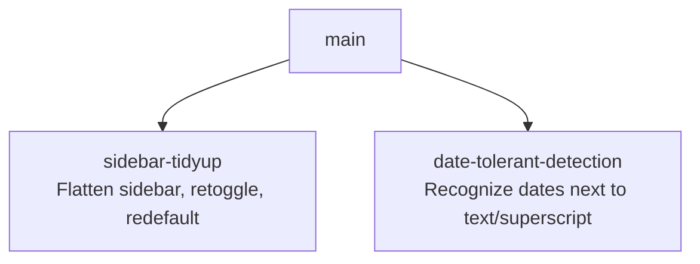

# Sprint Plan: Sidebar Tidy-Up & Date-Detection Tolerance

**Created:** 2026-06-05
**Base branch:** main
**Slug:** sidebar-tidyup-and-date-tolerance

## Context

Two unrelated polish items in the Chrome extension:

1. **Sidebar visual + UX cleanup.** The options panel currently splits controls into "Include" and "Exclude" groups with prose section headings, uses native checkboxes (not the iOS-style toggle pill used elsewhere in the UI), labels each granularity dropdown with redundant "round to:" text, and defaults `times` to `minute`. The user wants a single flat list of toggles (no group labels, no "round to:" labels), all rendered as toggle pills, with a specific reordering and a new set of defaults that better matches typical use.
2. **Date detection robustness.** `isDateLike` rejects cells whose date text is adjacent to other characters (trailing words, footnote superscripts, etc.) because the regexes are fully anchored against the trimmed string. Real spreadsheets routinely have `"March 14, 2024¹"` or `"2020-03-14 sales"`, and these currently fall through to the numeric-include path, defeating `excludeDates`.

These two concerns touch different files and have no shared code path → two independent sprints rooted at `main`.

## 1. Repo Survey

- Chrome extension (MV3) at `chrome-extension/`: `sidebar.html` + `sidebar.js` + `sidebar.css` (sidebar UI), `content.js` (in-page logic incl. date detection and the existing toggle-pill component used in the title row), `defaults.js` (shared `DR_DEFAULTS`), `tests.js` (node test runner).
- Sibling implementations in `js/` (Google Sheets custom function) and `python/` — out of scope for both sprints.
- iOS-style toggle CSS already exists for the title-row enable switch (`.switch` + `.slider` in `sidebar.html` / `sidebar.css`); the checkbox rows in the options section use plain `<input type="checkbox">` without that styling.
- Date parsing lives entirely in `content.js` (`parseDateLike` ~L1044, `parseAmbiguousNumericDate` ~L1107, `isDateLike` ~L1122). All regexes use `^…$` anchors against `text.trim()`.

## 2. Repo Conventions

- **Version files:**
  - `chrome-extension/manifest.json` — semver in `version` key (1–4 dot ints, no pre-release)
  - `python/pyproject.toml` — semver in `[project].version`
- **Test command:** `node chrome-extension/tests.js` (and `node js/tests.js` for the sheets function)
- **Lint / format:** none configured in repo
- **Build:** none — the extension loads source directly
- **Branch naming:** `feature/<label>` / `fix/<label>` / `refactor/<label>` / `plan/<slug>` (never `claude/`)
- **Commit convention:** Conventional Commits (`feat(sidebar): …`, `fix: …`)
- **PR template:** none
- **Version-bump workflow:** detected at `.github/workflows/bump-version.yml` (triggers on PR-merged-to-main, bumps the matching manifest/pyproject — sprint branches must NOT bump versions themselves).

## 3. Design

### D1 — Flatten the options list, drop group framing

Removes the two `<p class="section-heading">` lines and merges `includeWords / includeCurrency / includePercent / excludeDates / excludeTimes / excludeFirstRow / excludeFirstColumn` into a single flat list inside one container, in the order the user specified. The mixed include/exclude semantics are preserved in the underlying state shape (IDs stay `includeWords`, `excludeDates`, etc.) — only the presentation flattens. This avoids touching the state layer in `defaults.js`, content-script consumers, and the existing tests.

*Principle:* **Minimize design-time coupling** — keep storage/consumer contracts stable; UI changes don't ripple.

### D2 — Replace native checkboxes with the existing toggle-pill component

Reuse the `.switch / .slider` CSS already defined for the enable switch rather than adding a new toggle abstraction. Each row becomes:

```html
<label class="toggle-row">
  <span>words</span>
  <span class="switch"><input type="checkbox" id="includeWords"><span class="slider"></span></span>
</label>
```

The granularity dropdowns stay inline on the dates/times rows, but the `<span class="granularity-label">round to:</span>` element is deleted entirely (per ask 3); the dropdown alone is enough context. Toggle width/colour constants in `content.js` (`TOGGLE_PILL_WIDTH_PX` etc.) are unrelated — they belong to a different component in the page, not the sidebar.

*Principle:* **Simple components** — reuse the in-repo toggle styling rather than introducing a new one.

### D3 — Update defaults

Edit `DR_DEFAULTS` in `chrome-extension/defaults.js`:

| key | old | new |
|---|---|---|
| `includeWords` | true | **true** (unchanged) |
| `includeCurrency` | true | **true** (unchanged) |
| `includePercent` | true | **true** (unchanged) |
| `excludeDates` | true | **true** (unchanged — "dates selected" in the new UI means "exclude dates from rounding", consistent with current semantics) |
| `excludeTimes` | true | **false** (deselected) |
| `excludeFirstRow` | true | **false** (deselected) |
| `excludeFirstColumn` | true | **false** (deselected) |
| `timeGranularity` | `'minute'` | **`'hour'`** |
| `dateGranularity` | `'decade'` | unchanged |

The HTML option ordering for `#timeGranularity` is reordered so `hour` appears first (matching the new default) — currently `minute` is first.

### D4 — Tolerant date matching

Two-part change to `content.js`:

1. **Relax anchors.** Replace `^…$` in `parseDateLike` and `parseAmbiguousNumericDate` with boundary-aware patterns that allow non-alphanumeric trailing/leading characters. Concretely, use `(?:^|[^\w])` and `(?:$|[^\w])` lookaround-equivalents (JS supports lookbehind in modern Chrome — Chrome MV3 targets ≥ Chrome 88 which has it) around each shape, and drop the full-string anchor.
2. **Pre-clean superscripts and ordinal markers.** Before regex matching, normalize the trimmed input by stripping a small allowlist of trailing/leading noise: superscript digits (`¹²³⁴⁵⁶⁷⁸⁹⁰`), footnote markers (`*`, `†`, `‡`), and ordinal suffixes after day numbers (`1st`, `2nd`, `3rd`, `4th` → `1`, `2`, `3`, `4`) — implemented as a single regex pass on a working copy of `text`. Keep `MONTH_NAMES` / `MONTH_NAME_MAP` reuse intact.

Guardrail: the bare-year branch (`^(\d{4})$`) is the most permissive existing pattern and is *not* loosened — relaxing it would false-positive on prices and IDs. It still requires the trimmed string to be exactly four digits.

New tests in `chrome-extension/tests.js` cover: `"2020-03-14 sales"`, `"March 14, 2024¹"`, `"Sales: 2020"` (should remain non-date, year alone is too risky inside prose), `"Jun 1st, 2020"`, `"21st June 2020"`.

*Principle:* **Pre-merge testing** — every loosening of a parser ships with regression tests in the same sprint.

## 4. Sprint List & Dependency Graph

### Sprint List

1. **sidebar-tidyup** — Flatten sidebar options to a single toggle list, drop group/round-to labels, reorder, update defaults (incl. times → hour). _Depends on:_ none.
2. **date-tolerant-detection** — Relax `isDateLike` to recognize dates adjacent to text, superscripts, or ordinal suffixes. _Depends on:_ none.

Both touch disjoint files (`sidebar.html` / `sidebar.css` / `defaults.js` vs `content.js`); they can be developed and merged in any order.

### Dependency Graph



## 5. Sprint Definitions

### sidebar-tidyup

- **Goal:** Flatten the sidebar options into a single ordered list of toggle-style switches with the user's new defaults.
- **Scope:**
  - `chrome-extension/sidebar.html` — replace the two `<div class="exclusion-group">` blocks (L265–L310) with one flat container; delete the two `<p class="section-heading">` lines; delete both `<span class="granularity-label">round to:</span>` spans; rewrite each row from `<input type="checkbox">` to the `.switch`/`.slider` pattern already used in the title row; reorder rows to: words, currencies, percentages, dates, times, first row, first column; reorder `#timeGranularity` `<option>`s so `hour` is first.
  - `chrome-extension/sidebar.css` — add `.toggle-row` layout (label-left, switch-right, granularity-dropdown beside the switch for the dates/times rows); confirm `.switch`/`.slider` styling renders correctly at the row sizes; remove now-unused `.checkbox-row`, `.section-heading`, `.row-label`, `.granularity-label`, `.exclusion-group` if no other callers.
  - `chrome-extension/defaults.js` — flip `excludeTimes`, `excludeFirstRow`, `excludeFirstColumn` to `false`; change `timeGranularity` to `'hour'`.
  - `chrome-extension/sidebar.js` — verify the existing change/load handlers still find each `#id` (they should, since IDs are unchanged); update any code that toggles `.granularity-label` visibility (search for the class) to no longer reference it.
  - `chrome-extension/tests.js` — update any snapshot/dom-shape assertions that reference `.checkbox-row`, `.section-heading`, `.granularity-label`, or the old default values.
- **Out of scope:** Underlying include/exclude semantics; the dual-slider section; the enable switch; the range input; the live preview band.
- **Acceptance criteria:**
  - Sidebar renders one flat list of seven toggle pills in the order: words, currencies, percentages, dates, times, first row, first column.
  - No "Include numbers in cells containing:", "Exclude:", or "round to:" text appears anywhere in the options section.
  - On a fresh install (cleared `chrome.storage`), the defaults are: words/currencies/percentages/dates ON; times/first-row/first-column OFF; `dateGranularity = decade`; `timeGranularity = hour`.
  - Toggling any row updates rounding behavior identically to the previous build (same underlying state keys).
  - `node chrome-extension/tests.js` passes.
- **Depends on:** none
- **Complexity:** M
- **Dev notes:**
  - Reuse the existing `.switch`/`.slider` classes from the title-row enable switch — don't introduce a new toggle component.
  - The state keys (`includeWords`, `excludeDates`, etc.) stay as-is; only the visual grouping flattens. This keeps `content.js` and `defaults.js` consumers untouched beyond the value flips.
  - Do not bump `manifest.json` version — the merge workflow handles that.
  - When deleting the `.granularity-label` span, also remove any `sidebar.js` line that shows/hides it via `disabled`/`hidden` toggling. The `<select>`'s own `disabled` attribute (already toggled by the row's checkbox state) remains the source of truth for whether the dropdown is interactive.

### date-tolerant-detection

- **Goal:** Recognize dates in cells that contain adjacent non-date characters (trailing words, leading labels, footnote superscripts, ordinal suffixes).
- **Scope:**
  - `chrome-extension/content.js` — modify `parseDateLike` (~L1044) and `parseAmbiguousNumericDate` (~L1107) to operate on a pre-normalized copy of `text.trim()` (strip trailing superscript digits `[²³¹⁰-⁹]+`, trailing footnote markers `[*†‡]`, and ordinal suffixes after day numbers `(\d{1,2})(?:st|nd|rd|th)`), then relax the `^…$` anchors on every shape EXCEPT the bare-year shape, swapping them for word-boundary-style guards that permit non-alphanumeric neighbors.
  - `chrome-extension/tests.js` — add positive cases (`"2020-03-14 sales"`, `"March 14, 2024¹"`, `"Jun 1st, 2020"`, `"21st June 2020"`, `"Sales as of 2024-Q1: March 14, 2024"`) and negative cases (`"Sales: 2020"` — bare year inside prose stays non-date; `"version 2020.1.3"` — not a date; `"$2,020.00"` — not a date).
- **Out of scope:** New date shapes (e.g., European `DD.MM.YYYY`, Asian formats); the per-column ambiguity resolver in `roundTable()`; time detection.
- **Acceptance criteria:**
  - `isDateLike("2020-03-14 sales")`, `isDateLike("March 14, 2024¹")`, `isDateLike("Jun 1st, 2020")` all return `true`.
  - `isDateLike("Sales: 2020")`, `isDateLike("$2,020.00")`, `isDateLike("version 2020.1.3")` remain `false`.
  - Existing date-detection tests still pass.
  - `node chrome-extension/tests.js` passes.
- **Depends on:** none
- **Complexity:** M
- **Dev notes:**
  - Define the normalization regex(es) as named module-level constants near the existing `MONTH_NAMES` / `MONTH_NAME_MAP` so future shape additions can reuse them — e.g., `SUPERSCRIPT_DIGITS_RE`, `FOOTNOTE_MARKERS_RE`, `ORDINAL_SUFFIX_RE`.
  - Keep the bare-year branch strict — loosening it false-positives on prices and IDs.
  - Lookbehind is fine in MV3 (Chrome ≥ 88).
  - Do not bump `manifest.json` version.

## 6. Open Questions

- **Screenshots referenced under "date cells" were not attached to this session.** The plan addresses the two failure modes the user described in text (text adjacency, superscript adjacency) and a likely-related third (ordinal suffixes like `1st`/`2nd`). If the screenshots show a different failure shape (e.g., dates embedded mid-sentence, non-Western numerals, or `DD.MM.YYYY`), reopen the date sprint scope before execution.
- **Times default = hour with `excludeTimes = false`** means the time-granularity dropdown is irrelevant until the user toggles times on. That's fine — but confirm the user wants `hour` as the *latent* default the moment they enable times (rather than `minute`, which is current).

## 7. Out of Scope (Separate Sprint-Stack)

- Adding new date shapes (European, Asian, quarter notation) — distinct effort, deserves its own design pass.
- Reworking the include/exclude semantic model (currently dates "selected" means "excluded from rounding"; a future UX pass might unify the verb).

## Decisions Log

- 2026-06-05: Initial draft generated by sprint-plan skill.
