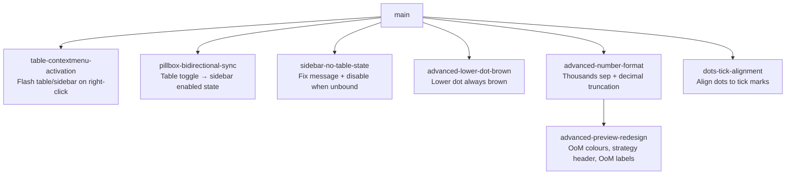

# Sprint Plan: Sidebar UX Sprint

**Created:** 2026-06-23
**Base branch:** main
**Slug:** sidebar-ux-sprint

## 1. Repo Survey

**Language / runtime:** JavaScript (no build step) — Chrome Extension MV3 (Manifest V3). Extension files are loaded directly as content scripts and a side-panel HTML page. No bundler or transpiler.

**Key files:**
- `chrome-extension/manifest.json` — version, permissions, content-script load order
- `chrome-extension/content.js` — main content script: right-click tracking, table rounding pipeline, IPC with sidebar
- `chrome-extension/ui-toggle.js` — per-table morph toggle button UI, `flashTargetedTable`, `flashRangePulse`
- `chrome-extension/sidebar.js` — side-panel logic: slider, preview bands, IPC with content.js
- `chrome-extension/sidebar.html` — side-panel markup + embedded CSS
- `chrome-extension/rounding.js` — shared arithmetic (loaded by both content and sidebar)
- `chrome-extension/background.js` — service worker: context-menu wiring, sidebar open/close relay
- `chrome-extension/tests.js` — node-runnable unit tests

**Test command:** `node chrome-extension/tests.js`
**Lint/format:** none detected
**Build:** none (load-unpacked)

**Existing patterns:**
- IPC is via `chrome.runtime.sendMessage` / `chrome.tabs.sendMessage`; the background worker relays between tab content and the sidebar.
- Visual feedback uses CSS `@keyframes` animations injected at runtime via `ensureHighlightStyleInjected()`.
- `syncSwitchForTable(table)` keeps the table's morph-toggle aria state in sync after every rounding operation.
- The sidebar maintains `cachedSamples` / `cachedMaxMag` and calls `renderPreviewBands()` to redraw the advanced preview section.

## 2. Repo Conventions

- **Version files:**
  - `chrome-extension/manifest.json` — `"version"` key, 3-component semver integers only (Chrome constraint)
  - `python/pyproject.toml` — `version = "..."` key
- **Test command:** `node chrome-extension/tests.js` (and `node js/tests.js` for the Sheets lib)
- **Lint:** none
- **Format:** none
- **Build:** none
- **Branch naming:** `feature/<label>` (never `claude/` or `session/`)
- **Commit convention:** Conventional Commits (`feat:`, `fix:`, `chore:`, etc.)
- **PR template:** none detected
- **Version-bump workflow:** detected at `.github/workflows/bump-version.yml`

## 3. Design

### 3.1 IPC topology for sidebar ↔ content sync

**Decision:** Use the existing `chrome.tabs.sendMessage` channel for content→sidebar messages, routed through the background worker where necessary. The sidebar already listens to `chrome.runtime.onMessage`; new message actions follow the existing `ACTION_NAME` string convention.

**Why:** All existing cross-context comms use this pattern. Adding new action strings to the existing `onMessage` listener in each context is the minimal-footprint, team-autonomous change (principle: *Simple interactions*, *Minimize design-time coupling*).

**Alternative considered:** Direct `chrome.runtime.sendMessage` from content to sidebar. Rejected because content scripts and side-panel documents can only communicate through the background worker or via `chrome.tabs.sendMessage` from a privileged context; the existing flow already handles this.

**Implication:** The background worker must relay any new content→sidebar messages (as it does for existing relay patterns).

### 3.2 "Active table" state and sidebar binding

**Decision:** "Bound" means `lastRightClickedTable` is non-null (set on right-click in content.js). Sprints that need to know whether the sidebar is bound to a table check this existing sentinel — no new state object needed.

**Why:** Adding another binding abstraction for 7 sprints' worth of UX polish would be over-engineering. The existing `lastRightClickedTable` WeakMap key is the correct single source of truth (*Simple components*, *Minimize design-time coupling*).

### 3.3 Disabled-state for sidebar slider when no table bound

**Decision:** When no table is bound, add a `no-table` class to `document.body` in the sidebar. CSS rules scoped to `body.no-table` disable pointer events and reduce opacity on the advanced section and the slider. The `status` element shows the updated message.

**Why:** Mirrors the existing `optionsSection.disabled` pattern (CSS class toggle + `pointer-events: none`). Keeps the sidebar's disabled logic in one layer (CSS) and avoids sprinkling `disabled` attributes across many elements (*Simple components*).

### 3.4 Preview band rendering redesign (sprints 5 + 7)

**Decision:** Extend `renderBand` with a `bandConfig` parameter (or split it into `renderTopBand` / `renderBotBand`) so the two bands can diverge in structure (top band gets a strategy header row; bottom band gets an OoM label on the original). DOM structure changes live in JS (via `document.createElement`), not in the static HTML template, consistent with how the current band is built.

**Why:** The two bands now require materially different markup. A shared `renderBand` with a config object keeps the split DRY while allowing the differences to be expressed declaratively (*Simple components*).

## 4. Sprint List & Dependency Graph

### Sprint List

| # | Label | Goal | Depends on | Rationale |
|---|-------|------|------------|-----------|
| 1 | `table-contextmenu-activation` | Flash table border on right-click; flash sidebar border if open | none | Purely additive event handler + CSS animation; touches no shared state |
| 2 | `pillbox-bidirectional-sync` | When table toggle is clicked, update the sidebar's enabled state | none | IPC addition only; reverse direction of existing sidebar→table sync |
| 3 | `sidebar-no-table-state` | Fix "no table" message; disable slider + options when no table is bound | none | Sidebar-only; CSS class toggle on `body` |
| 4 | `advanced-lower-dot-brown` | Lower-order dot is always brown (lighter shade when linked to top) | none | Two-line CSS change in sidebar.html |
| 5 | `advanced-number-format` | Thousands separators + decimal truncation in preview band numbers | none | Isolated formatting helper changes in sidebar.js |
| 6 | `dots-tick-alignment` | Fix slider dots not aligning to tick marks | none | CSS-only tweak in sidebar.html |
| 7 | `advanced-preview-redesign` | OoM colours, top-band strategy header, OoM labels on originals, ordering fix | `advanced-number-format` | Builds on the formatting helpers added in sprint 5; merge-conflict risk if done in parallel |

### Dependency Graph

## 5. Sprint Definitions

### table-contextmenu-activation

- **Goal:** When the user right-clicks on a table, flash the table border to indicate it is now the active table; if the sidebar is currently open, flash the sidebar border too.
- **Scope:**
  - `chrome-extension/content.js` — `contextmenu` handler: call `flashTargetedTable(table)` when a table is targeted; also send a new `TABLE_ACTIVATED` message to the runtime so the sidebar can react.
  - `chrome-extension/sidebar.js` — add handler for `TABLE_ACTIVATED` that applies a brief CSS flash to the sidebar container (e.g. `document.body` border).
  - `chrome-extension/sidebar.html` — add `@keyframes drSidebarFlash` and `.dr-sidebar-flash` CSS class; the flash is a subtle border pulse (matching the existing `drExtTargetFlash` aesthetic).
  - `chrome-extension/background.js` — relay `TABLE_ACTIVATED` from the content tab to the sidebar if `sidebarTabId` is set, using `chrome.tabs.sendMessage`.
- **Out of scope:** Changing what "activation" means; any changes to `lastRightClickedTable` selection logic.
- **Acceptance criteria:**
  - Right-clicking a table causes `flashTargetedTable` to run on that table (border flashes blue, matches existing toggle-flash behaviour).
  - If the sidebar is open, the sidebar container also briefly flashes (subtle border animation, ~0.6 s, similar to the range-pulse keyframe).
  - Right-clicking a non-table element produces no flash.
  - Existing tests pass.
- **Depends on:** none
- **Complexity:** S
- **Dev notes:** `flashTargetedTable` already exists in `ui-toggle.js:362`. The `contextmenu` listener in `content.js:39` already sets `lastRightClickedTable` — add the flash call there, guarded by `if (table)`. For the sidebar flash, a `body`-scoped border keyframe works because the side panel is a narrow fixed-width page. Keep the animation under 1 s and visually softer than the table flash to indicate "bound" vs "operated on".

---

### pillbox-bidirectional-sync

- **Goal:** When the user clicks the table's toggle (morph pill), reflect the new enabled state in the sidebar's main toggle checkbox — completing the two-way sync.
- **Scope:**
  - `chrome-extension/ui-toggle.js` — in the `click` handler of `createToggleForTable`, after `runToggleAction(table)`, send `{ action: 'TABLE_TOGGLE_STATE', enabled: isTableRounded(table) }` to `chrome.runtime`.
  - `chrome-extension/background.js` — relay `TABLE_TOGGLE_STATE` to the sidebar (same pattern as other relay messages).
  - `chrome-extension/sidebar.js` — add handler for `TABLE_TOGGLE_STATE`: set `enabledEl.checked = request.enabled` and call `updateDisabledState()`.
- **Out of scope:** Syncing which table is active; syncing slider/offset values; handling the case where no sidebar is open (message is silently dropped).
- **Acceptance criteria:**
  - Clicking the table's morph pill while the sidebar is open changes `enabledEl.checked` to match the table's new rounded/unrounded state.
  - Clicking the sidebar's enabled toggle still updates the table's pill state (existing behaviour unchanged).
  - Toggling on a table that is not the sidebar's bound table does not update the sidebar (only `lastRightClickedTable` drives the sidebar).
  - Existing tests pass.
- **Depends on:** none
- **Complexity:** S
- **Dev notes:** The relay in `background.js` only needs to fire if `sidebarTabId` is set — wrap in `if (sidebarTabId !== null)`. In `ui-toggle.js`, send only for the table that matches `lastRightClickedTable` to avoid spurious sidebar updates from unbound tables. Guard: `if (sidebarOpen && lastRightClickedTable && table === lastRightClickedTable)`.

---

### sidebar-no-table-state

- **Goal:** When no table is bound to the sidebar, show a clearer message and disable the slider (and options) so the user can't interact with controls that have no effect.
- **Scope:**
  - `chrome-extension/sidebar.js` — introduce `setTableBound(isBound)` helper that toggles `document.body.classList.toggle('no-table', !isBound)`. Call it on init (default `false`) and whenever `lastRightClickedTable` state is known (via the `SIDEBAR_OPENED` / `TABLE_ACTIVATED` messages).
  - `chrome-extension/sidebar.html` — update the `#status` default text to the new message; add CSS for `body.no-table` that applies `opacity: 0.4; pointer-events: none` to `#optionsSection` and `#advancedSection`, and shows a prominent `#status` message (`"Right-click a table to connect it here."`).
  - Fix the status message string in `sidebar.js:282` from `'Right-click a table first, then reopen the sidebar.'` to `'Right-click a table to connect it here.'`
- **Out of scope:** Persisting the bound state across sidebar close/reopen; changing what "bound" means.
- **Acceptance criteria:**
  - When the sidebar opens with no previously right-clicked table, `#status` reads "Right-click a table to connect it here." and the options + slider are visually disabled (low opacity, not clickable).
  - After the user right-clicks a table (binding it), the sidebar enables its controls and clears the message.
  - The existing error message path (runtime error → "Right-click a table first…") is replaced by the new message.
  - Existing tests pass.
- **Depends on:** none
- **Complexity:** S
- **Dev notes:** The status message currently set in `sidebar.js:282` is the `chrome.runtime.lastError` branch inside `sendToActiveTab`. Replace the string there and also set `body.no-table` on sidebar load when `lastRightClickedTable` has not been communicated yet. The sidebar learns about binding via `SIDEBAR_OPENED` (content.js already sends `PREVIEW_SAMPLES_CHANGED` at that point); use the `PREVIEW_SAMPLES_CHANGED` handler to infer binding state from whether samples are null.

---

### advanced-lower-dot-brown

- **Goal:** The lower-order (bot) slider thumb is always brown — a lighter shade (#c48a6a or similar) when its value matches the top thumb (linked state), and the existing darker brown (#b3623d) when decoupled.
- **Scope:**
  - `chrome-extension/sidebar.html` — change `.dual-thumb.bot.linked { background: #9aa0a6; }` to `.dual-thumb.bot.linked { background: #c48a6a; }` (or a tuned lighter brown). Also update `#sliderBlock.linked .label-row .lbl.bot { color: #9aa0a6; }` to `color: #c48a6a;` so the label matches.
- **Out of scope:** Changing any other aspect of the slider.
- **Acceptance criteria:**
  - In the linked state the bot thumb is visibly brown (lighter than #b3623d, clearly not grey).
  - In the decoupled state the bot thumb is the existing darker brown #b3623d.
  - Visual transition between linked/decoupled states remains smooth.
  - Existing tests pass.
- **Depends on:** none
- **Complexity:** S
- **Dev notes:** The two CSS rules to change are at `sidebar.html:135` (`.lbl.bot` color) and `sidebar.html:176` (`.dual-thumb.bot.linked` background). Choose a lighter brown that reads as "same family" as #b3623d — roughly 15–20% lighter in HSL lightness works well (e.g. `hsl(20, 40%, 60%)`).

---

### advanced-number-format

- **Goal:** In the advanced preview bands, apply thousands separators to the original (from) number, and truncate (not round) decimals: no decimals for |n| ≥ 100, otherwise at most 4 decimal places.
- **Scope:**
  - `chrome-extension/sidebar.js` — add `formatOriginal(numOrStr)` helper: parse the raw cell text to a number, apply thousands-comma formatting, and truncate decimals per the rule. Use this in `renderBand` for `from.textContent` instead of `row.original`.
  - Also apply the same decimal truncation to the `rounded` value displayed in `numEl` (the right-hand side after the arrow) — `formatNumberWithCommas` already adds thousands sep; add a `truncateDecimals(n)` step before it.
- **Out of scope:** Changing how the rounding arithmetic works; changing the sample selection logic.
- **Acceptance criteria:**
  - Original numbers in the preview band display with thousands commas (e.g. `273,233`).
  - Rounded numbers with magnitude ≥ 100 display with no decimal places.
  - Rounded numbers with magnitude < 100 display with at most 4 decimal places (excess digits truncated, not rounded; e.g. `1.7999999999` → `1.7999`).
  - Existing tests pass.
- **Depends on:** none
- **Complexity:** S
- **Dev notes:** Decimal truncation (not rounding): `Math.trunc(n * 1e4) / 1e4` for the 4-decimal case; `Math.trunc(n)` for the ≥100 case. The boundary is `Math.abs(n) >= 100`. Named constants: `PREVIEW_DECIMAL_THRESHOLD = 100` and `PREVIEW_MAX_DECIMALS = 4` in `sidebar.js`. The `row.original` field is a string (raw cell text); parse with `parseFloat` or the existing `toNumber` function (loaded via `core.js` `<script>` tag in `sidebar.html`) before formatting.

---

### dots-tick-alignment

- **Goal:** The slider dot/thumb positions align exactly over the corresponding tick marks.
- **Scope:**
  - `chrome-extension/sidebar.html` — adjust `.dual-thumb` CSS `top` value and/or the `.dual-ticks` positioning so the tops of the tick lines are co-incident with the center of the thumbs. May also need to adjust the `pct()` calculation in `sidebar.js` if the track's effective left/right edges don't match the thumb travel range.
- **Out of scope:** Changing thumb size or tick height.
- **Acceptance criteria:**
  - At every stop position (−1, −0.75, …, +1), the center of the blue top thumb sits directly above the corresponding tick mark.
  - The bot thumb, when linked (same position as top), also sits on a tick.
  - Visual check: load the extension in Chrome, open the sidebar on any page with a table, and verify alignment at the extreme (−1 and +1) and center (0) stops.
- **Depends on:** none
- **Complexity:** S
- **Dev notes:** The track is `top: 26px` inside a `height: 56px` `.dual-wrap`. The top thumb is `top: 26px; transform: translate(-50%, -50%)` — vertically centred on the track line. The tick container `.dual-ticks` is `top: 22px` with `height: 12px` ticks. The tick top sits at 22 px, and the thumb centre is at 26 − 9 = 17 px from the wrap top — so the thumb centre is 4 px above the tick top. Moving `.dual-ticks` to `top: 17px` (or `top: 18px` for a visual match) should align them. Horizontal alignment: the 9-column grid and the 9 STOPS map to the same 0–100% range as `pct(v)`, so horizontal should already be correct — verify by checking whether the leftmost tick aligns with `left: 0%` and rightmost with `left: 100%`. If not, `.dual-ticks` may need `left/right` padding adjustments equal to `TOGGLE_HIT_PAD_PX`-equivalent values on the track.

---

### advanced-preview-redesign

- **Goal:** Restyle the advanced preview bands: colour step/OoM labels blue (top band) or brown (bottom band); restructure the top band to show a strategy header row instead of a second example; add OoM labels to original numbers in the bottom band; fix ordering so lower-OoM rows never appear above higher-OoM rows.
- **Scope:**
  - `chrome-extension/sidebar.js`:
    - Replace the shared `renderBand(el, rows, offset)` with two specialised functions: `renderTopBand(el, rows, offset)` and `renderBotBand(el, rows, offset, maxMag)`.
    - `renderTopBand`: show one example row (the first/only sample — `PREVIEW_NUM_TOP = 1`) preceded by a strategy header row: `100k+ → nearest 25k (i.e. a quarter of 100k)`. The strategy string is derived from `maxMag` and the step for `topVal`. Both header and example are emitted in a grid layout consistent with the rest.
    - `renderBotBand`: each row gains an OoM label on the original: `266,453 (100k+)` where `(100k+)` is in brown (a `` styled brown). Sort rows descending by magnitude so the highest-OoM example appears first. The step `(25k)` label is already present; colour it brown via `stepEl.className = 'step bot'`.
    - Update `renderPreviewBands()` to call the two new functions.
    - Add `formatOomLabel(mag)` helper: `mag ≥ 5 → "100k+"`, `mag ≥ 4 → "10k+"`, `mag ≥ 3 → "1k+"`, etc. (pattern: `10^mag` with `k/M/B` suffix, always `+`).
    - Add `formatStrategyHeader(maxMag, offset)` helper: returns e.g. `"100k+ → nearest 25k (i.e. a quarter of 100k)"` by computing the step string from `stepForOffset(10^maxMag, offset)`.
  - `chrome-extension/sidebar.html`:
    - Add CSS classes: `.step.top { color: #1a73e8; }` (blue), `.step.bot { color: #b3623d; }` (brown), `.oom-label { color: #b3623d; }`, `.strategy { color: #1a73e8; grid-column: 1 / -1; font-style: italic; }`.
- **Out of scope:** Changing how samples are selected (that's `extractPreviewSamples` in `content.js`); changing the slider values or offset arithmetic.
- **Acceptance criteria:**
  - Top band: first line is the strategy header in blue (e.g. `100k+ → nearest 25k (i.e. a quarter of 100k)`); the single example row below it is in default/grey.
  - Bottom band: each row shows `[original with commas] ([OoM+]) → [rounded] ([step])` where both OoM labels are brown.
  - Rows in the bottom band appear in descending OoM order (highest magnitude first).
  - Step labels in the top band are blue; step labels in the bottom band are brown.
  - Existing tests pass; visual check in Chrome confirms layout.
- **Depends on:** `advanced-number-format`
- **Complexity:** M
- **Dev notes:** `stepForOffset` and `formatStep` are already defined in `rounding.js` and available in the sidebar context. `cachedMaxMag` is already maintained in `sidebar.js:78`. Pass `cachedMaxMag` into `renderBotBand` for the OoM label computation. The top-band strategy header is one `div.pair` with `grid-column: 1 / -1` so it spans all 4 columns. The step for the strategy header uses `topVal` and the largest magnitude sample (`cachedSamples.top[0].num`). The `formatOomLabel` helper should map `mag` to the human label: mag 5 → "100k+", mag 4 → "10k+", mag 3 → "1k+", mag 2 → "100+", mag 1 → "10+", mag 0 → "1+", mag -1 → "0.1+", etc.

## 6. Open Questions

1. **Sidebar flash colour and duration (sprint `table-contextmenu-activation`):** The brief sidebar flash is described as "subtle". Use the same blue as `drExtTargetFlash` (rgba(66,133,244,...))? Or a different colour to distinguish "you've bound a table" from "you've operated on a table"? Default assumption: same blue at lower intensity (50% opacity max) — override if the user wants a different palette.

2. **Strategy header wording (sprint `advanced-preview-redesign`):** The spec example is `"100k+ → nearest 25k (i.e. a quarter of 100k)"`. The "a quarter of 100k" parenthetical may not generalise cleanly for all offset values. Should the helper always emit the "(i.e. a fraction of OoM)" clause, or only for fractional offsets? Default assumption: always emit it; derived from the step/OoM ratio.

3. **`(10+)` vs `(10k+)` OoM labels (sprint `advanced-preview-redesign`):** The spec example shows `(10+)` for mag = 1 and `(100k+)` for mag = 5. Confirming the naming convention: use `k` for 10³⁺, `M` for 10⁶⁺, `B` for 10⁹⁺, and plain digits for mag < 3? Default assumption: yes.

## 7. Out of Scope (Separate Sprint-Stack)

- Grid virtualization support for mixed-cell extraction (`mode: 'extracted'` on grids), tracked in issue #120 — unrelated to this UX sprint.
- Python / Google Sheets changes — no touch points in this plan.

## Decisions Log
- 2026-06-23: Initial draft generated by sprint-plan skill.
