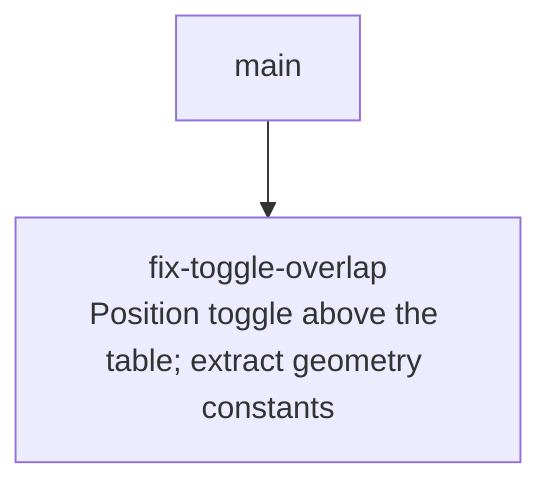

# Sprint Plan: Toggle Positioning Fix

**Created:** 2026-06-01
**Base branch:** main
**Slug:** toggle-positioning

## 1. Repo Survey

Monorepo with three implementations of Dynamic Rounding (`js/`, `python/`, `chrome-extension/`). This plan targets `chrome-extension/` only.

The per-table toggle switch was added by the `auto-table-toggle` sprint (see `docs/sprint-plans/auto-table-toggle.md`). It is created in `chrome-extension/content.js` and positioned as an absolutely-positioned `<label>` appended to `document.body`, aligned to each tracked table's `getBoundingClientRect()`.

Relevant code:

- `positionToggle(table, labelEl)` — `content.js:203-222`. Computes the toggle's `left` and `top` from the table rect; the current expression hard-codes `36`, `2`, and `-2`.
- `ensureToggleStyleInjected()` — `content.js:151-201`. Injects the toggle CSS. `width: 36px; height: 20px;` for `.dr-ext-toggle`, plus a 14px slider knob with 3px inset.

No bundler, no framework, vanilla JS only.

## 2. Repo Conventions

- **Version files:**
  - `chrome-extension/manifest.json` — `version` key, 1-4 dot-separated integers.
  - `python/pyproject.toml` — semver in `version =` line.
  - `js/CHANGELOG.md` — informational only.
- **Test command:** `node chrome-extension/tests.js`
- **Lint / Format / Build:** none configured.
- **Branch naming:** `fix/<label>` for bug fixes (per `CLAUDE.md`); never `claude/`.
- **Commit convention:** plain prefixed (`fix: …`, `chore: …`, `Sprint <label>: …` for sprint-stack commits).
- **PR template:** none.
- **Version-bump workflow:** detected at `.github/workflows/bump-version.yml` — triggers on `pull_request: types: [closed]` with `if: github.event.pull_request.merged == true`, bumps `chrome-extension/manifest.json` patch when files under `chrome-extension/**` change. Sprint commits in this plan do **not** modify `manifest.json`.

## 3. Design

### 3.1 The bug

In `positionToggle` (`content.js:217-221`):

```js
const left = rect.right + scrollX - 36 + 2;
const top  = rect.top   + scrollY - 2;
```

The toggle is 20px tall. `top = rect.top - 2` puts only 2px of the toggle above the table; the remaining 18px overlays the first row, which obscures right-aligned content in the first row (e.g. the "214" word count in the Google Docs Word Count dialog, which is rendered as a table).

### 3.2 Fix

Shift the toggle up by its own height so it sits fully above the table, leaving the existing 2px gap between the toggle's bottom and the table's top edge.

```js
const top = rect.top + scrollY - TOGGLE_HEIGHT_PX - TOGGLE_EDGE_GAP_PX;
```

*Principle: simple components — one-line geometric correction in the existing helper, no new abstractions, no new DOM.*

### 3.3 Tradeoff: best-efforts, not a guarantee

Shifting the toggle up trades one failure mode (overlapping row 1) for several others — overlapping content immediately above the table, floating outside a containing card or dialog, disappearing under a sticky page header, or rendering off-screen if the table's top is at the viewport edge. None of these can be fully avoided by a fixed upward shift, since the extension has no model of the host page's layout.

**Decision (per user direction):** accept this as a best-efforts fix. Some overlap is preferable to introducing host-page DOM mutations (e.g. right-padding row 1) or runtime heuristics (e.g. conditional shifting based on detected whitespace), both of which would create ongoing technical debt without eliminating the underlying risk.

Apply one minimal defensive guard: clamp `top` so the toggle is never rendered above the current scroll position. This is a single `Math.max` with no new branches, no DOM changes, and no heuristics — it only kicks in at the viewport edge:

```js
const top = Math.max(scrollY, rect.top + scrollY - TOGGLE_HEIGHT_PX - TOGGLE_EDGE_GAP_PX);
```

Other risks (collisions with content above the table, container clipping, sticky-header coverage) are accepted as-is.

*Principle: minimize design-time coupling — the fix touches only the extension's own positioning math; host-page DOM and CSS are not modified.*

### 3.4 Named constants over magic numbers

The current code embeds `36`, `20`, `14`, `3`, and `2` as bare literals across both `positionToggle` (JS) and `ensureToggleStyleInjected` (CSS template string). These values carry semantic meaning (toggle width, toggle height, knob diameter, knob inset, edge gap) and are used in multiple call sites — the CSS template and the JS positioning math must stay in lockstep, since the JS subtracts the toggle's width and height to align it with the table edge.

**Decision:** introduce module-level constants at the top of `content.js`, used by both the CSS template (via string interpolation) and the positioning math:

- `TOGGLE_WIDTH_PX = 36`
- `TOGGLE_HEIGHT_PX = 20`
- `TOGGLE_KNOB_PX = 14`
- `TOGGLE_KNOB_INSET_PX = 3`
- `TOGGLE_EDGE_GAP_PX = 2`

The knob's `translateX(16px)` when checked is `TOGGLE_WIDTH_PX - TOGGLE_KNOB_PX - 2 * TOGGLE_KNOB_INSET_PX` — express it that way so resizing the toggle doesn't desync the knob travel.

*Principle: named constants over magic numbers — the values appear in both the JS positioning math and the CSS template, so the constant defines the single source of truth and the geometry stays consistent if the toggle is later resized.*

*Alternative considered:* CSS custom properties (`--dr-toggle-width`) read via `getComputedStyle`. Rejected — adds a runtime read on the hot positioning path with no real benefit; module-level JS constants are interpolated once into the CSS template and reused directly.

## 4. Sprint List & Dependency Graph

### Sprint List

1. **fix-toggle-overlap** — Shift the per-table toggle fully above the table and replace toggle-geometry magic numbers with named constants. Depends on: none.

### Dependency Graph



## 5. Sprint Definitions

### fix-toggle-overlap

- **Goal:** Stop the per-table toggle from overlapping the first row of its table by positioning it above the table edge (best-efforts, with a clamp to keep it on-screen), and consolidate the toggle's geometry into named constants.
- **Scope:** `chrome-extension/content.js` only. Update `positionToggle` to compute `top` as `Math.max(scrollY, rect.top + scrollY - TOGGLE_HEIGHT_PX - TOGGLE_EDGE_GAP_PX)`. Define the constants listed in §3.4 at module scope. Replace the literal occurrences of `36`, `20`, `14`, `3`, and `2` in `positionToggle` and the CSS template in `ensureToggleStyleInjected` with the named constants (using template-string interpolation for the CSS).
- **Out of scope:** Any visual restyling beyond the vertical shift. Mitigations for the residual risks listed in §3.3 (overlap with content above the table, container clipping, sticky-header coverage) — explicitly accepted as best-efforts. Toggle behavior, accessibility wiring, host-page click suppression, the `MutationObserver` / `ResizeObserver` plumbing — all unchanged. `manifest.json` version bump (handled at merge by the workflow).
- **Acceptance criteria:**
  - When the table's top is below the current scroll position, the toggle's bottom edge sits `TOGGLE_EDGE_GAP_PX` above the table's top edge and no part of the toggle overlaps row 1.
  - When the table's top is at or above the current scroll position, the toggle is clamped to the top of the viewport rather than rendered off-screen.
  - The toggle's horizontal position is unchanged (still anchored to the table's right edge with the existing 2px overhang).
  - `node chrome-extension/tests.js` passes.
  - Manual: load the unpacked extension, open the Word Count dialog in Google Docs, confirm the numbers in column 2 are no longer obscured.
  - Manual: visit any host page with multiple data tables; confirm toggles still appear in the correct place and the knob still travels the full width when toggled.
- **Depends on:** none
- **Complexity:** S
- **Dev notes:** New named constants `TOGGLE_WIDTH_PX`, `TOGGLE_HEIGHT_PX`, `TOGGLE_KNOB_PX`, `TOGGLE_KNOB_INSET_PX`, `TOGGLE_EDGE_GAP_PX` defined at module scope in `chrome-extension/content.js`. The CSS in `ensureToggleStyleInjected` must be converted from a static template literal to one that interpolates the constants; the knob's checked-state `translateX` is derived as `TOGGLE_WIDTH_PX - TOGGLE_KNOB_PX - 2 * TOGGLE_KNOB_INSET_PX` rather than hard-coded `16px`.

## 6. Open Questions

None.

## 7. Out of Scope (Separate Sprint-Stack)

None.

## Decisions Log

- 2026-06-01: Initial draft generated by sprint-plan skill.
